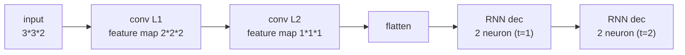

# Exam packet markdown templates

Two files per packet, written into
`content/02. Catatan/IF3270 Pembelajaran Mesin/uas/`:

- `Paket-Soal-IF3270-UAS-<slug>.md` — questions only (no answers).
- `Pembahasan-Paket-Soal-IF3270-UAS-<slug>.md` — worked key.

`<slug>` = the topics + a number, e.g. `cnn-rnn-lstm-01`. Distilled from the real
`uas/*.md` files. Fill the `<…>` placeholders; keep the structure.

---

## Soal skeleton (`Paket-Soal-IF3270-UAS-<slug>.md`)

```markdown
# Paket Soal Latihan UAS IF3270 Pembelajaran Mesin

Topik: <Topik A, Topik B, Topik C>
Semester II 2025-2026 · Sifat: Latihan (Buka Catatan)
Boleh menggunakan kalkulator. Total bobot: 100.
Pembulatan: gunakan <n> angka di belakang koma bila diperlukan.

KELAS: _______   NIM: _______   NAMA: _______

---

## Bagian I — <Topik / Komposit>  (Bobot: <w1>)

<setup: arsitektur, bobot/kernel/matriks, input data — as matrices/vectors>

a. (Nilai <n>) <pertanyaan>
b. (Nilai <n>) <pertanyaan>
...

## Bagian II — <Topik>  (Bobot: <w2>)

<setup>

| No | Pertanyaan | Jawaban |
| -- | ---------- | ------- |
| 1  | <…> (Nilai <n>) |  |
| 2  | <…> (Nilai <n>) |  |

## Bagian III — <Topik>  (Bobot: <w3>)

<setup>

1. (Nilai <n>) <pertanyaan>
2. (Nilai <n>) <pertanyaan>
```

Notes:
- Bobot across Bagian = 100; the `(Nilai n)` inside each Bagian sum to that Bagian's Bobot.
- Use the format that fits the topic (table for bertingkat/RNN/perceptron, a–b–c
  list for CNN nested, numbered list for LSTM/essay). See the playbook.
- **No answers, no intermediate results** in this file. Leave answer cells/space blank.
- **For a 4-Bagian UAS packet**, add a `## Bagian IV` and mirror the reference UAS
  shape (Bagian I = MC block, II = LSTM forward+BPTT, III = encoder-decoder
  param+formula, IV = RL). See the extra skeletons below.

### Bagian I — pilihan ganda (mark-each-option O/X) skeleton

```markdown
## Bagian I — Pilihan Ganda  (Bobot: 30, @2.5)

Beri tanda (O) pada setiap pilihan yang **tepat**, tanda (X) pada yang **salah**.
Pilihan yang tidak diberi tanda tidak mendapat nilai.

1. <pernyataan/pertanyaan>
   a. ( ) <opsi>
   b. ( ) <opsi>
   c. ( ) <opsi>
   d. ( ) <opsi>
2. …
```

### Bagian II — LSTM forward + BPTT skeleton

```markdown
## Bagian II — LSTM  (Bobot: 20)

<arsitektur 1 unit hidden, 2 fitur; matriks U*, W*, bias; input id1/id2 + target hidden; lr>

a. (Nilai 10) Lakukan 1 kali forward pass untuk kedua timestep; tuliskan nilai tiap
   gate dan neuron, lalu hitung error total. Sertakan formula tiap gate.
b. (Nilai 10) Lakukan 1 kali backward pass (BPTT) memakai hasil (a), learning rate <λ>.
   Tuliskan matriks bobot terbaru; sertakan formula tiap gate.
Catatan: gunakan ketelitian tiga angka di belakang koma.
```

### Bagian IV — RL (supervised-vs-RL table + Wumpus TD Q-learning) skeleton

```markdown
## Bagian IV — Reinforcement Learning  (Bobot: 25)

1. (Nilai 6) Lengkapi tabel perbandingan supervised learning vs reinforcement learning.

| Aspek | Supervised Learning | Reinforcement Learning |
| ----- | ------------------- | ---------------------- |
| Informasi yang diperlukan agen |  |  |
| Data observasi bersifat sekuensial? (Ya/Tidak/Belum tentu) |  |  |
| Apa yang dipelajari agen? |  |  |

2. Wumpus World: <grid + reward scheme + α + γ + daftar episode>.
   (i) (Nilai 12) Tuliskan update Q(s,a) rinci sesuai episode.
   (ii) (Nilai 3) Gambarkan grid berisi nilai Q(s,a) per episode.
   (iii) (Nilai 4) Gambarkan aksi terbaik tiap ruang non-terminal dari Q(s,a) terakhir.
```

---

## Kunci skeleton (`Pembahasan-Paket-Soal-IF3270-UAS-<slug>.md`)

```markdown
# Pembahasan Paket Soal Latihan UAS IF3270 — <Topik A, B, C>

> Semua angka diverifikasi dengan `scripts/gen_packet.py`. Pembulatan <n> desimal.

## Bagian I — <Topik>

**a.** <formula tertulis> = <angka tersubstitusi> = **<hasil>**

**b.** <tahap demi tahap, mis. CNN:>
- Padding: <matriks>
- Konvolusi: `pos(0,0): 1+0+0+-1+0.5 = 0.5` … (per posisi)
- Detector (ReLU): <matriks>
- Maxpool: <matriks>
- Flatten: <vektor>
...

## Bagian II — <Topik>

| No | Jawaban |
| -- | ------- |
| 1  | h₁(t=1) = tanh(Wxh·x + Whh·h₀ + bxh) = tanh(0.18) = **0.178** |
| 2  | … |

## Bagian III — <Topik>

1. f₁ = σ(Wxf·x₁ + Whf·h₀ + bf) = σ(1.85) = **0.864** ; i₁ = … ; Ĉ₁ = … ; o₁ = … ;
   C₁ = C₀⊙f₁ + i₁⊙Ĉ₁ = **0.6789** ; h₁ = o₁⊙tanh(C₁) = **0.4916**
2. <definisi simbol / esai / benar-salah dengan alasan>
```

Notes:
- Every numeric result in **bold** and lifted verbatim from the script trace.
- Show **formula → substituted numbers → result** for each step (rubric requires
  the formula and the numbers, not just the final answer).
- Architecture answers as a fenced mermaid block:



(Encoder boxes labelled by feature-map size; decoder boxes by neuron count;
weights `A,B,C / Wxh,Whh,Why` on the edges.)
- For BENAR/SALAH items, state the verdict, the reason, and the 2/1/0 rubric note.
```
