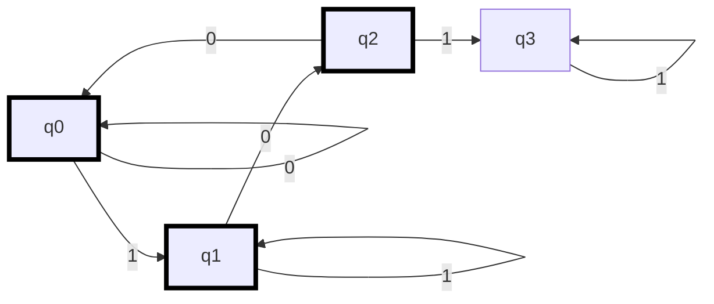
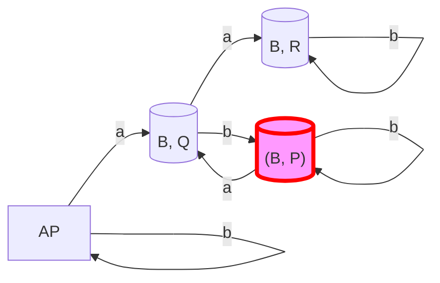
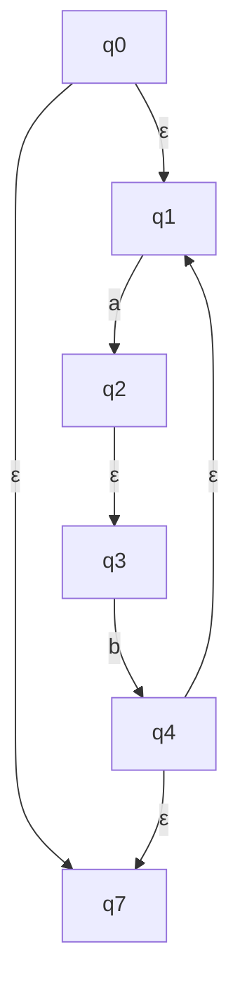

_Back to_ [[IF2224 Teori Bahasa Formal dan Otomata]]

### Soal 1: Desain DFA

Rancanglah sebuah Deterministic Finite Automaton (DFA) dengan $\Sigma = \{0, 1\}$ yang menerima bahasa $L$:

$L = \{ w \mid w \text{ tidak mengandung substring '101'} \}$

Sertakan:

a. Deskripsi state yang kamu gunakan.

b. Diagram transisi DFA.

**Jawaban:**

a. Deskripsi State:

* $q_0$: State awal. Belum melihat '101' dan state aman (simbol terakhir bukan '1' atau '10').

* $q_1$: Belum melihat '101', tapi string sejauh ini diakhiri '1'. Potensi awal '101'.

* $q_2$: Belum melihat '101', tapi string sejauh ini diakhiri '10'. Potensi kedua '101'.

* $q_3$: Trap state. Sudah melihat substring '101'. String pasti ditolak.

b. Diagram Transisi:


* **Start State:** $q_0$
* **Final States:** $\{q_0, q_1, q_2\}$ (Semua state kecuali trap state)

### Soal 2: Konversi ε-NFA ke DFA

Diberikan $\epsilon$-NFA berikut:

- $Q = \{A, B, C, D\}$  
    
- $\Sigma = \{a, b\}$  
    
- $q_0 = A$  
    
- $F = \{D\}$  
    
- Transisi $\delta$:
    
	| State | $\epsilon$ | $a$ | $b$ |
	| :---- | :--------: | :---: | :---: |
	| $\to A$ | $\{B\}$ | $\{A\}$ | $\emptyset$ |
	| B | $\emptyset$ | $\emptyset$ | $\{C\}$ |
	| C | $\{D\}$ | $\emptyset$ | $\emptyset$ |
	| $*D$ | $\emptyset$ | $\{D\}$ | $\emptyset$ |
    

Konversikan $\epsilon$-NFA ini menjadi DFA yang ekuivalen menggunakan **algoritma subset construction** dengan ECLOSE. Tunjukkan langkah-langkahnya (perhitungan ECLOSE dan transisi DFA) dan tabel transisi DFA hasil akhirnya.

**Jawaban:**

1. **Hitung ECLOSE untuk setiap state:**
    
    - ECLOSE(A) = {A, B} _(A bisa ke B via epsilon)_
        
    - ECLOSE(B) = {B}
        
    - ECLOSE(C) = {C, D} _(C bisa ke D via epsilon)_
        
    - ECLOSE(D) = {D}
        
2. **Subset Construction:**
    
    - **Start State DFA:** $S_0 = \text{ECLOSE}(A) = \{A, B\}$. Tandai $S_0$ sebagai state baru yang belum diproses.
        
    - **Proses** $S_0 = \{A, B\}$**:**
        
        - **Input 'a':**
            
            - $\delta(A, a) = \{A\}$, $\delta(B, a) = \emptyset$. Gabungan = $\{A\}$.
                
            - $\delta_D(S_0, a) = \text{ECLOSE}(\{A\}) = \{A, B\} = S_0$.
                
        - **Input 'b':**
            
            - $\delta(A, b) = \emptyset$, $\delta(B, b) = \{C\}$. Gabungan = $\{C\}$.
                
            - $\delta_D(S_0, b) = \text{ECLOSE}(\{C\}) = \{C, D\}$. Kita sebut state baru ini $S_1 = \{C, D\}$. Tandai $S_1$ belum diproses.
                
    - **Proses** $S_1 = \{C, D\}$**:**
        
        - **Input 'a':**
            
            - $\delta(C, a) = \emptyset$, $\delta(D, a) = \{D\}$. Gabungan = $\{D\}$.
                
            - $\delta_D(S_1, a) = \text{ECLOSE}(\{D\}) = \{D\}$. Kita sebut state baru ini $S_2 = \{D\}$. Tandai $S_2$ belum diproses.
                
        - **Input 'b':**
            
            - $\delta(C, b) = \emptyset$, $\delta(D, b) = \emptyset$. Gabungan = $\emptyset$.
                
            - $\delta_D(S_1, b) = \text{ECLOSE}(\emptyset) = \emptyset$. Kita sebut state baru ini $S_{\emptyset} = \emptyset$. Tandai $S_{\emptyset}$ belum diproses.
                
    - **Proses** $S_2 = \{D\}$**:**
        
        - **Input 'a':**
            
            - $\delta(D, a) = \{D\}$. Gabungan = $\{D\}$.
                
            - $\delta_D(S_2, a) = \text{ECLOSE}(\{D\}) = \{D\} = S_2$.
                
        - **Input 'b':**
            
            - $\delta(D, b) = \emptyset$. Gabungan = $\emptyset$.
                
            - $\delta_D(S_2, b) = \text{ECLOSE}(\emptyset) = \emptyset = S_{\emptyset}$.
                
    - **Proses** $S_{\emptyset} = \emptyset$**:** (Trap state kosong)
        
        - $\delta_D(S_{\emptyset}, a) = \text{ECLOSE}(\emptyset) = \emptyset = S_{\emptyset}$.
            
        - $\delta_D(S_{\emptyset}, b) = \text{ECLOSE}(\emptyset) = \emptyset = S_{\emptyset}$.
            
3. **Tentukan Final States DFA:** State DFA adalah final jika mengandung setidaknya satu final state NFA asli ($D$).
    
    - $S_0 = \{A, B\}$: Tidak mengandung D $\rightarrow$ Non-Final.
        
    - $S_1 = \{C, D\}$: Mengandung D $\rightarrow$ **Final**.
        
    - $S_2 = \{D\}$: Mengandung D $\rightarrow$ **Final**.
        
    - $S_{\emptyset} = \emptyset$: Tidak mengandung D $\rightarrow$ Non-Final.
        
4. Tabel Transisi DFA Hasil Akhir:
    
	| State | a | b | Final? |
	| :----------------- | :-----: | :------------: | :----: |
	| $\to \{A, B\}$ | $\{A, B\}$ | $\{C, D\}$ | Tidak |
	| $* \{C, D\}$ | $\{D\}$ | $\emptyset$ | Ya |
	| $* \{D\}$ | $\{D\}$ | $\emptyset$ | Ya |
	| $\emptyset$ | $\emptyset$ | $\emptyset$ | Tidak |
    
    (State bisa diganti nama, misal P={A,B}, Q={C,D}, R={D}, T=∅)
    

### Soal 3: Konversi DFA ke Regular Expression (State Elimination)

Konversikan DFA berikut menjadi Regular Expression menggunakan **metode State Elimination**. Eliminasi state dalam urutan: **q1**. Tunjukkan langkah-langkahnya.

- $Q = \{q_0, q_1, q_2\}$  
    
- $\Sigma = \{0, 1\}$  
    
- $q_0$ = Start State
    
- $F = \{q_2\}$  
    
- Transisi $\delta$:
    
	| State | 0 | 1 |
	| :--------- | :---: | :---: |
	| $\to q_0$ | $q_1$ | $q_0$ |
	| $q_1$ | $q_1$ | $q_2$ |
	| $* q_2$ | $q_0$ | $q_2$ |
    

**Jawaban:**

1. Gambar Awal (Generalized NFA): Tambahkan Start state baru (S) dan Final state baru (F).
    
    * S $\xrightarrow{\epsilon}$ q0
    
    - q0 $\xrightarrow{1}$ q0
        
    - q0 $\xrightarrow{0}$ q1
        
    - q1 $\xrightarrow{0}$ q1
        
    - q1 $\xrightarrow{1}$ q2
        
    - q2 $\xrightarrow{0}$ q0
        
    - q2 $\xrightarrow{1}$ q2
        
    - q2 $\xrightarrow{\epsilon}$ F
        
2. **Eliminasi q1:** Kita perlu mencari jalur yang melewati q1 dan menggantinya dengan transisi langsung.
    
    - Jalur: q0 $\to$ q1 $\to$ q2
        
    - Transisi masuk ke q1 (dari q0): `0`
        
    - Loop di q1: `0*`
        
    - Transisi keluar dari q1 (ke q2): `1`
        
    - **RE untuk jalur q0** $\to$ **q2 via q1:** `0 0* 1`
        
    - **Update Graf:** Hapus q1. Tambahkan/update transisi dari q0 ke q2 dengan RE baru ini.
        
    
    Graf setelah eliminasi q1:
    
    * S $\xrightarrow{\epsilon}$ q0
    
    - q0 $\xrightarrow{1}$ q0
        
    - q0 $\xrightarrow{00^*1}$ q2 _(Transisi baru/bypass)_
        
    - q2 $\xrightarrow{0}$ q0
        
    - q2 $\xrightarrow{1}$ q2
        
    - q2 $\xrightarrow{\epsilon}$ F
        
3. **Eliminasi q0:** (Tersisa S, q2, F)
    
    - Jalur: S $\to$ q0 $\to$ q2
        
    - Transisi masuk ke q0 (dari S): $\epsilon$  
        
    - Loop di q0: `1*`
        
    - Transisi keluar dari q0 (ke q2): `00*1`
        
    - **RE untuk jalur S** $\to$ **q2 via q0:** $\epsilon 1^* 00^*1 = 1^* 00^* 1$  
        
    - **Update Graf:** Hapus q0. Tambahkan/update transisi dari S ke q2.
        
    
    Graf setelah eliminasi q0:
    
    * S $\xrightarrow{1^*00^*1}$ q2
    
    - q2 $\xrightarrow{0 1^* 00^* 1}$ q2 _(Loop baru: q2_ $\to$ _q0_ $\to$ _q2)_
        
    - q2 $\xrightarrow{1}$ q2
        
    - q2 $\xrightarrow{\epsilon}$ F
        
4. **Eliminasi q2:** (Tersisa S, F)
    
    - Jalur: S $\to$ q2 $\to$ F
        
    - Transisi masuk ke q2 (dari S): `1*00*1`
        
    - Loop di q2: Ada dua loop, `1` dan `0 1* 00* 1`. Jadi loop totalnya adalah `(1 + 0 1* 00* 1)*`.
        
    - Transisi keluar dari q2 (ke F): $\epsilon$  
        
    - **RE Final (S** $\to$ **F):** `(1*00*1) (1 + 0 1* 00* 1)* \epsilon`
        
    - **RE Final (disederhanakan):** `(1*00*1)(1 + 01*00*1)*`
        

### Soal 4: Product Automaton dan Ketercakupan (Containment)

Diberikan dua DFA berikut, $M_L$ (menerima $L$) dan $M_M$ (menerima $M$):

DFA $M_L$: ($\Sigma=\{a,b\}$, $q_0=A$, $F=\{B\}$)

| State | a | b |
| :------ | :-: | :-: |
| $\to A$ | B | A |
| $*B$ | B | B |

DFA $M_M$: ($\Sigma=\{a,b\}$, $q_0=P$, $F=\{Q, R\}$)

| State | a | b |
| :------ | :-: | :-: |
| $\to P$ | Q | P |
| $*Q$ | R | P |
| $*R$ | R | R |

Gunakan metode Product Automaton untuk menentukan apakah $L \subseteq M$.

a. Tuliskan definisi state final untuk Product Automaton $M_{prod}$ yang akan menguji $L \subseteq M$ (yaitu, menguji apakah $L-M = \emptyset$).

b. Gambarkan bagian yang relevan (reachable) dari diagram transisi $M_{prod}$ mulai dari start state.

c. Berdasarkan diagram, apakah $L \subseteq M$? Jelaskan mengapa.

**Jawaban:**

a. Definisi State Final untuk Uji $L \subseteq M$:

Sebuah state $(q_L, q_M)$ di $M_{prod}$ adalah state final jika $q_L$ adalah final state di $M_L$ DAN $q_M$ adalah state non-final di $M_M$.

Dalam kasus ini, state final $M_{prod}$ adalah state $(B, p)$ di mana $p \notin \{Q, R\}$, yaitu hanya state (B, P).

b. Diagram Transisi Product Automaton (Reachable States):

* Start State: (A, P)

* $\delta((A, P), a) = (\delta_L(A, a), \delta_M(P, a)) = (B, Q)$

* $\delta((A, P), b) = (\delta_L(A, b), \delta_M(P, b)) = (A, P)$

* $\delta((B, Q), a) = (\delta_L(B, a), \delta_M(Q, a)) = (B, R)$

* $\delta((B, Q), b) = (\delta_L(B, b), \delta_M(Q, b)) = (B, P)$ <-- STATE FINAL PRODUK!

* $\delta((B, R), a) = (\delta_L(B, a), \delta_M(R, a)) = (B, R)$

* $\delta((B, R), b) = (\delta_L(B, b), \delta_M(R, b)) = (B, R)$

* $\delta((B, P), a) = (\delta_L(B, a), \delta_M(P, a)) = (B, Q)$

* $\delta((B, P), b) = (\delta_L(B, b), \delta_M(P, b)) = (B, P)$




c. Kesimpulan:

Tidak, $L$ tidak termuat dalam $M$ ($L \not\subseteq M$).

Alasan: Karena ada state final dalam product automaton yang dapat dicapai (reachable) dari start state, yaitu state (B, P). Ini berarti ada setidaknya satu string (contoh: "ab") yang diterima oleh $M_L$ (berakhir di B) tetapi tidak diterima oleh $M_M$ (berakhir di P, yang non-final). Ini menunjukkan bahwa $L - M \neq \emptyset$.

### Soal 5: Konversi RE ke ε-NFA

Buatlah $\epsilon$-NFA yang ekuivalen dengan Regular Expression berikut menggunakan aturan konstruksi standar (Thompson's construction):

$R = (a b)^* + c$

Gambarkan diagram transisinya.

**Jawaban:**

Kita bangun secara bertahap:

1. Automaton untuk 'a':
    
    > (q1) -- a --> (q2)
    
2. Automaton untuk 'b':
    
    > (q3) -- b --> (q4)
    
3. Automaton untuk 'ab' (Konkatenasi 1 dan 2): Hubungkan q2 ke q3 dengan $\epsilon$. Start=q1, Final=q4.
    
    > (q1) -- a --> (q2) -- $\epsilon$ --> (q3) -- b --> (q4)
    
4. Automaton untuk '(ab)*' (Star pada 3): Tambah start baru (q0) dan final baru (q7).
    
    * q0 $\xrightarrow{\epsilon}$ q1 (ke start 'ab')
    
    - q0 $\xrightarrow{\epsilon}$ q7 (langsung ke final, untuk $\epsilon$)
        
    - q4 $\xrightarrow{\epsilon}$ q1 (loop kembali ke start 'ab')
        
    - q4 $\xrightarrow{\epsilon}$ q7 (keluar dari loop ke final)
        
  
  Diagram parsial:
        
    

    
5. Automaton untuk 'c':
    
    > (q5) -- c --> (q6)
    
6. *Automaton untuk '(ab) + c' (Union 4 dan 5):** Tambah start baru (S) dan final baru (F).
    
    * S $\xrightarrow{\epsilon}$ q0 (start dari '(ab)*')
    
    - S $\xrightarrow{\epsilon}$ q5 (start dari 'c')
        
    - q7 $\xrightarrow{\epsilon}$ F (final dari '(ab)*')
        
    - q6 $\xrightarrow{\epsilon}$ F (final dari 'c')
        
    
    **Diagram Transisi Final:**
    
	```mermaid
	graph TD
			S -->|ε| q0;
			S -->|ε| q5;
	
			subgraph "(ab)*"
					q0 -->|ε| q1;
					q0 -->|ε| q7;
					q1 -->|a| q2;
					q2 -->|ε| q3;
					q3 -->|b| q4;
					q4 -->|ε| q1;
					q4 -->|ε| q7;
			end
	
			subgraph "c"
					q5 -->|c| q6;
			end
	
			q7 -->|ε| F((F));
			q6 -->|ε| F((F));
	
		 classDef start fill:#9cf,stroke:#333,stroke-width:2px;
		 class S start;
		 classDef final stroke:#000,stroke-width:4px;
		 class F final;
	
	```
    
    - Start State: S
        
    - Final State: F