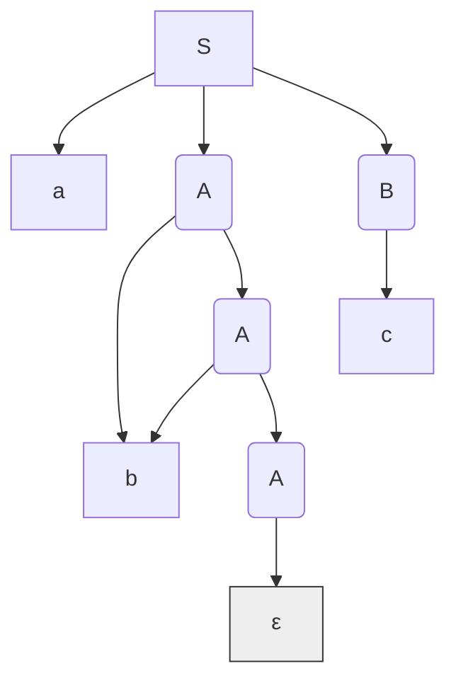

_Back to_ [[IF2224 Teori Bahasa Formal dan Otomata]]

### Soal 6: Derivasi dan Parse Tree CFG

Diberikan Context-Free Grammar (CFG) $G$:

- $V = \{S, A, B\}$  
    
- $T = \{a, b, c\}$  
    
- $P$:
    
    1. $S \to aAB$  
        
    2. $A \to bA \mid \epsilon$  
        
    3. $B \to cB \mid c$  
        
- $S = S$  
    

a. Lakukan Leftmost Derivation untuk menghasilkan string abbc.

b. Lakukan Rightmost Derivation untuk menghasilkan string abbc.

c. Gambarkan Parse Tree untuk string abbc berdasarkan grammar $G$.

**Jawaban:**

a. **Leftmost Derivation (`abbc`):**
$S \Rightarrow_{lm} aAB$
$\Rightarrow_{lm} abAB$ ($A \to bA$)
$\Rightarrow_{lm} abbAB$ ($A \to bA$)
$\Rightarrow_{lm} abb\epsilon B$ ($A \to \epsilon$)
$= abbB$
$\Rightarrow_{lm} abbc$ ($B \to c$)

b. **Rightmost Derivation (`abbc`):**
$S \Rightarrow_{rm} aAB$
$\Rightarrow_{rm} aAc$ ($B \to c$)
$\Rightarrow_{rm} abAc$ ($A \to bA$)
$\Rightarrow_{rm} abbAc$ ($A \to bA$)
$\Rightarrow_{rm} abb\epsilon c$ ($A \to \epsilon$)
$= abbc$

c. Parse Tree (abbc):



### Soal 7: Ambiguitas CFG

Perhatikan CFG berikut untuk ekspresi logika sederhana:

- $E \to E \text{ and } E \mid E \text{ or } E \mid \text{not } E \mid (E) \mid \textbf{true} \mid \textbf{false}$  
    

a. Tunjukkan bahwa grammar ini ambigu dengan memberikan dua Parse Tree yang berbeda untuk string not true or false.

b. Jelaskan secara singkat mengapa ambiguitas ini bisa menjadi masalah dalam konteks compiler.

c. Bagaimana cara umum untuk mengatasi ambiguitas seperti ini (tanpa perlu menulis ulang grammar secara lengkap)?

**Jawaban:**

a. **Dua Parse Tree untuk `not true or false`:**

* **Parse Tree 1: (`(not true) or false`)** `or` dievaluasi terakhir.
  ```mermaid
  graph TD
      E1(E) --> E2(E);
      E1 --> or["or"];
      E1 --> E3(E);
      E2 --> not["not"];
      E2 --> E4(E);
      E4 --> true["true"];
      E3 --> false["false"];
  ```

* **Parse Tree 2: (`not (true or false)`)** `not` dievaluasi terakhir.
  ```mermaid
  graph TD
      E1(E) --> not["not"];
      E1 --> E2(E);
      E2 --> E3(E);
      E2 --> or["or"];
      E2 --> E4(E);
      E3 --> true["true"];
      E4 --> false["false"];
  ```

b. Masalah Ambiguitas: Ambiguitas menyebabkan compiler tidak dapat menentukan makna (semantik) atau urutan evaluasi yang benar dari ekspresi. Dalam contoh ini, hasil evaluasi kedua Parse Tree akan berbeda:

* Tree 1: (not true) or false $\rightarrow$ false or false $\rightarrow$ false

* Tree 2: not (true or false) $\rightarrow$ not (true) $\rightarrow$ false

(Dalam kasus ini kebetulan hasilnya sama, tapi ambil contoh false or true and true akan berbeda hasilnya tergantung precedence). Compiler butuh satu interpretasi struktur yang jelas untuk menghasilkan kode yang benar.

c. Cara Mengatasi: Ambiguitas pada grammar ekspresi umumnya diatasi dengan:

1. Memperkenalkan Level Precedence: Membuat variabel non-terminal yang berbeda untuk setiap tingkat prioritas operator (misal, Factor untuk not, Term untuk and, Expression untuk or).

2. Menentukan Associativity: Menggunakan rekursi (biasanya rekursi kiri untuk operator left-associative seperti and dan or) untuk menentukan bagaimana operator dengan precedence sama dikelompokkan.

### Soal 8: Konsep Compiler (Frontend)

Jelaskan peran dari fase-fase berikut dalam frontend compiler dan sebutkan input serta output utamanya:

a. Lexical Analysis (Scanner)

b. Syntax Analysis (Parser)

**Jawaban:**

a. Lexical Analysis (Scanner):

* Peran: Membaca aliran karakter kode sumber, mengelompokkannya menjadi unit leksikal bermakna (token), menghapus whitespace dan komentar, memasukkan identifier ke tabel simbol, melaporkan error leksikal.

* Input: Urutan karakter kode sumber.

* Output: Urutan token.

b. Syntax Analysis (Parser):

* Peran: Memeriksa apakah urutan token dari scanner sesuai dengan aturan tata bahasa (grammar) bahasa sumber, membangun representasi struktur sintaksis (biasanya Parse Tree atau Abstract Syntax Tree - AST), melaporkan error sintaksis.

* Input: Urutan token dari scanner.

* Output: Parse Tree atau AST.

### Soal 9: Scanner vs Parser

Perhatikan potongan kode C berikut:

float average = sum / count ;

a. Identifikasi semua token yang akan dihasilkan oleh Scanner dari baris kode ini. Klasifikasikan tiap token (Keyword, Identifier, Operator, Number, Delimiter).

b. Jelaskan secara singkat apa yang akan dilakukan oleh Parser setelah menerima token-token tersebut. Apa yang akan diverifikasi oleh Parser?

**Jawaban:**

a. Token yang Dihasilkan Scanner:

* float : KEYWORD

* average: IDENTIFIER

* = : OPERATOR (Assignment)

* sum : IDENTIFIER

* / : OPERATOR (Division)

* count : IDENTIFIER

* ; : DELIMITER (Semicolon)

(Whitespace diabaikan)

b. Tugas Parser:

Setelah menerima token: KEYWORD(float), IDENTIFIER(average), OPERATOR(=), IDENTIFIER(sum), OPERATOR(/), IDENTIFIER(count), DELIMITIFIER(;)

Parser akan:

1. Memverifikasi Struktur: Memeriksa apakah urutan token ini valid sesuai grammar C untuk sebuah deklarasi-dengan-inisialisasi atau statement assignment. Misalnya, apakah format Tipe Identifier = Ekspresi ; terpenuhi.

2. Membangun Struktur Hirarkis: Membangun Parse Tree (atau AST) yang merepresentasikan struktur ini. Pohon tersebut akan menunjukkan bahwa = adalah operasi utama, dengan average di kiri dan ekspresi sum / count di kanan. Ekspresi sum / count sendiri akan memiliki / sebagai operator dengan sum dan count sebagai operand.

3. Melaporkan Error (jika ada): Jika urutannya salah (misal, titik koma hilang), parser akan melaporkan syntax error. Parser tidak memeriksa apakah sum atau count sudah dideklarasikan atau tipe datanya cocok (itu tugas Analisis Semantik).