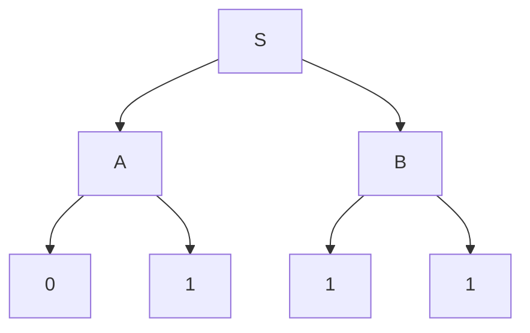
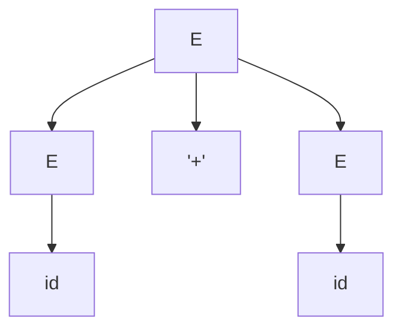
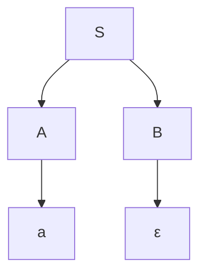
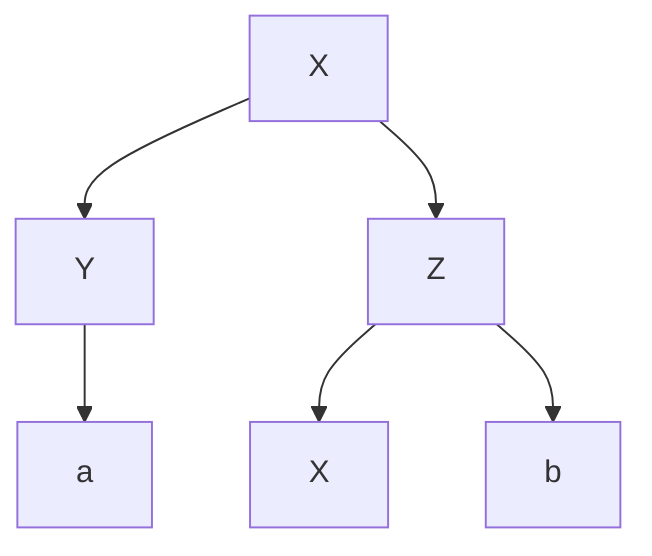
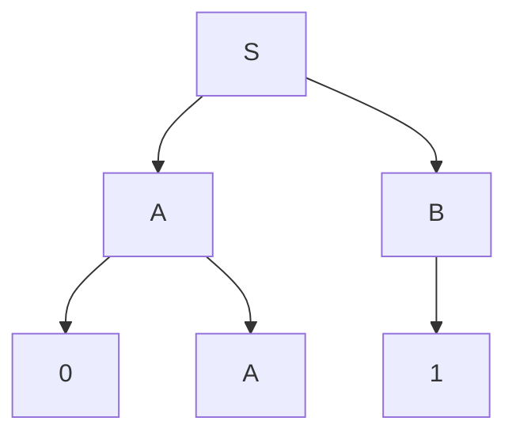
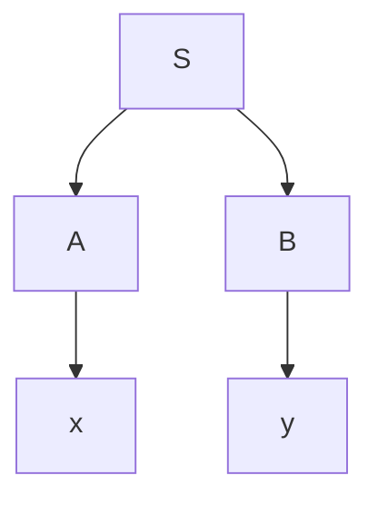
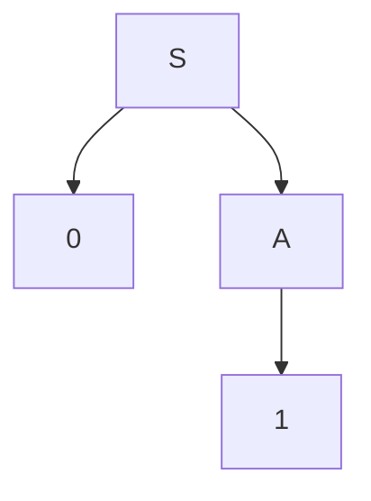

_Back to_ [[Soal Latihan UAS TBFO]]
# Problem Set Paket B: Visualisasi & Studi Kasus CFG

Mata Kuliah: Teori Bahasa Formal dan Otomata

Topik: Visualisasi Parse Tree, Tracing, dan Pembuktian

Fokus: Modeling, Reading Trees, & Ambiguity Analysis

Total Soal: 30 Soal

## Petunjuk Pengerjaan

1. **Format:** Pilihan Ganda Majemuk (Jawaban benar bisa lebih dari satu).
    
2. **Diagram:** Beberapa soal menggunakan diagram pohon (Mermaid). Perhatikan struktur _Parent-Child_ dengan teliti.
    
3. **Tujuan:** Menguji kemampuan membaca struktur pohon, memvalidasi langkah derivasi, dan menganalisis ambiguitas.
    

## BAGIAN I: Visualisasi Pohon & Yield (10 Soal)

**Fokus:** Membaca struktur pohon, menentukan Yield, dan validitas node.

**1. Perhatikan Parse Tree berikut untuk Grammar** $G$**:**

Manakah pernyataan yang BENAR mengenai pohon di atas?

- [x] a.Akar (Root) dari pohon adalah $S$.

- [x] b.Yield dari pohon ini adalah string "0111".

- [x] c.Terdapat aturan produksi $A \to 01$ dalam grammar $G$.

- [x] d.Pohon ini memiliki kedalaman (height) 2 (jika akar = level 0).

- [x] e.Simpul $A$ dan $B$ adalah sibling (saudara).

**2. Diberikan Parse Tree dengan struktur sebagai berikut:**

Interpretasi yang tepat untuk pohon ini adalah:

- [x] a.Pohon ini merepresentasikan ekspresi id + id.

- [x] b.Aturan produksi yang digunakan di akar adalah $E \to E + E$.

- [ ] c.Simbol + adalah sebuah Variabel.

- [x] d.Simbol id adalah Terminal (daun).

- [ ] e.Ini adalah contoh derivasi Rightmost saja.

**3. Tinjau pohon penurunan yang mengandung** $\epsilon$ **(epsilon):**

Analisis manakah yang BENAR?

- [x] a.Grammar pasti memiliki aturan $B \to \epsilon$.

- [x] b.Yield dari pohon ini adalah "a".

- [ ] c.Yield dari pohon ini adalah "aε".

- [x] d.Simpul $B$ adalah nullable variable.

- [ ] e.Pohon ini tidak valid karena memiliki daun kosong.

4. Jika sebuah Parse Tree memiliki 5 simpul daun (leaves) yang semuanya terminal, maka:

- [x] a.Panjang string hasil (Yield) adalah 5 karakter.

- [ ] b.Tinggi pohon pasti 5.

- [ ] c.Jumlah langkah derivasi minimal adalah 1.

- [x] d.Pohon tersebut merepresentasikan sebuah kalimat valid dalam bahasa.

- [x] e.Tidak mungkin ada simpul daun yang berlabel $\epsilon$.

**5. Perhatikan potongan sub-pohon berikut:**

Apa yang bisa disimpulkan mengenai Grammar yang menghasilkannya?

- [x] a.Grammar bersifat rekursif ($X$ memanggil $Z$, $Z$ memanggil $X$).

- [x] b.Aturan produksi yang terlibat adalah $X \to YZ$ dan $Z \to Xb$.

- [x] c.$Y$ pasti variabel yang menurunkan terminal a.

- [ ] d.Grammar ini pasti ambigu.

- [ ] e.Sub-pohon ini merepresentasikan string "axb" (jika $X$ belum diturunkan).

6. Manakah dari diagram berikut yang merepresentasikan aturan $A \to ( A )$?

- [x] a.Akar $A$ memiliki 3 anak: (, A, ).

- [ ] b.Akar $A$ memiliki 1 anak: (A).

- [x] c.Simbol kurung ( dan ) adalah daun (terminal).

- [x] d.Simpul $A$ di tengah adalah internal node.

- [ ] e.Yield-nya adalah string kosong.

7. Mengenai hubungan antara Tinggi Pohon dan Panjang Derivasi:

- [x] a.Semakin tinggi pohon, umumnya semakin banyak langkah derivasinya.

- [x] b.Pohon dengan tinggi 1 (Root langsung ke Terminal) merepresentasikan aturan $S \to w$.

- [ ] c.Tinggi pohon selalu sama dengan panjang string input.

- [x] d.Jumlah internal node sama dengan jumlah langkah substitusi variabel.

- [ ] e.Pohon yang sangat lebar tapi pendek (misal $S \to a_1 a_2 ... a_{100}$) memiliki 1 langkah derivasi.

8. Dalam memvisualisasikan Ambiguous Grammar untuk string id + id * id, kita akan menemukan:

- [x] a.Dua pohon dengan bentuk struktur yang berbeda.

- [ ] b.Dua pohon dengan Yield yang sama persis.

- [x] c.Salah satu pohon mengelompokkan id + id lebih dulu (di bawah).

- [x] d.Salah satu pohon mengelompokkan id * id lebih dulu (di bawah).

- [ ] e.Simpul akar (Root) yang berbeda untuk setiap pohon.

**9. Diberikan pohon:**

Validasi Yield dan Aturan:

- [ ] a.Yield adalah "001".

- [x] b.Yield adalah "0A1".

- [ ] c.Aturan yang dipakai: $S \to AB$, $A \to 0A$, $A \to 0$, $B \to 1$.

- [ ] d.Ada kesalahan struktur, $A$ tidak bisa punya anak $A$ lagi.

- [x] e.Pohon ini belum selesai (partial tree)

10. Visualisasi "Yield" dilakukan dengan cara:

- [ ] a.Traversal Pre-order pada pohon.

- [x] b.Membaca hanya simpul daun (leaves).

- [x] c.Membaca dari kiri ke kanan.

- [x] d.Mengabaikan simpul internal.

- [ ] e.Menyambungkan semua label simpul menjadi satu string.

## BAGIAN II: Studi Kasus Derivasi & Tracing (10 Soal)

**Fokus:** Menelusuri langkah derivasi dan mencocokkannya dengan pohon.

11. Diberikan Grammar: $S \to aSb \mid \epsilon$. Kita ingin memodelkan string "aabb". Manakah langkah yang benar?

- [x] a.Kita butuh Parse Tree dengan tinggi minimal 3.

- [x] b.Root $S$ akan punya anak $a, S, b$.

- [x] c.Anak $S$ yang di tengah akan menurunkan $a, S, b$ lagi.

- [x] d.$S$ terakhir akan menurunkan $\epsilon$.

- [x] e.Derivasi: $S \Rightarrow aSb \Rightarrow aaSbb \Rightarrow aabb$.

12. Studi Kasus "Palindrom": $P \to 0P0 \mid 1P1 \mid \epsilon$.

Jika kita menggambar Parse Tree untuk string "0110", maka:

- [x] a.Simpul akar $P$ memiliki anak $0, P, 0$.

- [ ] b.Simpul $P$ di level 2 memiliki anak $1, P, 1$.

- [x] c.Simpul $P$ di level 3 adalah daun dengan label $\epsilon$.

- [ ] d.Total ada 3 simpul internal berlabel $P$.

- [ ] e.String ini tidak bisa dibentuk oleh grammar tersebut.

**13. Tracing Leftmost Derivation untuk pohon berikut:**

- [x] a.Langkah 1: $S \to AB$.
- [x] b.Langkah 2: Ganti $A$ dengan $x$ ($S \Rightarrow xB$).
- [x] c.Langkah 3: Ganti $B$ dengan $y$ ($S \Rightarrow xy$).
- [ ] d.Langkah 2 harusnya mengganti $B$ dulu ($S \Rightarrow Ay$) jika ini Leftmost.
- [x] e.Urutan penggantian variabel di pohon tidak mempengaruhi struktur pohon akhir.

**14. Analisis Kesalahan (Error Analysis). Jika Grammar** $S \to A0$**,** $A \to 1A \mid \epsilon$**, tapi mahasiswa menggambar pohon:**

Apa kesalahan pada pohon tersebut?

- [x] a.Variabel $A$ menurunkan 1 padahal aturannya $A \to 1A$.

- [x] b.Seharusnya $A$ punya dua anak: 1 dan A.

- [x] c.Pohon tersebut menghasilkan string "10".

- [ ] d.Pohon tersebut valid untuk derivasi parsial.

- [ ] e.$S$ tidak boleh punya anak 0.

15. Diberikan Sentential Form: a A b  b.Langkah derivasi selanjutnya yang valid dalam Leftmost Derivation adalah:

- [x] a.Mengganti $A$ dengan body produksinya.

- [ ] b.Mengganti $B$ dengan body produksinya.

- [ ] c.Mengganti $a$ dengan variabel lain.

- [x] d.Memilih variabel paling kiri (yaitu $A$).

- [ ] e.Bebas memilih $A$ atau $B$.

16. Studi Kasus Ekspresi Matematika: $E \to E + T \mid T$.

String input: x + y + z. Bagaimana bentuk pohonnya agar asosiatif kiri (left-associative)?

- [x] a.Pohon tumbuh ke kiri (deep on the left).

- [x] b.Akar $E$ punya anak $E, +, T$.

- [x] c.Anak $E$ sebelah kiri akan memecah lagi menjadi $E, +, T$ (untuk x+y).

- [x] d.Anak $T$ sebelah kanan langsung membungkus z.

- [ ] e.Pohon tumbuh ke kanan ($E \to T + E$).

17. Konsep "Sub-tree" dalam Derivasi:

- [x] a.Setiap variabel dalam sentential form adalah akar dari sebuah sub-tree potensial.

- [x] b.Jika $S \Rightarrow^* \alpha A \beta$, maka $A$ akan menjadi akar sub-tree di tengah.

- [ ] c.Mengganti sub-tree $A$ dengan sub-tree lain akan mengubah yield string.

- [x] d.Sub-tree yang akarnya Terminal tidak memiliki anak.

- [x] e.Sub-tree merepresentasikan langkah derivasi parsial.

18. Tracing Rightmost untuk $S \to AB$, $A \to a$, $B \to b$.

- [x] a.$S \Rightarrow AB$.

- [x] b.Variabel paling kanan adalah $B$.

- [x] c.Langkah selanjutnya: $AB \Rightarrow Ab$.

- [x] d.Langkah selanjutnya: $Ab \Rightarrow ab$.

- [ ] e.Langkah ini menghasilkan pohon yang berbeda dengan Leftmost.

19. Jika sebuah pohon memiliki Yield "($S$)", manakah aturan yang mungkin menghasilkannya?

- [x] a.$A \to ( S )$.

- [x] b.$S \to ( S )$.

- [ ] c.$A \to ( A )$.

- [ ] d.$S \to \epsilon$.

- [ ] e.$S \to ()$.

20. Validasi Langkah Induksi:

Hipotesis: Sub-pohon dengan tinggi $k$ bisa diderivasi.

Kasus: Pohon dengan tinggi $k+1$ memiliki akar $S$ dan anak $X_1, X_2$.

- [x] a.Kita pecah menjadi derivasi $S \to X_1 X_2$.

- [x] b.Kita terapkan hipotesis pada sub-pohon $X_1$ dan $X_2$.

- [x] c.Kita gabungkan hasil derivasi $X_1$ lalu $X_2$.

- [x] d.Ini membuktikan bahwa pohon tinggi $k+1$ juga memiliki derivasi valid.

- [ ] e.Induksi gagal jika $X_1$ adalah terminal.

---

## BAGIAN III: Ekuivalensi & Bukti (10 Soal)

**Fokus:** Logika pembuktian antara Pohon, Derivasi, dan Grammar.

21. Pernyataan Ekuivalensi:

"Ada Parse Tree untuk $w$" $\iff$ "Ada Derivasi $S \Rightarrow^ w$".*

Implikasi dari pernyataan ini adalah:

- [x] a.Kita bisa menggunakan Parse Tree untuk membuktikan keanggotaan string.

- [x] b.Kita bisa menggunakan Derivasi untuk membuktikan keanggotaan string.

- [ ] c.Jika kita tidak bisa membuat pohon, maka string pasti tidak valid (asumsi kita jago gambar).

- [x] d.Compiler boleh memilih salah satu representasi internal.

- [ ] e.Jumlah simpul pohon sama dengan jumlah langkah derivasi.

22. Dalam pembuktian "Derivasi $\to$ Parse Tree", kita menggunakan induksi pada:

- [ ] a.Panjang string input ($|w|$).

- [ ] b.Jumlah langkah derivasi ($n$).

- [ ] c.Jumlah variabel dalam grammar.

- [ ] d.Tinggi pohon.

- [ ] e.Jumlah terminal.

23. Studi Kasus Ambiguitas & Ekuivalensi:

Jika $S \Rightarrow_{lm} w$ memiliki dua jalur berbeda, maka:

- [ ] a.Pasti ada dua Parse Tree berbeda untuk $w$.

- [ ] b.Pasti ada dua Rightmost Derivation berbeda untuk $w$.

- [ ] c.Grammar tersebut ambigu.

- [ ] d.Bahasa tersebut pasti ambigu inheren (inherently ambiguous).

- [ ] e.$w$ memiliki makna ganda.

24. Hubungan antara "Derivasi Terkiri" dan "Pre-order Traversal" pohon:

- [ ] a.Urutan variabel yang diekspansi dalam Leftmost Derivation sesuai dengan urutan variabel yang ditemui dalam Pre-order traversal pohon (depth-first, left-to-right).

- [ ] b.Pre-order traversal hanya mengunjungi daun.

- [ ] c.Keduanya mengunjungi simbol paling kiri terlebih dahulu.

- [ ] d.Tidak ada hubungan sama sekali.

- [ ] e.Derivasi Terkiri lebih mirip Post-order.

25. Mengapa pembuktian Ekuivalensi penting untuk algoritma Parsing?

- [ ] a.Menjamin bahwa jika algoritma (misal CYK) menemukan $w \in L(G)$, maka pasti ada pohon struktur yang valid.

- [ ] b.Memastikan bahwa output parser (Pohon) benar-benar merepresentasikan aturan Grammar.

- [ ] c.Agar kita bisa mengubah parser Top-Down menjadi Bottom-Up tanpa masalah teoritis.

- [ ] d.Karena komputer hanya mengerti angka biner.

- [ ] e.Untuk memvalidasi optimasi kode.

26. Jika $A \to B$ (Unit Production) ada dalam grammar, bagaimana visualisasinya di pohon?

- [ ] a.Simpul $A$ punya anak tunggal $B$.

- [ ] b.Simpul $B$ punya anak tunggal $A$.

- [ ] c.Simpul $A$ dan $B$ bergabung jadi satu node.

- [ ] d.Jalur pohon menjadi lebih panjang (bertambah tingginya).

- [ ] e.Ini menyebabkan siklus (cycle) di pohon.

27. Diberikan derivasi: $S \Rightarrow AB \Rightarrow aB \Rightarrow ab$.

Konstruksi pohonnya adalah:

- [ ] a.Buat Root $S$.

- [ ] b.Buat anak $A$ dan $B$ dari $S$.

- [ ] c.Dari $A$, buat anak $a$.

- [ ] d.Dari $B$, buat anak $b$.

- [ ] e.Hubungkan $a$ langsung ke $b$.

28. "Reversibility" (Keterbalikan):

Bisakah kita mengubah Rightmost Derivation menjadi Parse Tree, lalu mengubahnya menjadi Leftmost Derivation?

- [x] a.Bisa, karena Parse Tree adalah representasi netral (tidak peduli urutan waktu).

- [ ] b.Tidak, karena informasi urutan hilang.

- [x] c.Bisa, dan hasilnya pasti unik (untuk grammar unambiguous).

- [x] d.Bisa, tapi hasilnya mungkin berbeda jika grammar ambigu.

- [ ] e.Ini adalah cara standar untuk mengkonversi antar jenis derivasi.

29. Sebuah "Forest" (Hutan) dalam konteks parsing:

- [ ] a.Kumpulan Parse Tree parsial yang belum tersambung ke Root tunggal.

- [ ] b.Kondisi saat parsing belum selesai.

- [ ] c.Representasi untuk grammar ambigu (parse forest).

- [ ] d.Himpunan semua variabel.

- [ ] e.Istilah lain untuk Chomsky Normal Form.

30. Inferensi Rekursif vs Parse Tree:

- [ ] a.Inferensi Rekursif membangun validitas dari Daun ke Akar (Bottom-up logic).

- [ ] b.Parse Tree memvisualisasikan struktur dari Akar ke Daun (Top-down visual).

- [ ] c.Keduanya membuktikan hal yang sama.

- [ ] d.Inferensi rekursif tidak bisa menangani rekursi.

- [ ] e.Parse Tree lebih intuitif bagi manusia.

---

## Kunci Jawaban (Paket B)

**Bagian I**

1. **a, b, c, d, e** ($S$ root, $A\to01$ salah harusnya $0,1$ terpisah anak, yield $0111$, $A,B$ anak $S$)
    
2. **a, b, d** (Struktur `E+E`, `id` daun)
    
3. **a, b, d** (B epsilon, yield "a" karena $\epsilon$ kosong)
    
4. **a, d** (Panjang string 5, valid kalimat)
    
5. **a, b, c** (Rekursif $X-Z-X$, aturan $X\to YZ$, $Y\to a$)
    
6. **a, c, d** (Anak 3: `(`, `A`, `)`, kurung terminal)
    
7. **a, b, d** (Tinggi $\approx$ langkah, internal node = substitusi)
    
8. **a, b, c, d** (Struktur beda, yield sama, grouping beda)
    
9. **b** (Yield baca daun kiri-kanan: $0, A_1, 1$ -> $0A1$) -> _Note: Jika $A_1$ dianggap belum selesai_
    
10. **b, c, d** (Baca daun, kiri-kanan, internal skip)
    

Bagian II

11. a, b, c, d, e (Semua langkah benar untuk $S \to aSb \to aaSbb \to aabb$)

12. a, c, d ($P-0P0$, lalu $P-\epsilon$, total 3 P vertikal, daun $\epsilon$)

13. a, b, c, e (Langkah valid Leftmost, urutan pohon statis)

14. a, b (Aturan $A \to 1A$ harusnya 2 anak, di gambar cuma 1 anak 1)

15. a, d (Leftmost wajib variabel terkiri $A$)

16. a, b, c, d (Asosiatif kiri = tumbuh ke kiri/bawah kiri)

17. a, b, d, e (Definisi sub-tree dan derivasi parsial)

18. a, b, c, d (Langkah valid Rightmost)

19. a, b (Bisa dari $A$ atau $S$ asalkan bentuknya $(S)$ atau $(A)$ di body)

20. a, b, c, d (Logika induksi struktur pohon)

Bagian III

21. a, b, d (Ekuivalensi bukti, compiler internal)

22. b, d (Induksi langkah atau tinggi pohon)

23. a, b, c, e (Definisi ambiguitas)

24. a, c (Pre-order visit root-left-right $\approx$ expand parent-left child)

25. a, b, c (Validasi algoritma, fleksibilitas parser)

26. a, d (Anak tunggal, menambah tinggi tanpa nambah lebar)

27. a, b, c, d (Langkah konstruksi pohon standar)

28. a, c, d, e (Pohon adalah perantara konversi yang valid)

29. a, b, c (Definisi Forest dalam parsing)

30. a, b, c, e (Perbandingan sudut pandang pembuktian)