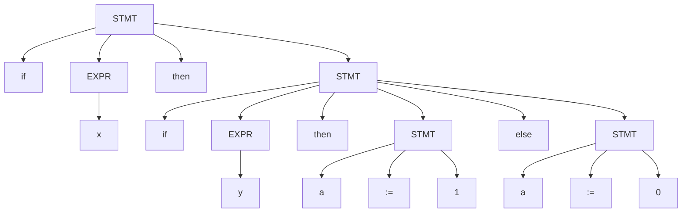

_Back to_ [[Soal Latihan UAS TBFO]]

# Problem Set Paket C: Studi Kasus Advanced Control Structures

Mata Kuliah: Teori Bahasa Formal dan Otomata / Teknik Kompilasi

Topik: Context-Free Grammar pada Konstruksi Bahasa Pemrograman

Fokus: Recursive Descent Parsing, Ambiguity, & Control Flow Analysis

Total Soal: 5 Soal (Berbasis Kasus Tunggal)

## Deskripsi Kasus: The "Dangling Else" Problem

Kita memiliki sebuah Grammar $G$ yang mendefinisikan struktur percabangan (`IF-THEN-ELSE`) dan assignment sederhan- [ ] a.

**Aturan Produksi (Grammar Rules):**

1. `STMT` $\to$ `if` `EXPR` `then` `STMT`
    
2. `STMT` $\to$ `if` `EXPR` `then` `STMT` `else` `STMT`
    
3. `STMT` $\to$ `id` `:=` `num`
    
4. `EXPR` $\to$ `var`
    

Skenario:

Seorang compiler designer sedang menganalisis string input berikut:

if x then if y then a := 1 else a := 0

Berikut adalah **Parse Tree (Pohon T)** yang dihasilkan oleh parser untuk string tersebut:

## Pertanyaan Studi Kasus

1. Analisis Struktur Pohon & Grammar:

Berdasarkan pohon $T$ di atas, manakah pernyataan yang BENAR mengenai aturan produksi yang diterapkan pada simpul-simpulnya?

- [ ] a. Simpul akar (Root) menggunakan aturan produksi nomor 2 (if-then-else).

- [x] b. Simpul akar (Root) menggunakan aturan produksi nomor 1 (if-then).

- [x] c. Simpul StmtInner menggunakan aturan produksi nomor 2 (if-then-else).

- [ ] d. Pohon ini menunjukkan bahwa klausa else terikat (bind) dengan if yang paling luar (if x).

- [x] e. Pohon ini menunjukkan bahwa klausa else terikat dengan if yang paling dalam (if y).

2. Interpretasi Logika Program (Semantik):

Jika kode ini dijalankan, bagaimanakah alur eksekusinya berdasarkan struktur pohon di atas?

- [ ] a. Jika x bernilai false, maka a := 0 akan dieksekusi.

- [x] b. Jika x bernilai true DAN y bernilai false, maka a := 0 akan dieksekusi.

- [x] c. Perintah a := 0 adalah bagian dari blok Else milik if y.

- [ ] d. Perintah a := 0 adalah bagian dari blok Else milik if x.

- [x] e. Struktur pohon ini merepresentasikan logika: "Jika x benar, maka cek y. Jika y salah, set a=0".

3. Implementasi Recursive Descent Parser:

Jika kita memodelkan parser kode ini menggunakan fungsi rekursif parseStmt(), manakah langkah-langkah yang tercermin dari pohon ini?

- [x] a. Fungsi parseStmt dipanggil pertama kali untuk Root. Ia mencocokkan token if, memanggil parseExpr, mencocokkan then, lalu memanggil parseStmt lagi (untuk StmtInner).

- [x] b. Saat parseStmt dipanggil untuk StmtInner, ia mendeteksi keberadaan token else setelah body then selesai.

- [ ] c. Fungsi parseStmt untuk Root mendeteksi token else sehingga ia memilih jalur produksi if-then-else.

- [x] d. Pohon ini menggambarkan strategi Greedy Binding atau Nearest Neighbor, di mana else dipasangkan dengan if terdekat yang belum punya pasangan.

- [ ] e. Parser harus melakukan backtracking dari StmtAssign2 ke Root.

4. Analisis Ambiguitas (Alternate Parse Tree):

Grammar di atas terkenal ambigu (Dangling Else Ambiguity). Jika kita menggambar pohon alternatif (Pohon $T_2$) untuk string yang sama, manakah karakteristik yang akan muncul?

- [x] a. Pada Pohon $T_2$, Simpul Akar (Root) akan menggunakan aturan produksi nomor 2 (if-then-else).

- [x] b. Pada Pohon $T_2$, StmtInner (anak dari Root) akan menggunakan aturan nomor 1 (if-then).

- [x] c. Pada Pohon $T_2$, klausa else akan menjadi anak langsung dari Root.

- [ ] d. Pohon $T_2$ akan memiliki Yield string yang berbeda dengan Pohon $T$.

- [x] e. Pohon $T_2$ merepresentasikan logika: "Jika x salah, maka set a=0".

5. Tracing Leftmost Derivation:

Manakah langkah-langkah awal derivasi terkiri yang sesuai dengan struktur Pohon $T$ di atas?

- [x] a. STMT $\Rightarrow$ if EXPR then STMT

- [ ] b. STMT $\Rightarrow$ if EXPR then STMT else STMT

- [x] c. ... $\Rightarrow$ if x then STMT $\Rightarrow$ if x then if EXPR then STMT else STMT

- [ ] d. ... $\Rightarrow$ if x then STMT $\Rightarrow$ if x then if EXPR then STMT

- [ ] e. Derivasi ini membuktikan bahwa else adalah bagian dari ekspansi variabel STMT yang kedua (kanan).

## Kunci Jawaban & Pembahasan

**1. Jawaban: b, c, e**

- **Analisis:**
    
    - Lihat Root: Anaknya hanya `if`, `EXPR`, `then`, `STMT`. Tidak ada cabang `else` yang keluar langsung dari Root. Jadi Root pakai aturan 1 (`if-then`). (Opsi b Benar, a Salah).
        
    - Lihat StmtInner: Anaknya lengkap `if`, `EXPR`, `then`, `STMT`, `else`, `STMT`. Jadi dia pakai aturan 2. (Opsi c Benar).
        
    - Secara visual, `else` menempel pada `if` kedua (inner/`if y`). (Opsi e Benar).
        

**2. Jawaban: b, c, e**

- **Analisis:**
    
    - Karena `else` milik `if y`, maka `a:=0` hanya jalan kalau `if y` dievaluasi (artinya `x` harus true dulu) TAPI `y` ternyata fals- [ ] e. (Opsi b & c Benar).
        
    - Jika `x` false, program langsung selesai (keluar dari Root), tidak kena `else`. (Opsi a Salah).
        
    - Opsi e adalah rangkuman logika yang benar dari pohon ini.
        

**3. Jawaban: a, b, d**

- **Analisis:**
    
    - Ini adalah simulasi cara kerja parser. Root memanggil fungsi untuk anak-anakny- [ ] a. Karena Root tidak punya `else` di levelnya, dia memanggil `parseStmt` untuk anak (inner).
        
    - Di dalam `StmtInner`, parser melihat ada `else`, jadi dia lanjut parsing cabang els- [ ] e.
        
    - Konsep "Else nempel ke If terdekat" disebut _Nearest Neighbor_ atau _Close Binding_, yang merupakan standar di C/Java/Pascal untuk menangani ambiguitas ini.
        

**4. Jawaban: a, b, c, e**

- **Analisis:**
    
    - Pohon Alternatif ($T_2$) adalah interpretasi di mana `else` milik `if x` (Outer).
        
    - Maka Root harus punya cabang `else` $\to$ Aturan 2. (Opsi a & c Benar).
        
    - `StmtInner` (anak Root di cabang then) tidak punya `else` lagi $\to$ Aturan 1. (Opsi b Benar).
        
    - Logikanya berubah drastis: Jika `x` false, masuk `else` (`a:=0`). (Opsi e Benar).
        
    - Yield (string input) tetap sama, hanya strukturnya bed- [ ] a. (Opsi d Salah).
        

**5. Jawaban: a, c**

- **Analisis:**
    
    - Langkah 1: Harus sesuai Root. Root pakai `if-then` (tanpa else). Jadi $\Rightarrow$ `if EXPR then STMT`. (Opsi a Benar).
        
    - Langkah selanjutnya: Ganti `EXPR` jadi `x`. Lalu ganti `STMT` (yang inner) menjadi bentuk `if-then-else`. (Opsi c Benar).