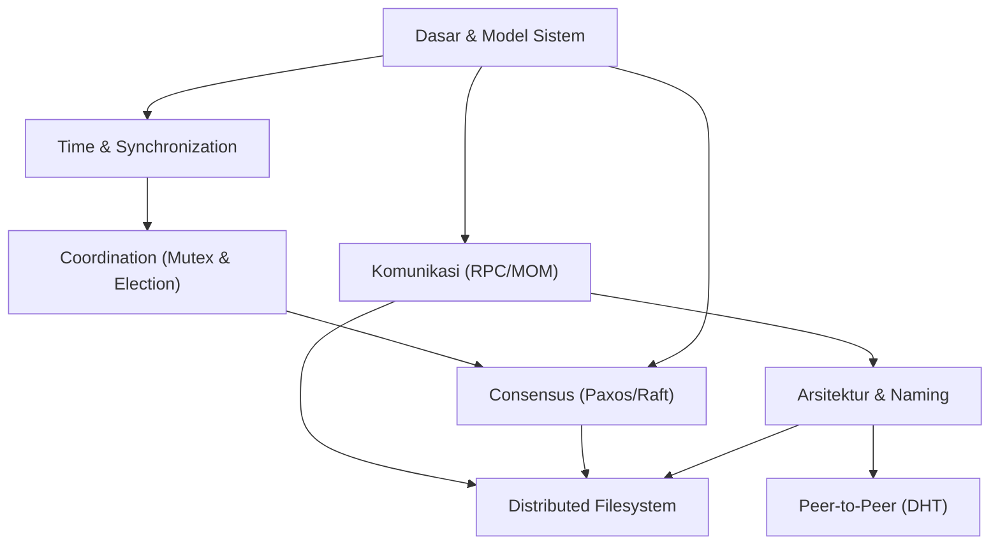

# Rencana Mengajar Tuto Sebaya: Sistem Terdistribusi (2 Jam)

## 1. Diagram Dependensi Materi

## 2. Jadwal & Strategi Whiteboard (120 Menit)

### **SESI 1: FONDASI & KOMUNIKASI (30 Menit)**

#### **1. Dasar & Model (10 Menit)**

- **Subtopik:** Definisi, 8 Fallacies, Model (Sync/Async), Failure (Crash/Byzantine).
    
- **Whiteboard Action:**
    
    - Gambar 2 komputer dihubungkan garis bergelombang (Network).
        
    - Tulis di garis itu: _"Latency > 0", "Packet Loss", "Unsecure"_.
        
    - Buat tabel kecil: **Sync** (Ada batas waktu/timeout pasti) vs **Async** (Timeout = Crash ATAU Lambat? Tidak tahu).
        

#### **2. Clock Synchronization (10 Menit)**

- **Subtopik:** Physical (NTP), Logical (Lamport, Vector).
    
- **Whiteboard Action:**
    
    - Gambar 2 garis waktu vertikal (Process A & B).
        
    - Gambar pesan miring dari A ke B.
        
    - Tunjukkan kalau `Jam B < Jam A` saat pesan sampai = **Mustahil**.
        
    - Tulis rumus Lamport: `Lc = max(La, Lb) + 1`.
        

#### **3. Komunikasi & RPC (10 Menit)**

- **Subtopik:** RPC, Stub, Marshaling, MOM.
    
- **Whiteboard Action:**
    
    - Gambar kotak **Client** dan **Server**.
        
    - Gambar kotak kecil di dalam Client bernama **"Stub"**.
        
    - Tunjukkan panah: `Client -> Stub (Marshaling) -> Network -> Stub (Unmarshaling) -> Server`.
        
    - _Kunci:_ Stub membuat remote call terasa seperti local call.
        

### **SESI 2: STRUKTUR & ORGANISASI (25 Menit)**

#### **4. Arsitektur & Pola (10 Menit)**

- **Subtopik:** Layered, Event-Driven, Service-Based.
    
- **Whiteboard Action:**
    
    - **Event-Driven:** Gambar satu pipa besar (**Event Bus**).
        
    - Gambar komponen yang "melempar" event ke pipa, dan komponen lain "mengambil" event. Tekankan sifat _Decoupled_.
        

#### **5. Desentralisasi & Naming (15 Menit)**

- **Subtopik:** P2P, DHT (Chord), Naming.
    
- **Whiteboard Action:**
    
    - **Chord Ring (Wajib Gambar):** Buat lingkaran dengan angka 0-15 (atau N).
        
    - Tunjukkan node 1 menyimpan data (key) yang > node sebelumnya.
        
    - Gambarkan **Finger Table**: Node 1 tidak tanya ke Node 2, tapi langsung loncat ke Node 4, 8 (Exponential jump). Ini inti efisiensi DHT.
        

### **SESI 3: KOORDINASI & KONSENSUS (40 Menit)**

_(Bagian tersulit, gunakan warna merah untuk menekankan kegagalan)_

#### **6. Mutex & Election (10 Menit)**

- **Subtopik:** Token Ring, Bully Algorithm.
    
- **Whiteboard Action:**
    
    - **Bully:** Gambar Node ID 5 (mati), Node 1, 2, 3, 4 sadar.
        
    - Node 4 bilang "Saya paling tua, saya bos!". Node 3 protes, Node 4 bully balik.
        
    - _Inti:_ ID tertinggi menang.
        

#### **7. Teori Mustahil (5 Menit)**

- **Subtopik:** FLP, CAP Theorem.
    
- **Whiteboard Action:**
    
    - Segitiga **C-A-P**.
        
    - Arsir sisi **P (Partition)**. Bilang: "Di internet, kabel pasti putus. Jadi P itu Wajib."
        
    - Sekarang pilih: Mau data konsisten tapi sistem mati (CP)? Atau sistem nyala tapi data ngaco (AP)?
        

#### **8. Consensus: Paxos & Raft (15 Menit)**

- **Subtopik:** Paxos (Konsep Quorum), Raft (Leader, Log, Term).
    
- **Whiteboard Action:**
    
    - Fokus ke **Raft**. Gambar 3 Node: 1 Leader, 2 Follower.
        
    - Gambar kotak-kotak berderet (**Log**).
        
    - Simulasikan Client kirim data "X=5".
        
    - Leader tulis di Log (belum commit) -> Kirim ke Follower -> Follower Ack -> Leader Commit -> Leader reply Client.
        
    - _Tekankan:_ Butuh **Mayoritas (Quorum)**.
        

#### **9. Fault Tolerance (10 Menit)**

- **Subtopik:** Replikasi, Checkpoint.
    
- **Whiteboard Action:**
    
    - Bedakan **Primary-Backup** (Semua tulis ke Primary, Primary copy ke Backup).
        

### **SESI 4: APLIKASI NYATA (20 Menit)**

#### **10. Distributed Filesystem (20 Menit)**

- **Subtopik:** NFS vs AFS vs GFS.
    
- **Whiteboard Action:**
    
    - Bagi papan jadi 3:
        
        1. **NFS:** Gambar Server & Client. Tulis **"Stateless"**. Jika Server restart, Client tidak perlu tau (tapi request harus lengkap).
            
        2. **AFS:** Gambar Client punya **Cache Disk** besar. Download whole file.
            
        3. **GFS (Google):** Gambar 1 **Master** (Metadata/RAM) dan banyak **Chunkserver** (Data).
            
            - Gambar Client tanya Master "Dimana data X?". Master jawab "Di Chunkserver 1".
                
            - Client langsung lari ke Chunkserver 1 (Bypass Master). Ini rahasia _Scalability_ GFS.
