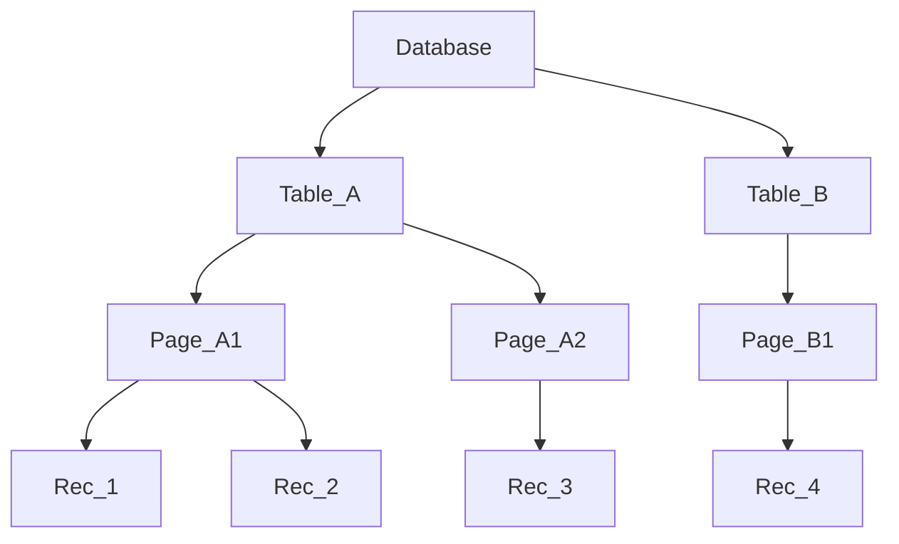

_Back to_ [[Latihan UAS IF3140]]

# Problem Set: Concurrency Control (Paket A)

**Mata Pelajaran:** Sistem Basis Data

**Estimasi Waktu:** 120 Menit

**Total Nilai:** 100 Poin

## Tujuan Pembelajaran

Setelah menyelesaikan problem set ini, mahasiswa diharapkan dapat:

1. Melakukan tracing perolehan kunci (locks) pada protokol Two-Phase Locking (Basic, Strict, dan Rigorous).
    
2. Mengimplementasikan Tree Protocol pada struktur data hirarkis.
    
3. Menganalisis perolehan Intention Locks pada protokol Multiple Granularity.
    
4. Menentukan validitas schedule berdasarkan Timestamp Ordering dan Validation-Based Protocol.
    
5. Mengevaluasi nasib transaksi pada protokol Multiversion dan Snapshot Isolation (First-Committer Wins).
    

## SOAL 1: Two-Phase Locking Protocols (20 Poin)

Diberikan urutan masuk instruksi dari 3 buah transaksi ($T_1, T_2, T_3$) ke DBMS sebagai berikut:

**Schedule S:** $R_1(A); R_2(B); W_1(A); R_3(C); R_1(B); W_3(C); W_2(B); W_1(B); C_1; C_2; C_3;$  

Asumsikan:

- $R_y(X)$ dan $W_y(X)$ adalah operasi read dan write transaksi $T_y$ terhadap data $X$.
    
- DBMS menggunakan _automatic acquisition of locks_.
    
- Tidak ada skema pencegahan deadlock (jika terjadi deadlock, instruksi terhenti).
    

Pertanyaan:

Tuliskan schedule eksekusi lengkap dengan perolehan kunci ($SL_y$: Shared Lock, $XL_y$: Exclusive Lock, $UL_y$: Unlock) untuk protokol berikut:

a. Basic Two-Phase Locking (2PL).

b. Strict Two-Phase Locking (Strict 2PL).

c. Rigorous Two-Phase Locking (Rigorous 2PL).

_Catatan: Tunjukkan pada langkah mana transaksi harus menunggu (WAIT) jika terjadi konflik._

## SOAL 2: Tree Protocol (15 Poin)

Diberikan _partial ordering_ item data dalam struktur pohon sebagai berikut:

i. Prosedur Lock/Unlock:

Tuliskan urutan instruksi $lock-X$ dan $unlock$ yang valid sesuai Tree Protocol untuk transaksi berikut:

- **T4:** Mengubah nilai pada `Rec_1` dan `Rec_3`.
    
- **T5:** Membaca dan mengubah nilai pada `Rec_2` dan `Rec_4`.
    

ii. Analisis Keamanan:

Jelaskan mengapa Tree Protocol menjamin sistem bebas dari deadlock meskipun tidak menggunakan skema pencegahan tambahan (seperti timestamping atau deadlock detection).

## SOAL 3: Multiple Granularity Locking (15 Poin)

Sebuah sistem basis data menggunakan hirarki: Database (DB) -> Tabel (T) -> Blok (B) -> Record (R).

Tabel "Karyawan" terdiri dari 100 blok data. Transaksi $T_6$ ingin melakukan operasi sebagai berikut:

"Membaca seluruh record pada Tabel Karyawan, namun hanya mengubah nilai gaji pada record-record yang berada di Blok 15 dan Blok 50."

Pertanyaan:

i. Sebutkan urutan perolehan lock ($IS, IX, S, X, SIX$) yang diminta oleh $T_6$ dari level tertinggi hingga terendah.

ii. Jika pada saat yang sama transaksi $T_7$ sedang memegang $S-lock$ pada Blok 15, apakah $T_6$ dapat melanjutkan operasinya? Jelaskan menggunakan matriks kompatibilitas lock.

## SOAL 4: Timestamp & Validation Protocols (25 Poin)

Diberikan schedule sebagai berikut:

Schedule S2: $R_1(X); R_2(Y); W_2(X); W_1(Y); C_1; C_2;$

Asumsikan $TS(T_1) = 1$ dan $TS(T_2) = 2$. Sebelum eksekusi, semua $W-TS$ dan $R-TS$ item data adalah 0.

Pertanyaan:

i. Apakah schedule tersebut diizinkan oleh Basic Timestamp Ordering Protocol? Lakukan tracing langkah demi langkah.

ii. Apakah schedule tersebut diizinkan jika menggunakan Thomas' Write Rule? Jelaskan perbedaannya.

iii. Lakukan tracing Validation-Based Protocol untuk schedule tersebut. Tentukan apakah $T_2$ berhasil melewati fase validasi setelah $T_1$ commit.

(Gunakan 3 fase: Read, Validation, Write).

## SOAL 5: Multiversion & Snapshot Isolation (25 Poin)

Diberikan transaksi dan nilai awal data $A=10, B=20$.

- **T8:** $R(A), B = B + A, W(B), Commit$  
    
- **T9:** $R(B), A = A + B, W(A), Commit$  
    

Eksekusi _interleaved_ yang terjadi adalah:

1. $R_8(A)$  
    
2. $R_9(B)$  
    
3. $B = B + A$ (T8)
    
4. $W_8(B)$  
    
5. $A = A + B$ (T9)
    
6. $W_9(A)$  
    
7. $Commit T_8$  
    
8. $Commit T_9$  
    

Pertanyaan:

i. Jika menggunakan Multiversion Timestamp Ordering, tuliskan versi data yang dihasilkan ($A_0, A_9, B_0, B_8$, dst) dan nilai $W-TS$ serta $R-TS$ pada setiap langkah.

ii. Jika menggunakan Snapshot Isolation dengan aturan First-Committer Wins, tentukan apakah $T_9$ berhasil commit. Berikan penjelasan mengenai Write Set dari kedua transaksi tersebut.

> [!ad-libitum]- # Kunci Jawaban & Pembahasan
> 
> ## Bagian 1: 2PL
> 
> **a. Basic 2PL:**
> 
> 1. $SL_1(A), R_1(A)$  
>     
> 2. $SL_2(B), R_2(B)$  
>     
> 3. $XL_1(A), W_1(A)$ (Upgrade)
>     
> 4. $SL_3(C), R_3(C)$  
>     
> 5. $SL_1(B), R_1(B)$ (Boleh karena S-lock kompatibel)
>     
> 6. $XL_3(C), W_3(C)$ (Upgrade)
>     
> 7. $XL_2(B), W_2(B)$ (Upgrade)
>     
> 8. $XL_1(B), W_1(B)$ -> WAIT (Konflik dengan $XL_2(B)$)
>     
>     Keterangan: Pada Basic 2PL, transaksi bisa melepas lock kapan saja setelah lock point, namun di sini $T_1$ tertahan menunggu $T_2$.
>     
> 
> b. Strict 2PL:
> 
> Sama dengan Basic, namun $XL_y(X)$ hanya dilepas setelah Commit. $T_1$ tetap menunggu $T_2$.
> 
> c. Rigorous 2PL:
> 
> Sama dengan Strict, namun seluruh lock (S dan X) ditahan hingga commit.
> 
> ## Bagian 2: Tree Protocol
> 
> **i. Jawaban T4 & T5:**
> 
> - **T4:** $lock-X(DB) \to lock-X(Table\_A) \to lock-X(Page\_A1) \to lock-X(Rec\_1) \to lock-X(Page\_A2) \to lock-X(Rec\_3) \to unlock \dots$  
>     
> - T5: $lock-X(DB) \to lock-X(Table\_A) \to lock-X(Page\_A1) \to lock-X(Rec\_2) \to lock-X(Table\_B) \to lock-X(Page\_B1) \to lock-X(Rec\_4) \dots$
>     
> ii. Pembahasan: Tree protocol menjamin bebas deadlock karena perolehan lock mengikuti urutan parsial (top-down). Tidak mungkin ada siklus tunggu (circular wait) karena arah perolehan lock selalu searah menjauhi root, sehingga siklus dalam Wait-for Graph tidak mungkin terbentuk.
>     
> 
> ## Bagian 3: Multiple Granularity
> 
> **i. Urutan Lock T6:**
> 
> 1. $IS(DB)$  
>     
> 2. $SIX(Tabel\_Karyawan)$ (SIX karena baca semua, update sebagian)
>     
> 3. $IX(Blok\_15), IX(Blok\_50)$  
>     
> 4. $X(Rec\_gaji\_di\_B15), X(Rec\_gaji\_di\_B50)$
>     
>     ii. Analisis: $T_6$ meminta $IX$ pada Blok 15. Karena $T_7$ memegang $S-lock$, maka $T_6$ WAIT. Berdasarkan matriks kompatibilitas, $S$ dan $IX$ tidak kompatibel.
>     
> 
> ## Bagian 4: Timestamp & Validation
> 
> **i. Basic TO:**
> 
> - $R_1(X): TS(1) \ge W-TS(X)=0$ (OK, $R-TS(X)=1$)
>     
> - $R_2(Y): TS(2) \ge W-TS(Y)=0$ (OK, $R-TS(Y)=2$)
>     
> - $W_2(X): TS(2) \ge R-TS(X)=1$ dan $TS(2) \ge W-TS(X)=0$ (OK, $W-TS(X)=2$)
>     
> - $W_1(Y): TS(1) < R-TS(Y)=2$ -> ABORT T1. T1 mencoba menulis data yang sudah dibaca transaksi lebih muda.
>     
> ii. Thomas' Write Rule: Jika $TS(T_i) < W-TS(Q)$, write diabaikan. Namun pada kasus $W_1(Y)$, konfliknya adalah dengan $R-TS(Y)$, maka tetap Abort.
> 
> iii. Validation: $T_1$ divalidasi lebih dulu. $T_2$ divalidasi terhadap $T_1$. Karena $WS(T_1)=\{Y\}$ beririsan dengan $RS(T_2)=\{Y\}$, maka $T_2$ gagal validasi (Kondisi 2 dilanggar).
> 
> 
> ## Bagian 5: MVCC & SI
> 
> i. MVCC:
> 
> Langkah 4 ($W_8(B)$) membuat versi $B_8$ dengan $W-TS=8$. Langkah 6 ($W_9(A)$) membuat versi $A_9$ dengan $W-TS=9$. Semua lolos karena $TS(Ti) \ge R-TS(Q_{old})$.
> 
> ii. Snapshot Isolation:
> 
> - $WS(T_8) = \{B\}$, $WS(T_9) = \{A\}$.
>     
> - Karena $WS(T_8) \cap WS(T_9) = \emptyset$, maka **tidak ada konflik tulis-tulis**.
>     
> - Kedua transaksi **COMMIT SUKSES**. Terjadi anomali _Write Skew_ karena hasil akhir bergantung pada urutan commit tanpa menghiraukan pembacaan data yang dilakukan secara konkuren.
>     

## Tips Pengerjaan untuk Peserta

1. Alokasikan 30 menit untuk Soal 1 karena tracing lock sangat rawan ketidaktelitian.
    
2. Pada Multiple Granularity, selalu mulai dari level Database.
    
3. Ingat: Pada Snapshot Isolation, transaksi membaca data yang sudah dicommit **sebelum** transaksi tersebut dimulai.