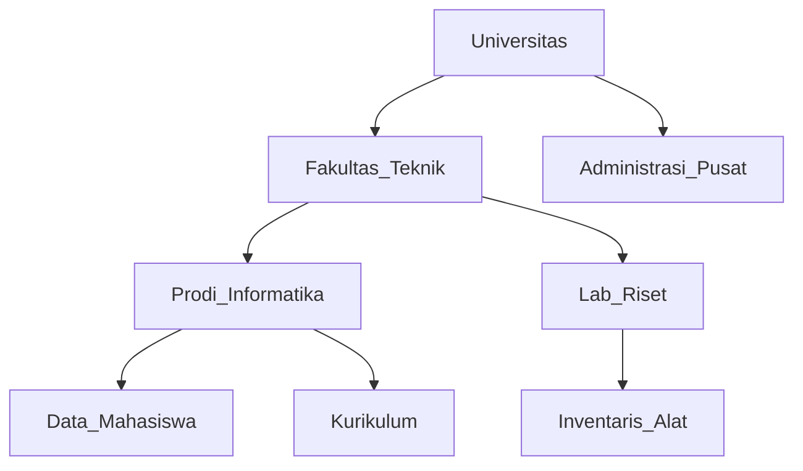

_Back to_ [[Latihan UAS IF3140]]
# Problem Set: Concurrency Control (Paket B)

**Mata Pelajaran:** Sistem Basis Data

**Estimasi Waktu:** 120 Menit

**Total Nilai:** 100 Poin

## Tujuan Pembelajaran

Setelah menyelesaikan paket soal ini, mahasiswa diharapkan dapat:

1. Melakukan tracing perolehan kunci dan manajemen antrian (_Blocking Queue_) pada protokol Two-Phase Locking.
    
2. Menerapkan mekanisme perolehan kunci top-down pada struktur pohon data yang kompleks.
    
3. Menganalisis interaksi kunci niat (_Intention Locks_) pada hirarki data Multiple Granularity.
    
4. Mengevaluasi jadwal transaksi menggunakan Timestamp Ordering dan Thomas' Write Rule.
    
5. Memahami fase eksekusi pada protokol berbasis validasi dan multiversion.
    

## SOAL 1: 2PL & Transaction Manager Logic (25 Poin)

Diberikan urutan kedatangan operasi dari 3 transaksi ($T_1, T_2, T_3$) sebagai berikut:

**Urutan:** $R_1(A); R_2(A); W_3(B); W_1(B); W_2(B); C_1; C_3; C_2;$  

**Aturan Transaction Manager:**

1. Gunakan **Rigorous Two-Phase Locking**.
    
2. Operasi diproses berdasarkan urutan kedatangan.
    
3. Jika transaksi terblokir (menunggu lock), semua operasi berikutnya dari transaksi tersebut masuk ke **Blocking Queue**.
    
4. Saat transaksi yang terblokir aktif kembali, operasi di antriannya mendapat **prioritas utama** sebelum melayani urutan kedatangan baru.
    

Pertanyaan:

Tuliskan schedule eksekusi yang dihasilkan, mencakup perolehan lock ($SL, XL$), pelepasan lock ($UL$), dan status Blocking Queue. Berikan penjelasan untuk setiap langkahnya.

## SOAL 2: Tree Protocol - University System (15 Poin)

Perhatikan struktur data hirarkis berikut yang merepresentasikan data universitas:

i. Prosedur Lock:

Tuliskan urutan instruksi $lock-X$ dan $unlock$ yang valid sesuai Tree Protocol untuk transaksi berikut:

- **T4:** Memperbarui `Kurikulum` dan `Inventaris_Alat`.
    
- **T5:** Membaca data pada `Data_Mahasiswa` dan memperbarui `Inventaris_Alat`.
    

ii. Karakteristik:

Jelaskan perbedaan mendasar antara cara pelepasan kunci (unlock) pada Tree Protocol dibandingkan dengan protokol 2PL standar.

## SOAL 3: Multiple Granularity - E-Commerce (20 Poin)

Hirarki data: Database (DB) -> Store (S) -> Category (C) -> Product (P).

Terdapat Toko "Elektronik-X" yang memiliki kategori "Smartphone". Kategori ini memiliki ribuan produk.

**Skenario:**

1. Transaksi **T6** sedang melakukan _update_ harga pada **seluruh produk** di kategori "Smartphone".
    
2. Transaksi **T7** ingin membaca spesifikasi **satu produk spesifik** (misal: P-001) yang berada di bawah kategori "Smartphone".
    
3. Transaksi **T8** ingin melakukan pengecekan stok pada **seluruh produk** di Toko "Elektronik-X".
    

Pertanyaan:

i. Tentukan jenis kunci ($IS, IX, S, SIX, X$) paling efisien yang harus dimiliki $T_6$ pada level Category dan Product.

ii. Tuliskan daftar perolehan kunci lengkap untuk T7 dan T8.

iii. Berdasarkan matriks kompatibilitas, apakah T7 harus menunggu T6? Bagaimana dengan T8 terhadap T6? Jelaskan.

## SOAL 4: Timestamp Ordering & Thomas' Write Rule (20 Poin)

Diberikan schedule sebagai berikut:

Schedule S: $R_2(X); W_3(X); R_1(Y); W_1(X); W_2(Y); C_2; C_3; C_1;$

Asumsikan $TS(T_1)=1, TS(T_2)=2, TS(T_3)=3$. Nilai awal $R-TS$ dan $W-TS$ adalah 0.

Pertanyaan:

i. Lakukan tracing eksekusi menggunakan Basic Timestamp Ordering. Transaksi mana yang mengalami abort?

ii. Jika sistem menerapkan Thomas' Write Rule, apakah ada perbedaan nasib transaksi? Jelaskan mekanismenya pada operasi $W_1(X)$ jika $W_3(X)$ sudah dilakukan lebih dulu.

## SOAL 5: Validation & Multiversion Schemes (20 Poin)

i. Validation-Based Protocol:

Lakukan tracing untuk schedule: $R_1(A); R_2(B); W_1(B); W_2(A); C_1; C_2;$.

Tentukan apakah $T_2$ lolos fase validasi jika $Validation(T_1) < Validation(T_2)$. Gunakan kriteria irisan Read Set dan Write Set.

ii. Multiversion 2PL:

Jelaskan keuntungan mekanisme pembacaan pada Multiversion 2PL untuk transaksi yang bersifat Read-Only. Mengapa transaksi Read-Only pada protokol ini dijamin tidak akan pernah menunggu lock dari transaksi Update?

> [!ad-libitum]- # Kunci Jawaban & Pembahasan Paket B
> 
> ## Bagian 1: 2PL dengan Blocking Queue
> 
> 1. $SL_1(A); R_1(A)$: $T_1$ dapat S-lock A.
>     
> 2. $SL_2(A); R_2(A)$: $T_2$ dapat S-lock A (kompatibel).
>     
> 3. $XL_3(B); W_3(B)$: $T_3$ dapat X-lock B.
>     
> 4. $W_1(B)$: $T_1$ minta $XL(B)$. Konflik dengan $T_3$. $T_1$ **WAIT**. Antrian $T_1: [W_1(B), C_1]$.
>     
> 5. $W_2(B)$: $T_2$ minta $XL(B)$. Konflik dengan $T_3$. $T_2$ **WAIT**. Antrian $T_2: [W_2(B), C_2]$.
>     
> 6. $C_3$: $T_3$ commit. Semua lock dilepas ($UL_3(B)$).
>     
> 7. **Prioritas Eksekusi**: Karena $T_1$ lebih dulu mengantri untuk B, $T_1$ bangun.
>     
>     - $XL_1(B); W_1(B); C_1; UL_1(A); UL_1(B);$  
>         
> 8. **Pelepasan Lock** $T_1$: Membangunkan $T_2$.
>     
>     - $XL_2(B); W_2(B); C_2; UL_2(A); UL_2(B);$  
>         
> 
> ## Bagian 2: Tree Protocol
> 
> **i. Urutan Lock:**
> 
> - **T4:** $lock-X(UNIV) \to lock-X(FAK) \to lock-X(PRODI) \to lock-X(KUR) \to lock-X(LAB) \to lock-X(ALAT)$.
>     
> - T5: $lock-X(UNIV) \to lock-X(FAK) \to lock-X(PRODI) \to lock-X(MHS) \to lock-X(LAB) \to lock-X(ALAT)$.
>     
>     ii. Pembahasan: Pada 2PL, unlock hanya boleh di fase shrinking. Pada Tree Protocol, unlock bisa dilakukan kapan saja setelah proses pada node tersebut selesai, asal tidak melanggar aturan bahwa node yang sudah di-unlock tidak boleh di-lock kembali.
>     
> 
> ## Bagian 3: Multiple Granularity
> 
> i. T6: Pada level Category butuh $IX$, pada level Product butuh $X$ (untuk setiap produk). Namun, karena mencakup seluruh produk, lebih efisien menggunakan $X$ langsung pada level Category.
> 
> ii. Daftar Lock:
> 
> - **T7:** $IS(DB) \to IS(S) \to IS(C) \to S(P-001)$.
>     
> - T8: $IS(DB) \to S(S\_Elektronik\_X)$.
>     
> iii. Analisis: $T_7$ butuh $IS(C)$, sedangkan $T_6$ memegang $X(C)$. T7 WAIT. $T_8$ butuh $S(S)$, sedangkan $T_6$ punya $IX(S)$ (via ancestor). Berdasarkan matriks, $S$ dan $IX$ konflik, maka T8 WAIT.
>     
> 
> ## Bagian 4: Timestamp Ordering
> 
> **i. Tracing TO:**
> 
> - $R_2(X): OK (R-TS(X)=2)$.
>     
> - $W_3(X): OK (W-TS(X)=3)$.
>     
> - $R_1(Y): OK (R-TS(Y)=1)$.
>     
> - $W_1(X): TS(1) < R-TS(X)=2$. Abort T1.
>     
>     ii. Thomas' Write Rule: Jika $W_1(X)$ datang setelah $W_3(X)$, dan $TS(1) < W-TS(X)=3$, maka operasi $W_1(X)$ cukup diabaikan (ignored) tanpa melakukan abort pada $T_1$, asalkan tidak melanggar $R-TS$. Namun, karena $TS(1) < R-TS(X)=2$, $T_1$ tetap harus Abort.
>     
> 
> ## Bagian 5: Validation & MVCC
> 
> **i. Validation:**
> 
> - $RS(T_1)=\{A\}, WS(T_1)=\{B\}$  
>     
> - $RS(T_2)=\{B\}, WS(T_2)=\{A\}$  
>     
> - Saat $T_2$ validasi: $WS(T_1) \cap RS(T_2) = \{B\}$. Karena ada irisan, $T_2$ melanggar kondisi validasi. T2 Abort.
>     
>     ii. MV-2PL: Karena transaksi Read-Only membaca versi data yang sudah di-commit sebelum transaksi tersebut dimulai. Versi tersebut tidak akan berubah oleh transaksi Update yang sedang berjalan, sehingga tidak perlu meminta lock.
>     

**Tips Strategi:**
- Fokus pada _Blocking Queue_ di Soal 1, karena urutan eksekusi berubah total setelah pelepasan kunci.
 - Pada Soal 3, perhatikan bahwa mengunci level yang terlalu tinggi bisa mematikan konkurensi, tapi level terlalu rendah meningkatkan overhead.