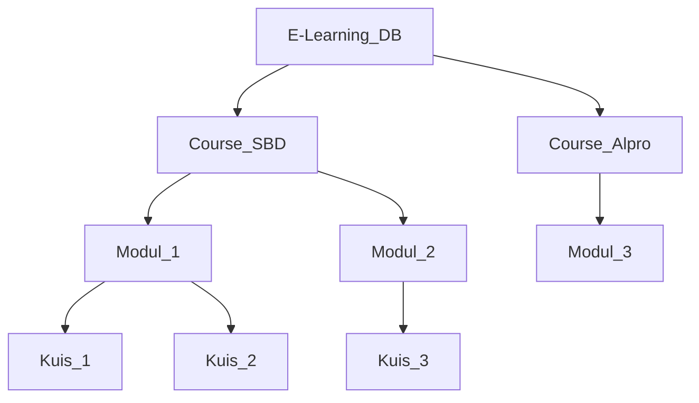

_Back to_ [[Latihan UAS IF3140]]
# Problem Set: Concurrency Control (Paket C - Advanced)

**Mata Pelajaran:** Sistem Basis Data

**Estimasi Waktu:** 120 Menit

**Total Nilai:** 100 Poin

## Petunjuk Umum

- Jawablah soal teori dengan ringkas dan tepat.
    
- Untuk soal studi kasus, sertakan _tracing_ langkah demi langkah.
    
- Gunakan matriks kompatibilitas dan aturan protokol yang sesuai dengan materi pendukung.
    

## SOAL 1: Lock-Based & Compatibility Matrix (20 Poin)

A. Teori: Matriks Kompatibilitas (10 Poin)

Lengkapilah tabel matriks kompatibilitas berikut dengan memberikan tanda (v) jika kompatibel dan (x) jika tidak kompatibel. Berikan satu kalimat penjelasan mengapa kunci SIX memiliki sifat tersebut terhadap IX.

|**Status**|**IS**|**IX**|**S**|**SIX**|**X**|
|---|---|---|---|---|---|
|**IS**||||||
|**IX**||||||
|**S**||||||
|**SIX**||||||
|**X**||||||

_Penjelasan SIX vs IX:_ __________________________________________________________________

B. Studi Kasus: Rigorous 2PL dengan Upgrade Lock (10 Poin)

Diberikan urutan kedatangan instruksi: $R_1(A); R_2(B); R_1(B); W_2(B); W_1(A); C_1; C_2;$.

Gunakan protokol Rigorous 2PL dengan aturan Transaction Manager:

- Transaksi meminta kunci $SL$ saat _read_ dan melakukan **Upgrade** ke $XL$ saat _write_.
    
- Jika terblokir, instruksi masuk _Blocking Queue_. Saat bebas, antrian diprioritaskan.
    

**Pertanyaan:** Tuliskan _schedule_ eksekusi lengkap (Lock, Op, Unlock) dan status _Blocking Queue_.

## SOAL 2: Tree Protocol & Path Analysis (20 Poin)

A. Teori: Isian Terstruktur (5 Poin)

Jelaskan perbedaan kondisi yang menyebabkan sebuah transaksi di-abort pada protokol Tree Protocol dibandingkan dengan Basic 2PL. Jika Tree Protocol tidak mengenal fase shrinking, apakah ia masih menjamin Conflict Serializability? Mengapa?

B. Studi Kasus: E-Learning Hierarchy (15 Poin)

Perhatikan struktur hirarki sistem E-Learning berikut:

Pertanyaan:

i. Transaksi T1 perlu mengubah Kuis_1 dan Kuis_3. Tuliskan urutan $lock-X$ dan $unlock$ yang paling efisien agar T1 tidak mengunci seluruh database terlalu lama.

ii. Transaksi T2 mulai setelah T1 melakukan $lock-X$ pada Course_SBD. T2 ingin membaca Kuis_2. Tunjukkan pada node mana T2 akan tertahan (wait).

## SOAL 3: Multiple Granularity & Lock Escalation (20 Poin)

A. Teori: Analisis Trade-off (5 Poin)

Dalam konteks Multiple Granularity, jelaskan fenomena Lock Escalation. Kapan sebuah DBMS sebaiknya menaikkan granularitas kunci dari level Record ke level Table?

B. Studi Kasus: Operasi Batch vs Point (15 Poin)

Hirarki: DB -> Table -> Page -> Record.

T3: "Menghitung total nilai seluruh mahasiswa pada tabel Nilai (Read All) dan memberikan bonus 5 poin pada record mahasiswa dengan ID = 135."

T4: "Mengubah alamat mahasiswa dengan ID = 140 pada tabel yang sama."

Pertanyaan:

i. Tentukan daftar kunci niat ($IS, IX, SIX, S, X$) untuk T3 agar pengerjaan efisien.

ii. Jika T3 memegang kunci pada level tabel, apakah T4 dapat mengeksekusi operasinya secara paralel? Sertakan alasan berdasarkan jenis kunci yang dipegang.

## SOAL 4: Non-Locking Protocols & Obsolete Writes (20 Poin)

A. Teori: Fase Validation (5 Poin)

Pada Validation-Based Protocol, jelaskan apa yang terjadi jika sebuah transaksi $T_i$ berada pada Validation Phase dan ditemukan bahwa $Finish(T_j) > Start(T_i)$ sementara $WS(T_j) \cap RS(T_i) \neq \emptyset$.

B. Studi Kasus: Thomas' Write Rule Challenge (15 Poin)

Schedule: $R_1(A); R_2(A); W_2(A); W_1(A); C_2; C_1;$.

Asumsikan $TS(T_1) = 10$ dan $TS(T_2) = 20$.

Pertanyaan:

i. Lakukan tracing menggunakan Basic Timestamp Ordering. Manakah transaksi yang gagal?

ii. Lakukan tracing menggunakan Thomas' Write Rule.

## SOAL 5: MVCC & Snapshot Isolation Anomaly (20 Poin)

A. Teori: Write Skew Analysis (5 Poin)

Jelaskan mengapa Snapshot Isolation (SI) yang menggunakan logika First-Committer Wins tidak dapat mencegah anomali Write Skew. Berikan satu contoh skenario dunia nyata di mana Write Skew merugikan konsistensi data.

B. Studi Kasus: Multiversion Tracing (15 Poin)

Data awal: $X_0 (W-TS=0, R-TS=0)$. Transaksi:

- $T_5 (TS=5): R(X), W(X)$  
    
- $T_6 (TS=6): R(X)$  
    
- $T_7 (TS=7): W(X)$  
    

**Urutan Eksekusi:**

1. $R_5(X)$  
    
2. $R_6(X)$  
    
3. $W_7(X)$  
    
4. $W_5(X)$  
    

Pertanyaan:

Tuliskan versi data yang tercipta, nilai $R-TS$ dan $W-TS$ setiap versi, serta transaksi mana yang harus abort menurut protokol Multiversion Timestamp Ordering.

> [!ad-libitum]- # Kunci Jawaban & Pembahasan Paket C
> 
> ## Solusi 1: Locking
> 
> A. Matriks Kompatibilitas:
> 
> | Status | IS | IX | S | SIX | X |
> | :--- | :---: | :---: | :---: | :---: | :---: |
> | IS | v | v | v | v | x |
> | IX | v | v | x | x | x |
> | S | v | x | v | x | x |
> | SIX | v | x | x | x | x |
> | X | x | x | x | x | x |
> 
> Penjelasan: SIX dan IX tidak kompatibel karena SIX sudah memegang S-lock pada seluruh sub-pohon, sedangkan IX berniat melakukan penulisan yang bisa merusak konsistensi pembacaan SIX.
> 
> **B. Tracing 2PL:**
> 
> 1. $SL_1(A); R_1(A);$  
>     
> 2. $SL_2(B); R_2(B);$  
>     
> 3. $SL_1(B); R_1(B);$ (Kompatibel dengan $SL_2$)
>     
> 4. $W_2(B):$ Minta $XL_2(B)$. Konflik karena $SL_1(B)$. **T2 WAIT**. Antrian $T_2: [W_2(B), C_2]$.
>     
> 5. $W_1(A):$ Minta $XL_1(A)$. Karena $T_1$ adalah pemegang tunggal, **Upgrade Berhasil**. $XL_1(A); W_1(A);$  
>     
> 6. $C_1: Commit; UL_1(A); UL_1(B);$  
>     
> 7. **Bebas:** $T_2$ bangun. $XL_2(B); W_2(B); C_2; UL_2(B);$  
>     
> 
> ## Solusi 2: Tree Protocol
> 
> A. Teori: Pada Tree Protocol, transaksi tidak pernah di-abort karena deadlock (bebas deadlock). Ia menjamin Conflict Serializability karena urutan penguncian dari atas ke bawah memaksa urutan eksekusi yang konsisten secara topologi.
> 
> B. Tracing:
> 
> i. T1: $lock-X(DB) \to lock-X(C1) \to lock-X(M1) \to lock-X(Q1) \to lock-X(C2) \to lock-X(M3) \to lock-X(Q3)$. (Pelepasan kunci bisa dilakukan segera setelah anak dikunci).
> 
> ii. T2 akan tertahan pada node C1 (Course_SBD) karena $T_1$ memegang $lock-X$ pada node tersebut dan $T_2$ harus melewati node tersebut untuk sampai ke Q2.
> 
> ## Solusi 3: Multiple Granularity
> 
> A. Teori: DBMS melakukan eskalasi ketika jumlah kunci level rendah (misal 5000 record) terlalu banyak sehingga membebani memori Lock Manager.
> 
> B. Tracing:
> 
> i. T3: $IX(DB), SIX(Table\_Nilai), IX(Page\_ID135), X(Rec\_ID135)$.
> 
> ii. T4 membutuhkan $IX$ pada level tabel untuk sampai ke $Record\_ID140$. Karena $T_3$ memegang $SIX$, dan $SIX$ vs $IX$ adalah KONFLIK, maka T4 WAIT.
> 
> ## Solusi 4: Timestamping
> 
> i. Basic TO: $W_1(A)$ datang saat $R-TS(A)=20$ (dari $T_2$) dan $W-TS(A)=20$ (dari $T_2$). Karena $TS(T_1)=10 < 20$, maka T1 ABORT.
> 
> ii. Thomas' Write Rule: $W_1(A)$ diabaikan (ignored) karena $TS(10) < W-TS(20)$. Namun, karena $TS(10) < R-TS(20)$,  Transaksi T1 tetap perlu abort. Nilai akhir $W-TS(A)$ tetap 20.
> 
> ## Solusi 5: MVCC & SI
> 
> A. Teori: SI hanya mengecek irisan Write Set. Write Skew terjadi ketika dua transaksi membaca data yang sama namun menulis ke item data yang berbeda (irisan WS kosong), sehingga keduanya commit namun melanggar batasan integritas global.
> 
> B. Tracing MVCC:
> 
> 8. $R_5(X):$ Baca $X_0, R-TS(X_0)=5$.
>     
> 9. $R_6(X):$ Baca $X_0, R-TS(X_0)=6$.
>     
> 10. $W_7(X):$ Buat $X_7 (W-TS=7, R-TS=7)$.
>     
> 11. $W_5(X):$ Cek $TS(5) < R-TS(X_0)=6$. Karena versi yang dibaca $T_5$ sudah dibaca transaksi lebih muda, **T5 ABORT**.
>     
> 

**Tips Advanced:**
 
 - Hati-hati pada **SIX lock**, ia sering menjadi penjebak dalam soal paralelisme tabel.
     
 - Pada **MVCC**, selalu perhatikan $R-TS$ pada versi yang spesifik dibaca oleh transaksi tersebut.