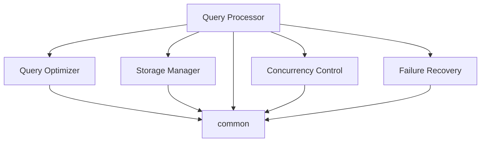
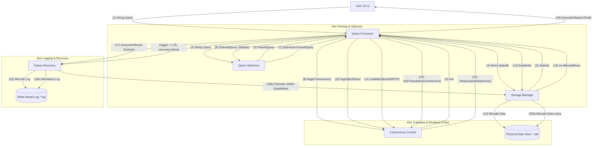

_Back to_ [[Link Terpusat Apacy]]

# Panduan Alur Kerja Harian mDBMS Apacy

Dokumen ini adalah panduan wajib bagi **setiap anggota** Super Group Apacy. Karena kita bekerja di satu repositori (`monorepo`) yang `public`, kita menggunakan aturan ketat untuk melindungi *branch* `main` dan memastikan integrasi berjalan mulus.

**Filosofi Inti:**
1.  *Branch* `main` **TERKUNCI**. Tidak ada yang bisa `push` langsung ke `main`.
2.  Semua pekerjaan **WAJIB** dilakukan di *feature branch* terpisah.
3.  Semua kode **WAJIB** masuk ke `main` melalui **Pull Request (PR)**.
4.  Setiap PR **WAJIB** di-*review* dan di-*approve* oleh pemilik kode (CODEOWNERS).

---
## Diagram Dependensi


---
## DFD



---

## Alur Kerja Langkah-demi-Langkah

Ikuti 8 langkah ini setiap kali Anda memulai tugas baru.

### Langkah 1: Sinkronisasi dengan `main`
Selalu pastikan kode lokal Anda paling *update* sebelum memulai pekerjaan baru.

```bash
# Pindah ke branch utama
git checkout main

# Tarik perubahan terbaru dari GitHub
git pull origin main
```

### Langkah 2: Buat Branch Baru

Buat _branch_ baru dari `main` untuk tugas Anda. Gunakan format penamaan yang telah disepakati: `tipe/<komponen>/<deskripsi-fitur>`.

- **Tipe:** `feat` (fitur baru), `fix` (perbaikan bug), `docs` (dokumentasi).
    
- **Komponen:** `query-processor`, `storage-manager`, `query-optimizer`, `concurrency-control-manager`, `failure-recovery-manager`, atau `common`.
    

**Contoh untuk Grup "Bash" (QP):**

```Bash
# (dari branch 'main')
git checkout -b feat/query-processor/implement-nested-loop-join
```

**Contoh untuk Grup SM:**

```Bash
# (dari branch 'main')
git checkout -b fix/storage-manager/serializer-off-by-one
```

### Langkah 3: Bekerja (Coding, Commit, Test)

Kerjakan tugas Anda di _branch_ ini.

- **Coding:** Implementasikan fitur Anda (misal: mengisi `JoinStrategy.java`).
    
- **Testing:** Jika Anda Grup QP, gunakan _Mock Components_ di `src/test/java/` untuk menguji _logic_ Anda secara independen. Jika Anda grup lain, buat _unit test_ di folder `src/test/` modul Anda.
    
- **Commit:** Buat _commit_ secara berkala dengan pesan yang jelas.

    ```Bash
    git add .
    git commit -m "feat(qp): implement nested loop join logic"
    ```
    

### Langkah 4: Push Branch Anda ke GitHub

Saat pekerjaan Anda siap untuk di-_review_ (atau Anda ingin mem-backup pekerjaan Anda), _push_ _branch_ Anda ke repositori organisasi.


```Bash
# -u akan mengatur 'origin' sebagai upstream untuk branch ini
git push -u origin feat/query-processor/implement-nested-loop-join
```

### Langkah 5: Buat Pull Request (PR)

1. Buka halaman GitHub repositori `mDBMS-Apacy`.
    
2. Anda akan melihat _banner_ kuning "Your branch is ready...". Klik tombol **"Compare & pull request"**.
    
3. **Judul PR:** Buat judul yang jelas, misal: `feat(qp): Implement Nested Loop Join`.
    
4. **Deskripsi:** Jelaskan apa yang Anda kerjakan, apa yang perlu di-_review_, atau @mention teman satu tim jika perlu.
    
5. Klik **"Create pull request"**.
    

### Langkah 6: Proses Review Otomatis (CODEOWNERS)

- Saat PR dibuat, GitHub akan membaca file `.github/CODEOWNERS`.
    
- Jika Anda mengubah file di `query-processor/`, GitHub akan **secara otomatis** meminta _review_ dari `@apacy-mdbms/qp-Bash`.
    
- Jika Anda mengubah file di `common/`, GitHub akan **secara otomatis** meminta _review_ dari **SEMUA 5 TIM**.
    

### Langkah 7: Diskusi & Revisi (Jika Perlu)

- Anggota tim Anda (yang di-tag oleh CODEOWNERS) akan me-_review_ kode Anda.
    
- Mereka mungkin akan meninggalkan komentar atau meminta perubahan.
    
- Untuk melakukan revisi, **tetap di _branch_ yang sama**. Buat _commit_ baru dan `git push` lagi.
    
    Bash
    
    ```
    # (Setelah memperbaiki kode)
    git commit -m "fix(qp): handle empty table in join"
    git push
    ```
    
- Pull Request Anda akan otomatis ter-update dengan _commit_ baru.
    

### Langkah 8: Merge (Penyelesaian)

- Setelah PR Anda mendapatkan jumlah _approval_ yang disyaratkan (minimal 1), tombol "Merge" akan berwarna hijau.
    
- **PIC Tim** (atau siapa pun yang bertugas) akan me-_merge_ PR Anda ke `main`.
    
- **PENTING:** Selalu pilih **"Squash and merge"** (jika ada banyak _commit_ revisi) atau **"Create a merge commit"**. JANGAN `push` manual.
    
- Setelah di-_merge_, Anda bisa menghapus _branch_ Anda (GitHub akan memberikan tombolnya).
    
- Ulangi dari **Langkah 1** untuk tugas berikutnya.
    

---

### Skenario Khusus: Mengubah `common/`

Modul `common/` adalah dasar kita. Mengubahnya berisiko merusak _compile_ 4 grup lainnya.

1. **Stop:** Jangan langsung _coding_.
    
2. **Diskusi:** Bicarakan usulan perubahan (misal: "Saya perlu menambah _field_ baru di `Row.java`") dengan PIC dari 5 grup.
    
3. **Branch:** Buat _branch_ `feat/common/add-getter-to-row`.
    
4. **PR:** Buat PR.
    
5. **Review Wajib:** PR ini akan **secara otomatis** me-request _review_ dari **SEMUA 5 TIM**.
    
6. **Merge:** PR **TIDAK BISA** di-_merge_ sampai semua 5 PIC Tim setuju.