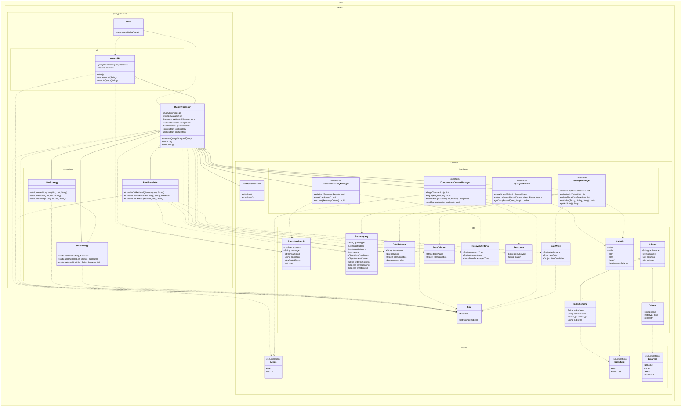

```mermaid
classDiagram
direction TB
	namespace com.apacy.queryprocessor {
		class Main {
			+static main(String\[\] args)
		}
	
		class QueryProcessor {
			-IQueryOptimizer qo
			-IStorageManager sm
			-IConcurrencyControlManager ccm
			-IFailureRecoveryManager frm
			-PlanTranslator planTranslator
			-JoinStrategy joinStrategy
			-SortStrategy sortStrategy
			+executeQuery(String sqlQuery)
			+initialize()
			+shutdown()
		}
	
		class PlanTranslator {
			+translateToRetrieval(ParsedQuery, String)
			+translateToWrite(ParsedQuery, String, boolean)
			+translateToDeletion(ParsedQuery, String)
		}
	}
	
	  namespace com.apacy.common.enums {
    class Action {
	    <<Enumeration>>
      READ
      WRITE
    }
    class DataType {
     <<Enumeration>> 
      INTEGER
      FLOAT
      CHAR
      VARCHAR
    }
    class IndexType  {
    <<Enumeration>>
      Hash
      BPlusTree
    }
  }

  namespace com.apacy.queryprocessor.execution {
    class JoinStrategy {
      +static nestedLoopJoin(List, List, String)
      +static hashJoin(List, List, String)
      +static sortMergeJoin(List, List, String)
    }

    class SortStrategy {
      +static sort(List, String, boolean)
      +static sortMultiple(List, String\[\], boolean\[\])
      +static externalSort(List, String, boolean, int)
    }
  }
  
  namespace com.apacy.queryprocessor.cli {
    class ApacyCLI {
      -QueryProcessor queryProcessor
      -Scanner scanner
      +start()
      -processInput(String)
      -executeQuery(String)
    }
  }

  namespace com.apacy.common {
    class DBMSComponent {
      +initialize()
      +shutdown()
    }
  }
  
  namespace com.apacy.common.interfaces {
    class IQueryOptimizer {
	    <<interface>>
      +parseQuery(String) ParsedQuery
      +optimizeQuery(ParsedQuery, Map) ParsedQuery
      +getCost(ParsedQuery, Map) double
    }
    class IStorageManager {
	    <<interface>>
      +readBlock(DataRetrieval) List
      +writeBlock(DataWrite) int
      +deleteBlock(DataDeletion) int
      +setIndex(String, String, String) void
      +getAllStats() Map
    }
    class IConcurrencyControlManager {
    	<<interface>>
      +beginTransaction() int
      +logObject(Row, int) void
      +validateObject(String, int, Action) Response
      +endTransaction(int, boolean) void
    }
    class IFailureRecoveryManager {
	    <<interface>>
      +writeLog(ExecutionResult) void
      +saveCheckpoint() void
      +recover(RecoveryCriteria) void
    }
  }
  
namespace com.apacy.common.dto {
    class Column {
      +String name
      +DataType type
      +int length
    }
    class DataDeletion {
      +String tableName
      +Object filterCondition
    }
    class DataRetrieval {
      +String tableName
      +List columns
      +Object filterCondition
      +boolean useIndex
    }
    class DataWrite {
      +String tableName
      +Row newData
      +Object filterCondition
    }
    class ExecutionResult {
      +boolean success
      +String message
      +int transactionId
      +String operation
      +int affectedRows
      +List rows
    }
    class IndexSchema {
      +String indexName
      +String columnName
      +IndexType indexType
      +String indexFile
    }
    class ParsedQuery {
      +String queryType
      +List targetTables
      +List targetColumns
      +List values
      +Object joinConditions
      +Object whereClause
      +String orderByColumn
      +boolean isDescending
      +boolean isOptimized
    }
    class RecoveryCriteria {
      +String recoveryType
      +String transactionId
      +LocalDateTime targetTime
    }
    class Response {
      +boolean isAllowed
      +String reason
    }
    class Row {
      +Map data
      +get(String) Object
    }
    class Schema {
      +String tableName
      +String dataFile
      +List columns
      +List indexes
    }
    class Statistic {
      +int nr
      +int br
      +int lr
      +int fr
      +Map V
      +Map indexedColumn
    }
  }

	Main ..> QueryProcessor 
  Main ..> ApacyCLI 

  ApacyCLI o-- QueryProcessor 
  ApacyCLI ..> ExecutionResult 
  ApacyCLI ..> Row 

  QueryProcessor --|> DBMSComponent 
  QueryProcessor o-- PlanTranslator 
  QueryProcessor o-- JoinStrategy 
  QueryProcessor o-- SortStrategy 

  QueryProcessor o-- IQueryOptimizer 
  QueryProcessor o-- IStorageManager 
  QueryProcessor o-- IConcurrencyControlManager 
  QueryProcessor o-- IFailureRecoveryManager 
  
    PlanTranslator ..> ParsedQuery 
  PlanTranslator ..> DataRetrieval
  PlanTranslator ..> DataWrite 
  PlanTranslator ..> DataDeletion
  PlanTranslator ..> Row

  QueryProcessor ..> ParsedQuery 
  QueryProcessor ..> DataRetrieval 
  QueryProcessor ..> ExecutionResult 
  QueryProcessor ..> RecoveryCriteria 
  QueryProcessor ..> Response 
  QueryProcessor ..> Row 
  QueryProcessor ..> Action 


  JoinStrategy ..> SortStrategy
  JoinStrategy ..> Row
  SortStrategy ..> Row 

  IQueryOptimizer ..> ParsedQuery 
  IQueryOptimizer ..> Statistic 

  IStorageManager ..> DataRetrieval
  IStorageManager ..> DataWrite
  IStorageManager ..> DataDeletion
  IStorageManager ..> Row
  IStorageManager ..> Statistic
  
  IConcurrencyControlManager ..> Response 
  IConcurrencyControlManager ..> Row 
  IConcurrencyControlManager ..> Action 

  IFailureRecoveryManager ..> ExecutionResult 
  IFailureRecoveryManager ..> RecoveryCriteria

  Schema o-- "1..*" Column
  Schema o-- "0..*" IndexSchema
  IndexSchema ..> IndexType
  Column ..> DataType
  Statistic ..> IndexType
  DataWrite ..> Row
```