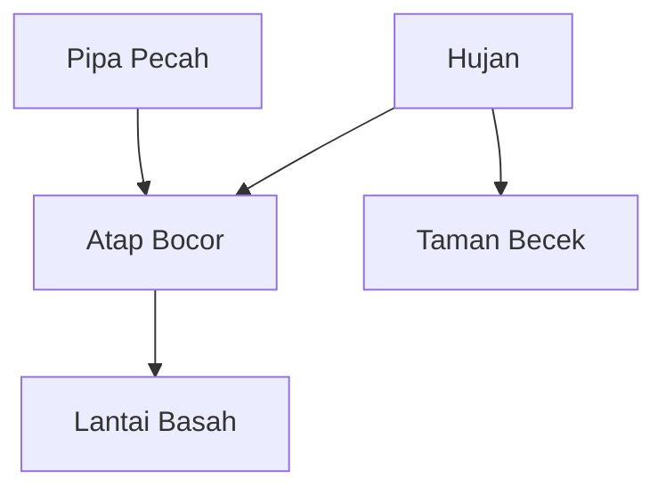

_Back to_ [[Latihan UAS IF3170]]

# Problem Set: Probabilistic & Tree-Based Models

**Mata Pelajaran:** Inteligensi Artifisial (IF3170)

**Topik:** Supervised Learning (Bayes, DTL) & Probabilistic Reasoning (BN)

**Estimasi Waktu:** 60 Menit

**Total Nilai:** 40 Poin

## Tujuan Pembelajaran

Setelah menyelesaikan bagian ini, mahasiswa diharapkan dapat:

1. Menghitung probabilitas posterior menggunakan Naive Bayes dan Standard Bayes.
    
2. Membangun dan menganalisis struktur Decision Tree menggunakan algoritma ID3, CART, dan C4.5.
    
3. Menganalisis aliran informasi (independensi) dalam Bayesian Network.
    
4. Mengevaluasi isu-isu kritis dalam DTL seperti overfitting dan bias atribut.
    

## Petunjuk Umum

- Jawablah pertanyaan secara berurutan.
    
- Untuk soal hitungan, tuliskan **rumus** yang digunakan dan **langkah-langkah** perhitungannya.
    
- Bulatkan hasil akhir hingga **3 angka di belakang koma**.
    

## BAGIAN I: Probabilistic & Tree-Based Models

### Deskripsi Dataset (Untuk Soal 1 & 2)

Anda diberikan dataset kecil mengenai penerimaan karyawan di perusahaan startup teknologi "TechCorp" berdasarkan 4 fitur: **IPK** (Numerik), **Portfolio** (Bagus/Biasa), **Wawancara** (Bagus/Biasa/Buruk), dan **Alumni** (Ya/Tidak - apakah pelamar dari kampus ternama).

|   |   |   |   |   |   |
|---|---|---|---|---|---|
|**No**|**IPK**|**Portfolio**|**Wawancara**|**Alumni**|**Diterima (Target)**|
|1|3.8|Bagus|Biasa|Ya|**Ya**|
|2|2.8|Biasa|Buruk|Tidak|**Tidak**|
|3|3.9|Bagus|Bagus|Ya|**Ya**|
|4|3.2|Biasa|Biasa|Tidak|**Tidak**|
|5|3.5|Bagus|Biasa|Ya|**Ya**|
|6|2.9|Buruk|Buruk|Tidak|**Tidak**|

### Soal 1. Analisis Sentimen Startup (Naive Bayes vs Standard Bayes) (10 Poin)

**Fokus:** Naive Bayes Classifier, Joint Probability, Zero Frequency Problem.

Gunakan dataset "TechCorp" di atas. Terdapat pelamar baru dengan data: **X = <Portfolio=Bagus, Wawancara=Buruk, Alumni=Tidak>**. (Abaikan atribut IPK untuk soal ini).

**Pertanyaan:**

a. **(Naive Bayes)** Hitung prediksi kelas untuk data **X** menggunakan algoritma **Naive Bayes**. Tuliskan probabilitas Prior $P(C)$ dan Likelihood $P(x_i|C)$ untuk setiap atribut (Portfolio, Wawancara, Alumni). Tentukan kelas akhirnya.

b. **(Standard Bayes)** Hitung prediksi kelas untuk data **X** menggunakan prinsip **Standard Bayes** (Joint Probability murni tanpa asumsi independensi). Gunakan rumus $P(C|X) = \frac{P(X \cap C)}{P(X)}$.

c. **(Analisis)** Bandingkan hasil dari (a) dan (b). Mengapa hasilnya bisa berbeda (atau sama)? Jelaskan kelemahan _Standard Bayes_ yang terlihat dari kasus ini jika data latih terbatas.

### Soal 2. Konstruksi Pohon Keputusan Lengkap (12 Poin)

**Fokus:** DTL Algorithms (ID3, CART, C4.5), Information Gain, Gini Index, Gain Ratio, dan Struktur Pohon Lengkap.

Gunakan dataset "TechCorp" yang sama.

**Pertanyaan:**

a. **(ID3 - Pohon Lengkap)** Abaikan atribut `IPK` dan `No`. Gunakan atribut **Portfolio**, **Wawancara**, dan **Alumni**.

- Hitung Information Gain untuk menentukan Root Node.
    
- Lanjutkan perhitungan secara rekursif hingga terbentuk **Pohon Keputusan Lengkap** (sampai semua leaf node murni atau atribut habis).
    
- Gambarkan pohon hasil akhirnya.
    

b. **(CART - Binary Split)** Abaikan atribut `IPK` dan `No`. Gunakan atribut **Portfolio** dan **Wawancara** saja.

- Algoritma CART menggunakan _Binary Split_. Hitunglah Gini Impurity untuk menentukan split terbaik di Root Node. (Contoh split: Portfolio=Bagus vs {Biasa, Buruk}).
    
- Gambarkan **Pohon Biner Lengkap** yang terbentuk dari data tersebut.
    

c. **(C4.5 - Handling Numeric & Unique)**

1. **Atribut Numerik (IPK):** Jelaskan langkah C4.5 menangani atribut kontinu `IPK`. Tentukan _threshold_ (titik potong) terbaik berdasarkan perhitungan Gain.
    
2. **Gain Ratio:** Jika atribut `No` (ID Unik) dimasukkan dalam perhitungan, jelaskan mengapa C4.5 tidak akan memilihnya sebagai root node meskipun Information Gain-nya maksimal.
    

### Soal 3. Analisis Jaringan Bayesian (Diagramming & Reasoning) (8 Poin)

**Fokus:** Struktur DAG, D-Separation, Conditional Independence.

Perhatikan struktur Bayesian Network berikut yang memodelkan kejadian di sebuah rumah pintar:


%% 
_(Keterangan: Hujan dan Pipa Pecah adalah penyebab independen dari Atap Bocor. Atap Bocor menyebabkan Lantai Basah. Hujan juga menyebabkan Taman Becek)_
 %%
 
**Pertanyaan:** Tentukan status independensi (Independen / Dependen) antara pasangan node berikut, beserta alasan teknisnya (sebutkan tipe koneksi: Serial, Diverging, atau Converging):

1. **Pipa Pecah** dan **Hujan**, jika kondisi **Atap Bocor** _TIDAK DIKETAHUI_.
    
2. **Pipa Pecah** dan **Hujan**, jika kondisi **Lantai Basah** _DIKETAHUI_ (True). Jelaskan fenomena apa yang terjadi di sini.
    
3. **Lantai Basah** dan **Taman Becek**, jika kondisi **Atap Bocor** _DIKETAHUI_ (True).
    

### Soal 4. Isu Kritis DTL: Pruning Strategy (Tabel Komparatif) (6 Poin)

**Fokus:** Overfitting, Pre-Pruning, Post-Pruning.

Dalam pengembangan Decision Tree, overfitting adalah musuh utama. Isilah tabel perbandingan strategi penanganan overfitting berikut:

|   |   |   |
|---|---|---|
|**Aspek Perbandingan**|**Pre-Pruning (Early Stopping)**|**Post-Pruning (e.g., Reduced Error Pruning)**|
|**Mekanisme Utama**|_(Jelaskan kapan proses berhenti)_|_(Jelaskan apa yang dilakukan setelah tree jadi)_|
|**Kelebihan**|||
|**Risiko Utama**|_(Terkait Underfitting/Optimality)_|_(Terkait Komputasi)_|

### Soal 5. Konsep Probabilitas & Logika (4 Poin)

**Fokus:** Pemahaman Konseptual.

Tentukan apakah pernyataan berikut **BENAR** atau **SALAH**, dan berikan alasan singkat (maksimal 2 kalimat).

1. **Pernyataan:** Dalam Naive Bayes, jika sebuah nilai atribut pada data uji tidak pernah muncul pada data latih (frekuensi 0), maka probabilitas posterior kelas tersebut akan menjadi 0, mengabaikan bukti dari atribut lain.
    
    - **Jawaban:** ________
        
    - **Alasan:** ________
        
2. **Pernyataan:** DTL dengan kedalaman tak terbatas (unlimited depth) akan selalu memiliki _Training Error_ yang lebih tinggi dibandingkan DTL dengan kedalaman terbatas (misal depth=3).
    
    - **Jawaban:** ________
        
    - **Alasan:** ________
        

> [!ad-libitum]- # Kunci Jawaban & Rubrik Penilaian
>
> ### Soal 1. Analisis Sentimen Startup (10 Poin)
> 
> **Data Training:**
> 
> - **Ya (Diterima):** Data 1, 3, 5 (Total 3)
>     
> - **Tidak (Ditolak):** Data 2, 4, 6 (Total 3)
>     
> - Total Data = 6
>     
> 
> **a. Naive Bayes (4 Poin)**
> 
> - **Prior:**
>     
>     - $P(\text{Ya}) = 3/6 = 0.5$  
>         
>     - $P(\text{Tidak}) = 3/6 = 0.5$  
>         
> - **Likelihood (untuk X: Bagus, Buruk, Tidak):**
>     
>     - **Kelas Ya:**
>         
>         - $P(\text{Bagus}|\text{Ya}) = 3/3 = 1$ (Data 1, 3, 5)
>             
>         - $P(\text{Buruk}|\text{Ya}) = 0/3 = 0$ (Tidak ada pelamar diterima yg wawancara buruk)
>             
>         - $P(\text{Tidak}|\text{Ya}) = 0/3 = 0$ (Semua pelamar diterima adalah Alumni)
>             
>         - Likelihood Ya = $0.5 \times (1 \times 0 \times 0) = 0$  
>             
>     - **Kelas Tidak:**
>         
>         - $P(\text{Bagus}|\text{Tidak}) = 0/3 = 0$  
>             
>         - $P(\text{Buruk}|\text{Tidak}) = 2/3$ (Data 2, 6)
>             
>         - $P(\text{Tidak}|\text{Tidak}) = 3/3 = 1$ (Data 2, 4, 6)
>             
>         - Likelihood Tidak = $0.5 \times (0 \times 2/3 \times 1) = 0$  
>             
> - **Prediksi:** **Tidak Dapat Ditentukan (Keduanya 0)** atau **Zero Frequency Problem**. (Mahasiswa yang menjawab "Tidak" karena probabilitas 0 juga bisa dibenarkan jika ada argumen smoothing).
>     
> 
> **b. Standard Bayes (3 Poin)**
> 
> - Cari data eksak **X = <Bagus, Buruk, Tidak>**.
>     
> - Tidak ada data seperti itu di tabel.
>     
> - $P(X \cap Ya) = 0$, $P(X \cap Tidak) = 0$.
>     
> - **Prediksi:** Tidak dapat dihitung ($0/0$).
>     
> 
> **c. Analisis (3 Poin)**
> 
> - Kedua metode gagal memberikan prediksi yang valid karena masalah data yang sangat terbatas (_sparsity_).
>     
> - **Kelemahan Standard Bayes:** Membutuhkan data latih yang mencakup _semua kombinasi_ atribut yang mungkin. Jika kombinasi uji tidak ada di data latih, probabilitas menjadi 0 atau tidak terdefinisi. Naive Bayes sedikit lebih baik karena melihat per atribut, tapi tetap rentan terhadap frekuensi 0 (butuh Laplace Smoothing).
>     
> 
> ### Soal 2. Konstruksi Pohon Keputusan (12 Poin)
> 
> **a. ID3 - Pohon Lengkap (4 Poin)**
> 
> - **Step 1 (Root):**
>     
>     - Entropy(S) = 1 (3 Ya, 3 Tidak).
>         
>     - Gain(Portfolio): Bagus(3Y, 0T), Biasa(0Y, 2T), Buruk(0Y, 1T). Gain sangat tinggi (Max).
>         
>     - **Root:** Portfolio.
>         
> - **Step 2 (Cabang):**
>     
>     - Cabang **Bagus**: Data {1, 3, 5} -> Kelas **Ya** (Murni). -> Leaf Node.
>         
>     - Cabang **Biasa**: Data {2, 4} -> Kelas **Tidak** (Murni). -> Leaf Node.
>         
>     - Cabang **Buruk**: Data {6} -> Kelas **Tidak** (Murni). -> Leaf Node.
>         
> - **Gambar Pohon:**
>     
>     ```
>     Root: [Portfolio?]
>      ├── Bagus --> [Leaf: Ya]
>      ├── Biasa --> [Leaf: Tidak]
>      └── Buruk --> [Leaf: Tidak]
>     ```
>     
>     _(Catatan: Karena atribut Portfolio sudah memisahkan data dengan sempurna, atribut lain tidak perlu dicek lagi)._
>     
> 
> **b. CART - Binary Split (4 Poin)**
> 
> - **Atribut:** Portfolio (Bagus, Biasa, Buruk), Wawancara (Bagus, Biasa, Buruk).
>     
> - **Split Terbaik:** Portfolio = Bagus vs {Biasa, Buruk}.
>     
>     - Kiri (Bagus): 3 Data (3 Ya, 0 Tidak) -> Gini = 0 (Murni).
>         
>     - Kanan (Biasa, Buruk): 3 Data (0 Ya, 3 Tidak) -> Gini = 0 (Murni).
>         
> - **Gambar Pohon:**
>     
>     ```
>     Root: [Portfolio == Bagus?]
>      ├── (Yes) --> [Leaf: Ya] (3 Data)
>      └── (No)  --> [Leaf: Tidak] (3 Data)
>     ```
>     
> 
> **c. C4.5 Handling Issues (4 Poin)**
> 
> 1. **Atribut IPK:**
>     
>     - Urutkan nilai: 2.8, 2.9, 3.2, 3.5, 3.8, 3.9.
>         
>     - Perubahan kelas terjadi di:
>         
>         - 2.9 (Tidak) -> 3.2 (Tidak) [Tetap]
>             
>         - 3.2 (Tidak) -> 3.5 (Ya) [**Berubah**]. Threshold = $(3.2+3.5)/2 = 3.35$.
>             
>     - Threshold terbaik adalah **3.35** karena memisahkan data gagal (<=3.2) dan sukses (>=3.5) dengan sempurna.
>         
> 2. **Gain Ratio (Atribut No):** Atribut `No` memiliki Information Gain maksimal (karena setiap cabang murni 1 data), tetapi C4.5 menghitung `SplitInfo` yang sangat besar ($-\sum p \log p$). `GainRatio = Gain / SplitInfo`. Pembagi yang besar membuat nilai GainRatio menjadi kecil, sehingga atribut `No` tidak akan terpilih sebagai root.
>     
> 
> ### Soal 3. Analisis Jaringan Bayesian (8 Poin)
> 
> 1. **Independen.** (Converging). Common effect (Atap Bocor) tidak diketahui.
>     
> 2. **Dependen.** (Explaining Away). Common effect (Lantai Basah -> turunan Atap Bocor) diketahui.
>     
> 3. **Independen.** (Diverging/Serial blocked). Jalur Hujan -> Atap -> Lantai terputus karena Atap diketahui.
>     
> 
> ### Soal 4. Isu Kritis DTL (6 Poin)
> 
> - **Pre-Pruning:** Berhenti saat gain kecil/sample sedikit. Cepat tapi risiko underfitting.
>     
> - **Post-Pruning:** Tumbuh full lalu pangkas. Akurasi lebih baik tapi komputasi mahal.
>     
> 
> ### Soal 5. Konsep Probabilitas (4 Poin)
> 
> 1. **BENAR.** Zero Frequency Problem membuat likelihood 0, dan karena dikalikan, hasil akhir 0.
>     
> 2. **SALAH.** DTL depth tak terbatas justru memiliki _Training Error_ sangat rendah (0), tapi _Testing Error_ tinggi (Overfitting).