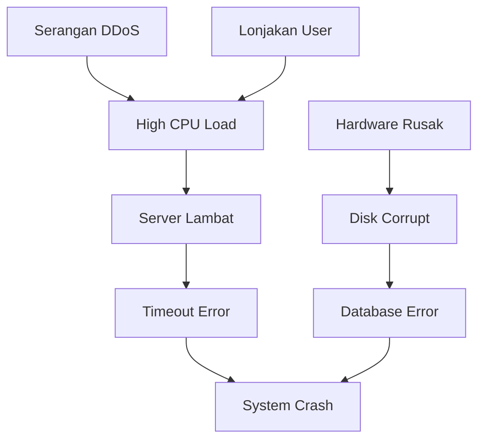

_Back to_ [[Latihan UAS IF3170]]
# Problem Set: Probabilistic & Tree-Based Models (Final)

Mata Pelajaran: Inteligensi Artifisial (IF3170)

Topik: Supervised Learning (Bayes, DTL) & Probabilistic Reasoning (BN)

Estimasi Waktu: 75 Menit

Total Nilai: 40 Poin

## Tujuan Pembelajaran

Setelah menyelesaikan set soal ini, mahasiswa diharapkan dapat:

1. Menerapkan teknik **Laplace Smoothing** pada dataset yang lebih besar untuk mengatasi masalah probabilitas nol.
    
2. Membangun **Pohon Keputusan Bertingkat** (kedalaman > 1) dengan menganalisis atribut yang menyebabkan _impurity_.
    
3. Menganalisis aliran probabilitas dan independensi pada struktur **Deep Bayesian Network**.
    

## Petunjuk Umum

- Gunakan dataset **"E-Shop Loyalty"** di bawah ini untuk mengerjakan Soal 1 dan Soal 2.
    
- Tuliskan langkah perhitungan secara eksplisit (rumus $\to$ substitusi angka $\to$ hasil).
    
- Bulatkan hasil akhir hingga **3 angka di belakang koma**.
    

## Dataset "E-Shop Loyalty" (Untuk Soal 1 & 2)

Dataset ini berisi data pelanggan toko online untuk memprediksi apakah pelanggan tersebut **Loyal** atau tidak.

- **Fitur Numerik:** `Total_Belanja` (Juta Rupiah).
    
- **Fitur Kategorikal:** `Membership` (Gold/Silver/Bronze), `Frekuensi` (Sering/Jarang), `Metode_Bayar` (Kartu/E-Wallet/Transfer).
    
- **Target:** `Loyal` (Ya/Tidak).
    

|**No**|**Total_Belanja**|**Membership**|**Frekuensi**|**Metode_Bayar**|**Loyal (Target)**|
|---|---|---|---|---|---|
|1|5.5|Gold|Sering|Kartu|**Ya**|
|2|1.2|Bronze|Jarang|Transfer|**Tidak**|
|3|8.0|Gold|Sering|E-Wallet|**Ya**|
|4|2.5|Bronze|Jarang|E-Wallet|**Tidak**|
|5|4.0|Silver|Sering|Kartu|**Ya**|
|6|9.5|Gold|Jarang|Kartu|**Ya**|
|7|1.5|Bronze|Jarang|Transfer|**Tidak**|
|8|3.0|Silver|Jarang|E-Wallet|**Tidak**|
|9|7.5|Gold|Sering|Transfer|**Ya**|
|10|6.0|Silver|Sering|E-Wallet|**Tidak**|

### Soal 1. Naive Bayes dengan Laplace Smoothing (10 Poin)

**Fokus:** Menangani _Zero Frequency Problem_ pada dataset yang lebih variatif.

Diketahui pelanggan baru dengan data: **X = <Membership=Silver, Frekuensi=Jarang, Metode_Bayar=Kartu>**. (Abaikan atribut `Total_Belanja` untuk soal ini).

**Pertanyaan:**

a. **(Naive Bayes Murni)** Hitung probabilitas likelihood $P(X|\text{Ya})$ dan $P(X|\text{Tidak})$ tanpa smoothing. Identifikasi atribut mana yang menyebabkan probabilitas menjadi 0 (jika ada).

b. **(Laplace Smoothing)** Hitung ulang prediksi untuk data **X** dengan menerapkan **Laplace Smoothing (**$\alpha=1$**)**.

- Gunakan rumus: $P(x_i|C) = \frac{count(x_i, C) + \alpha}{count(C) + \alpha \cdot |V|}$.
    
- $|V|$ adalah jumlah variasi nilai unik pada masing-masing atribut (misal: Membership punya 3 nilai unik).
    
- Tentukan kelas akhirnya (Ya/Tidak) berdasarkan hasil smoothing.
    

c. **(Analisis)** Bandingkan hasil poin (a) dan (b). Mengapa metode Naive Bayes Murni sangat rentan "menyerah" (memberikan nilai 0) pada atribut `Metode_Bayar` untuk kelas tertentu, padahal atribut `Membership` memberikan sinyal yang cukup kuat?

### Soal 2. Konstruksi Pohon Keputusan Lengkap (12 Poin)

**Fokus:** Membangun pohon keputusan bertingkat yang menangani _mixed nodes_.

**Instruksi:** Gunakan dataset "E-Shop Loyalty" di atas. Abaikan kolom `No`.

**Pertanyaan:**

a. **(ID3 - Root Analysis)** Hitung **Entropy(Total)** dari dataset. Kemudian hitung **Information Gain** hanya untuk atribut kategorikal: `Membership`, `Frekuensi`, dan `Metode_Bayar`. Tentukan atribut mana yang menjadi **Root Node**.

b. **(ID3 - Level 2 Split)** Berdasarkan Root Node yang terpilih di poin (a):

- Tentukan cabang mana yang sudah **Murni (Pure)** dan langsung menjadi _Leaf Node_.
    
- Tentukan cabang mana yang masih **Tidak Murni (Impure)**.
    
- Lakukan perhitungan _Information Gain_ ulang pada cabang yang tidak murni tersebut untuk menentukan node level selanjutnya.
    
- Gambarkan **Pohon Keputusan Lengkap** hasil akhirnya.
    

c. **(C4.5 - Numeric Handling)** Gunakan atribut numerik `Total_Belanja`.

- Urutkan data berdasarkan `Total_Belanja`.
    
- Identifikasi semua kandidat _threshold_ (titik potong) di mana target kelas berubah dari "Tidak" ke "Ya" (atau sebaliknya).
    
- Pilih satu threshold terbaik yang memisahkan data dengan error paling sedikit.
    

### Soal 3. Deep Bayesian Network Analysis (8 Poin)

**Fokus:** Analisis independensi pada jalur panjang (_Deep Structure_) dan kausalitas sistem.

Perhatikan struktur Bayesian Network berikut yang memodelkan kegagalan sistem server:



%% _(Keterangan: Serangan DDoS dan Lonjakan User menyebabkan High CPU. High CPU menyebabkan Server Lambat, lalu Timeout. Hardware Rusak menyebabkan Disk Corrupt, lalu DB Error. Timeout dan DB Error menyebabkan System Crash)_ %%

Pertanyaan:

Analisis hubungan independensi variabel berikut (Blocked/Active):

1. **Serangan DDoS** dan **Lonjakan User**, jika **High CPU Load** _TIDAK DIKETAHUI_.
    
2. **Serangan DDoS** dan **Lonjakan User**, jika **System Crash** _DIKETAHUI_ (True). (Jelaskan alasannya!).
    
3. **High CPU Load** dan **Database Error**, jika **System Crash** _TIDAK DIKETAHUI_.
    
4. **Hardware Rusak** dan **System Crash**, jika **Database Error** _DIKETAHUI_.
    

### Soal 4. Isu Kritis DTL: Gain Ratio vs Info Gain (6 Poin)

**Fokus:** Bias seleksi atribut.

Misalkan kita menambahkan atribut baru bernama **`Kode_Transaksi`** (unik untuk setiap baris, misal: TRX001, TRX002, dst) ke dalam dataset.

1. **Analisis ID3:** Jika kita menghitung Information Gain untuk `Kode_Transaksi`, berapakah nilai Entropi pada setiap cabangnya? Apa dampaknya terhadap pemilihan Root Node?
    
2. **Analisis C4.5:** Bagaimana rumus **Gain Ratio** mencegah `Kode_Transaksi` terpilih sebagai root node? Jelaskan peran variabel _Split Information_ dalam rumus tersebut.
    

### Soal 5. Konsep & Eksplorasi (4 Poin)

**Fokus:** Pemahaman algoritma.

Jawablah Benar/Salah beserta alasannya.

1. **Pernyataan:** Dalam algoritma CART (Classification and Regression Trees), sebuah node atribut yang memiliki 3 nilai unik (misal: Gold, Silver, Bronze) akan dipecah menjadi 3 cabang sekaligus.
    
    - **Jawaban:** ________
        
    - **Alasan:** ________
        
2. **Pernyataan:** Menambah kedalaman pohon (depth) pada Decision Tree akan selalu menurunkan _Training Error_, tetapi bisa meningkatkan _Testing Error_.
    
    - **Jawaban:** ________
        
    - **Alasan:** ________
        

> [!ad-libitum]- # Kunci Jawaban & Rubrik Penilaian
> 
> ### Soal 1. Naive Bayes dengan Smoothing (10 Poin)
> 
> **Statistik Data:**
> 
> - Total Data: 10
>     
> - Target Ya: 5 (Data: 1, 3, 5, 6, 9)
>     
> - Target Tidak: 5 (Data: 2, 4, 7, 8, 10)
>     
> - $P(\text{Ya}) = 0.5$, $P(\text{Tidak}) = 0.5$  
>     
> 
> a. Naive Bayes Murni (3 Poin)
> 
> Query: <Silver, Jarang, Kartu>
> 
> - **Kelas Ya:**
>     
>     - $P(\text{Silver}|\text{Ya}) = 1/5$ (Data 5)
>         
>     - $P(\text{Jarang}|\text{Ya}) = 1/5$ (Data 6)
>         
>     - $P(\text{Kartu}|\text{Ya}) = 3/5$ (Data 1, 5, 6)
>         
>     - Likelihood = $0.5 \times (0.2 \times 0.2 \times 0.6) = 0.012$  
>         
> - **Kelas Tidak:**
>     
>     - $P(\text{Silver}|\text{Tidak}) = 2/5$ (Data 8, 10)
>         
>     - $P(\text{Jarang}|\text{Tidak}) = 4/5$ (Data 2, 4, 7, 8)
>         
>     - $P(\text{Kartu}|\text{Tidak}) = 0/5$ (**Nol!** Tidak ada yang Tidak Loyal pakai Kartu)
>         
>     - Likelihood = $0.5 \times (0.4 \times 0.8 \times 0) = \mathbf{0}$  
>         
> - **Masalah:** Atribut `Metode_Bayar=Kartu` menyebabkan probabilitas kelas "Tidak" menjadi 0 mutlak.
>     
> 
> b. Laplace Smoothing (4 Poin)
> 
> $\alpha=1$. $|V|$: Membership=3, Frekuensi=2, Metode=3.
> 
> - *_Kelas Ya (Denominator = 5 + 1_|V|):**
>     
>     - $P(\text{Silver}|\text{Ya}) = (1+1)/(5+3) = 2/8$  
>         
>     - $P(\text{Jarang}|\text{Ya}) = (1+1)/(5+2) = 2/7$  
>         
>     - $P(\text{Kartu}|\text{Ya}) = (3+1)/(5+3) = 4/8$  
>         
>     - Posterior Ya $\propto 0.5 \times (0.25 \times 0.286 \times 0.5) = 0.0178$  
>         
> - **Kelas Tidak:**
>     
>     - $P(\text{Silver}|\text{Tidak}) = (2+1)/(5+3) = 3/8$  
>         
>     - $P(\text{Jarang}|\text{Tidak}) = (4+1)/(5+2) = 5/7$  
>         
>     - $P(\text{Kartu}|\text{Tidak}) = (0+1)/(5+3) = 1/8$ (**Diselamatkan dari 0**)
>         
>     - Posterior Tidak $\propto 0.5 \times (0.375 \times 0.714 \times 0.125) = 0.0167$  
>         
> - Prediksi Akhir: Ya (0.0178 > 0.0167).
>     
>     (Tanpa smoothing, kita mungkin bias, tapi smoothing menunjukkan probabilitasnya tipis).
>     
> 
> **c. Analisis (3 Poin)**
> 
> - Tanpa smoothing, algoritma terlalu "keras" menghukum kejadian yang belum pernah dilihat (Kartu pada kelas Tidak), sehingga mengabaikan bukti kuat lain (seperti Silver dan Jarang yang sebenarnya condong ke Tidak). Smoothing memberikan peluang kecil pada kejadian langka tersebut, memungkinkan atribut lain untuk "bersuara".
>     
> 
> ### Soal 2. Konstruksi Pohon Keputusan (12 Poin)
> 
> **a. Root Analysis (4 Poin)**
> 
> - **Entropy(S):** 5 Ya, 5 Tidak $\to$ **1.00**.
>     
> - **Gain(Membership):**
>     
>     - Gold (4 data: 1,3,6,9 $\to$ Y,Y,Y,Y) $\to$ E=0 (Murni).
>         
>     - Bronze (3 data: 2,4,7 $\to$ T,T,T) $\to$ E=0 (Murni).
>         
>     - Silver (3 data: 5,8,10 $\to$ Y,T,T) $\to$ 1 Ya, 2 Tidak.
>         
>         - $E(\text{Silver}) = -(1/3 \log 1/3 + 2/3 \log 2/3) \approx 0.918$.
>             
>     - Gain = $1 - [4/10(0) + 3/10(0) + 3/10(0.918)] = 1 - 0.275 = \mathbf{0.725}$.
>         
> - **Gain(Frekuensi):**
>     
>     - Sering (5 data: Y,Y,Y,Y,T) $\to$ 4Y, 1T. E=0.72.
>         
>     - Jarang (5 data: T,T,Y,T,T) $\to$ 1Y, 4T. E=0.72.
>         
>     - Gain rendah.
>         
> - **Gain(Metode):**
>     
>     - Kartu (3 data: Y,Y,Y) $\to$ E=0.
>         
>     - E-Wallet (4 data: Y,T,T,T) $\to$ E=0.81.
>         
>     - Transfer (3 data: T,T,Y) $\to$ E=0.91.
>         
>     - Gain lebih rendah dari Membership.
>         
> - **Root Terpilih:** **Membership**.
>     
> 
> **b. Level 2 Split & Gambar Pohon (4 Poin)**
> 
> - Root: **Membership**.
>     
>     - Cabang **Gold**: {Ya, Ya, Ya, Ya} $\to$ **Leaf: Ya**.
>         
>     - Cabang **Bronze**: {Tidak, Tidak, Tidak} $\to$ **Leaf: Tidak**.
>         
>     - Cabang **Silver**: {Data 5(Y), 8(T), 10(T)}. **Impure**.
>         
>         - Perlu split lagi. Atribut tersisa: **Frekuensi** & **Metode**.
>             
>         - Data subset Silver:
>             
>             - 5: Sering, Kartu $\to$ Ya
>                 
>             - 8: Jarang, E-Wallet $\to$ Tidak
>                 
>             - 10: Sering, E-Wallet $\to$ Tidak
>                 
>         - Cek **Frekuensi**:
>             
>             - Sering (5, 10): 1Y, 1T. (Masih kotor).
>                 
>             - Jarang (8): 1T.
>                 
>         - Cek **Metode_Bayar**:
>             
>             - Kartu (5): 1Y (Murni).
>                 
>             - E-Wallet (8, 10): 2T (Murni).
>                 
>         - Pilih **Metode_Bayar** sebagai node level 2.
>             
> - **Gambar Pohon:**
>     
>     ```
>     Root: [Membership?]
>      ├── Gold   --> [Leaf: Ya]
>      ├── Bronze --> [Leaf: Tidak]
>      └── Silver --> [Node: Metode_Bayar?]
>                      ├── Kartu    --> [Leaf: Ya]
>                      └── E-Wallet --> [Leaf: Tidak]
>                      (Catatan: Cabang Transfer tidak ada di data Silver)
>     ```
>     
> 
> **c. C4.5 Numeric (4 Poin)**
> 
> - Data `Total_Belanja`: 1.2(T), 1.5(T), 2.5(T), 3.0(T), 4.0(Y), 5.5(Y), 6.0(T), 7.5(Y), 8.0(Y), 9.5(Y).
>     
> - Perubahan Kelas:
>     
>     - 3.0(T) $\to$ 4.0(Y). Threshold $T_1 = 3.5$.
>         
>     - 5.5(Y) $\to$ 6.0(T). Threshold $T_2 = 5.75$.
>         
>     - 6.0(T) $\to$ 7.5(Y). Threshold $T_3 = 6.75$.
>         
> - **Evaluasi Threshold:**
>     
>     - $T_1 = 3.5$: Kiri(4 data T), Kanan(6 data: 5Y, 1T). Split sangat bersih di kiri. Ini kandidat terkuat.
>         
> 
> ### Soal 3. Deep Bayesian Network (8 Poin)
> 
> 1. **Independen.** (Converging / V-Structure). Selama node bersama **High CPU Load** tidak diketahui, penyebabnya (DDoS dan User) saling independen.
>     
> 2. **Dependen.** (Explaining Away). Kita tahu **System Crash** terjadi. System Crash memberikan informasi tentang penyebabnya (Timeout Error $\to$ Server Lambat $\to$ High CPU). Karena kita mendapat informasi turunan dari High CPU, maka V-structure menjadi aktif (coupled). Jika kita tahu ada Lonjakan User, probabilitas DDoS sebagai penyebab Crash menurun.
>     
> 3. **Independen.** (Serial Blocked? No). Jalur: High CPU $\to$ ... $\to$ System Crash $\leftarrow$ ... $\leftarrow$ DB Error.
>     
>     - Ini adalah struktur Converging di **System Crash**.
>         
>     - Karena **System Crash** _TIDAK DIKETAHUI_, maka jalur antara cabang kiri (CPU) dan kanan (DB Error) **TERBLOKIR**. Informasi tidak mengalir menyeberangi V-structure yang tidak diamati.
>         
> 4. **Independen.** (Serial Blocked). Jalur: Hardware $\to$ Disk $\to$ **DB Error** $\to$ System Crash. Node **DB Error** diketahui. Karena ini adalah rantai serial (causal chain), mengetahui node tengah (DB Error) memutus aliran informasi dari penyebab (Hardware) ke akibat (Crash). Crash sekarang hanya bergantung pada status DB Error yang sudah fix, tidak peduli apa hardware-nya.
>     
> 
> ### Soal 4. Isu Kritis DTL (6 Poin)
> 
> 1. **ID3:** Entropi setiap cabang `Kode_Transaksi` adalah **0** (karena unik, 1 data per cabang pasti murni). Information Gain akan maksimal. ID3 akan memilih Kode_Transaksi sebagai root, menghasilkan pohon yang sangat lebar dan dangkal (overfitting ekstrem).
>     
> 2. **C4.5:** Gain Ratio membagi Information Gain dengan **Split Information**.
>     
>     - Split Info $= -\sum p \log p$. Untuk atribut unik, ada banyak sekali pecahan kecil (1/N), sehingga nilai Split Info menjadi **sangat besar**.
>         
>     - Gain Ratio = Gain / (Sangat Besar) = **Sangat Kecil**.
>         
>     - Ini mencegah atribut unik terpilih.
>         
> 
> ### Soal 5. Konsep & Eksplorasi (4 Poin)
> 
> 1. **Salah.** CART selalu melakukan **Binary Split**. Untuk atribut dengan 3 nilai (Gold, Silver, Bronze), CART akan mencoba kombinasi seperti {Gold} vs {Silver, Bronze} atau {Gold, Silver} vs {Bronze}, tidak memecah jadi 3 sekaligus.
>     
> 2. **Benar.** Semakin dalam pohon, semakin ia "menghafal" detail dan noise pada data latih (_Training Error_ turun mendekati 0). Namun, pohon menjadi terlalu spesifik dan gagal menggeneralisasi data baru (_Testing Error_ naik/buruk) $\to$ Overfitting.