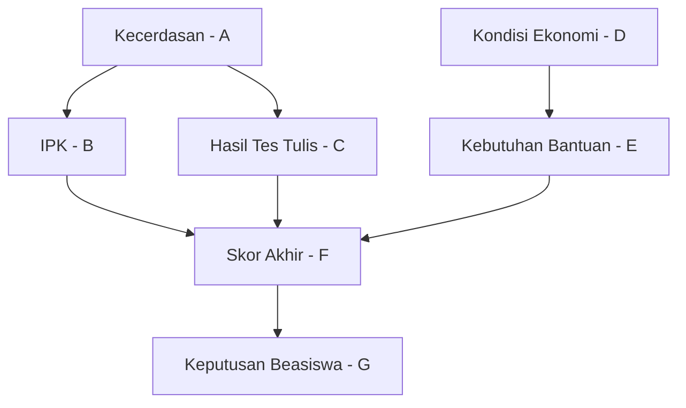

_Back to_ [[Latihan UAS IF3170]]

# Problem Set: Probabilistic & Tree-Based Models (Variasi Eksplorasi)

**Mata Pelajaran:** Inteligensi Artifisial (IF3170)

**Topik:** Supervised Learning (Bayes, DTL) & Probabilistic Reasoning (BN)

**Estimasi Waktu:** 75 Menit

**Total Nilai:** 40 Poin

## Tujuan Pembelajaran

Setelah menyelesaikan set soal ini, mahasiswa diharapkan dapat:

1. Menganalisis dampak **Prior Probability** pada Naive Bayes dalam kondisi dataset tidak seimbang.
    
2. Menerapkan mekanisme penanganan atribut numerik dan **Missing Values** pada algoritma C4.5.
    
3. Mengidentifikasi **Markov Blanket** dan independensi kondisional pada struktur Bayesian Network yang kompleks.
    

## Petunjuk Umum

- Gunakan dataset **"Seleksi Beasiswa"** di bawah ini untuk mengerjakan Soal 1 dan Soal 2.
    
- Tuliskan langkah perhitungan secara eksplisit (rumus $\to$ substitusi angka $\to$ hasil).
    
- Bulatkan hasil akhir hingga **3 angka di belakang koma**.
    

## Dataset "Seleksi Beasiswa" (Untuk Soal 1 & 2)

Dataset ini berisi data pelamar beasiswa prestasi di sebuah universitas. Terdapat **12 data** pelamar.

- **Fitur Numerik:** `IPK` (Skala 4.0).
    
- **Fitur Kategorikal:** `Ekonomi` (Mampu/Kurang), `Organisasi` (Aktif/Pasif), `Sertifikat` (Ada/Tidak).
    
- **Target:** `Lolos` (Ya/Tidak).
    
- **Catatan:** Tanda `?` menunjukkan nilai yang hilang (_missing value_).
    

|   |   |   |   |   |   |
|---|---|---|---|---|---|
|**No**|**IPK**|**Ekonomi**|**Organisasi**|**Sertifikat**|**Lolos (Target)**|
|1|3.8|Mampu|Aktif|Ada|**Ya**|
|2|2.9|Kurang|Pasif|Tidak|**Tidak**|
|3|3.5|Kurang|Aktif|Ada|**Ya**|
|4|3.2|Mampu|Pasif|Ada|**Tidak**|
|5|3.9|Mampu|Aktif|Tidak|**Ya**|
|6|2.8|Mampu|Pasif|Tidak|**Tidak**|
|7|3.6|Kurang|Pasif|Ada|**Ya**|
|8|3.1|Kurang|Aktif|Tidak|**Tidak**|
|9|3.7|Mampu|Pasif|Ada|**Ya**|
|10|3.0|Kurang|Pasif|Tidak|**Tidak**|
|11|**?**|Kurang|Aktif|Ada|**Ya**|
|12|3.4|**?**|Pasif|Ada|**Tidak**|

### Soal 1. Naive Bayes: Prior Sensitivity & Smoothing (10 Poin)

**Fokus:** Dampak probabilitas Prior pada dataset seimbang vs tidak seimbang dan Laplace Smoothing.

Diketahui pelamar baru dengan profil: **X = <Ekonomi=Kurang, Organisasi=Pasif, Sertifikat=Tidak>**. (Abaikan atribut `IPK` untuk soal ini).

**Pertanyaan:**

a. **(Analisis Prior dengan Missing Values)** Hitung probabilitas Prior $P(\text{Ya})$ dan $P(\text{Tidak})$ dari total 12 data di atas. Apakah penambahan 2 data baru mengubah keseimbangan dataset dibanding 10 data awal?

b. **(Perhitungan Smoothing)** Hitung prediksi untuk data **X** menggunakan Naive Bayes dengan **Laplace Smoothing (**$\alpha=1$**)**.

- Hitung Likelihood untuk setiap atribut (Ekonomi, Organisasi, Sertifikat).
    
- _Catatan:_ Untuk perhitungan Likelihood, abaikan baris yang nilai atributnya `?` (missing). Contoh: Jika menghitung $P(\text{Ekonomi}|\text{Kelas})$, data No. 12 tidak diikutsertakan dalam penyebut maupun pembilang atribut Ekonomi.
    
- Hitung Posterior Probability dan tentukan keputusan akhirnya.
    

c. **(Interpretasi Risiko)** Dalam kasus beasiswa ini, manakah yang lebih "mahal" (berisiko) secara etika: _False Positive_ (Memoloskan yang tidak layak) atau _False Negative_ (Menolak yang sebenarnya layak)? Hubungkan jawaban Anda dengan selisih probabilitas posterior yang Anda dapatkan.

### Soal 2. DTL Construction: Numeric & Missing Values (12 Poin)

**Fokus:** Penanganan atribut numerik (C4.5) dan konsep penanganan _Missing Values_ secara konkret.

**Pertanyaan:**

a. **(ID3 - Root Analysis)** Hitung **Information Gain** untuk atribut `Organisasi` dan `Sertifikat` menggunakan 12 data tersebut. Manakah yang lebih baik dijadikan Root Node?

b. **(C4.5 - Numeric Split)** Fokus pada atribut numerik **`IPK`**.

- Urutkan data berdasarkan IPK (abaikan Data No. 11 yang IPK-nya `?`).
    
- Identifikasi titik potong (_thresholds_) terbaik yang memisahkan kelas Target dengan Gain tertinggi.
    
- Gambarkan stump (pohon 1 tingkat) dari threshold terbaik tersebut.
    

c. **(Handling Missing Values - Konseptual)** Perhatikan **Data No. 12** (Ekonomi=`?`, Target=`Tidak`).

1. Jika atribut `Ekonomi` dipilih sebagai node keputusan, bagaimana algoritma C4.5 menghitung Information Gain atribut ini dengan keberadaan missing value? Jelaskan formulanya secara konsep (penggunaan bobot $F$).
    
2. Setelah pohon terbentuk, jika Data No. 12 digunakan sebagai data **Testing** dan masuk ke node `Ekonomi`, ke cabang manakah data ini akan dilewatkan?
    

### Soal 3. Bayesian Network: Markov Blanket (8 Poin)

**Fokus:** Konsep Markov Blanket dan Independensi dalam struktur kompleks.

Perhatikan struktur BN berikut mengenai faktor kelulusan beasiswa:



**Pertanyaan:**

1. **Markov Blanket:** Tentukan himpunan node yang membentuk **Markov Blanket** untuk node **`Skor Akhir` (F)**. Sebutkan siapa saja Parents, Children, dan Children's Parents-nya.
    
2. **Independensi:** Tentukan status hubungan pasangan berikut:
    
    - **IPK (B)** dan **Hasil Tes Tulis (C)**, jika **Kecerdasan (A)** _TIDAK DIKETAHUI_.
        
    - **IPK (B)** dan **Hasil Tes Tulis (C)**, jika **Skor Akhir (F)** _DIKETAHUI_. (Jelaskan fenomena _V-Structure_ yang terjadi di sini).
        
    - **Kecerdasan (A)** dan **Kebutuhan Bantuan (E)**, jika **Skor Akhir (F)** _DIKETAHUI_.
        

### Soal 4. Isu DTL: Gini Index vs Entropy (6 Poin)

**Fokus:** Perbandingan metrik splitting.

Algoritma CART menggunakan Gini Index, sedangkan ID3/C4.5 menggunakan Entropy.

1. **Hitung Gini:** Hitung **Gini Impurity** untuk simpul akar (sebelum di-split) pada dataset Beasiswa (12 data). Rumus: $Gini(S) = 1 - \sum p_i^2$.
    
2. **Analisis Komparatif:** Jelaskan satu perbedaan karakteristik utama antara Gini Index dan Entropy. Mengapa Gini Index sering dikatakan lebih efisien secara komputasi dibandingkan Entropy?
    

### Soal 5. Konsep Dasar (4 Poin)

**Fokus:** Pemahaman konseptual algoritma.

Jawablah Benar/Salah beserta alasannya.

1. **Pernyataan:** Dalam K-Means Clustering, hasil akhir klasterisasi bersifat deterministik (selalu sama setiap kali dijalankan) asalkan datasetnya tidak berubah.
    
    - **Jawaban:** ________
        
    - **Alasan:** ________
        
2. **Pernyataan:** Mengetahui nilai atribut _Leaf Node_ pada Decision Tree memberikan Information Gain sebesar 0.
    
    - **Jawaban:** ________
        
    - **Alasan:** ________
        

> [!ad-libitum]- # Kunci Jawaban & Rubrik Penilaian
> 
> ### Soal 1. Naive Bayes (10 Poin)
> 
> **Statistik Data (Total 12):**
> 
> - **Ya (Lolos):** 6 (Data 1, 3, 5, 7, 9, 11).
>     
> - **Tidak (Gagal):** 6 (Data 2, 4, 6, 8, 10, 12).
>     
> 
> **a. Analisis Prior (3 Poin)**
> 
> - $P(\text{Ya}) = 6/12 = 0.5$, $P(\text{Tidak}) = 6/12 = 0.5$.
>     
> - Dataset **tetap seimbang** (Balanced) karena penambahan 1 Ya dan 1 Tidak menjaga rasio 50:50.
>     
> 
> b. Smoothing (4 Poin)
> 
> Query X: <Ekonomi=Kurang, Organisasi=Pasif, Sertifikat=Tidak>
> 
> - *_Kelas Ya (Denominator = 6 + 1_|V|):**
>     
>     - **Ekonomi=Kurang:** Data(3, 7, 11) = 3. Data Valid (Y) utk Ekonomi = 6 (tidak ada missing di Y). Sm: $(3+1)/(6+2) = 4/8$.
>         
>     - **Organisasi=Pasif:** Data(7, 9) = 2. Sm: $(2+1)/(6+2) = 3/8$.
>         
>     - **Sertifikat=Tidak:** Data(5) = 1. Sm: $(1+1)/(6+2) = 2/8$.
>         
>     - Posterior Ya $\propto 0.5 \times (0.5 \times 0.375 \times 0.25) = 0.5 \times 0.0468 = \mathbf{0.0234}$.
>         
> - *_Kelas Tidak (Denominator = 6 + 1_|V|):**
>     
>     - **Ekonomi=Kurang:** Data(2, 8, 10) = 3. Data Valid (T) utk Ekonomi = 5 (Data 12 missing). Denom = 5+2. Sm: $(3+1)/(5+2) = 4/7$.
>         
>     - **Organisasi=Pasif:** Data(2, 4, 6, 10, 12) = 5. Denom = 6+2. Sm: $(5+1)/(6+2) = 6/8$.
>         
>     - **Sertifikat=Tidak:** Data(2, 6, 8, 10) = 4. Denom = 6+2. Sm: $(4+1)/(6+2) = 5/8$.
>         
>     - Posterior Tidak $\propto 0.5 \times (0.571 \times 0.75 \times 0.625) = 0.5 \times 0.267 = \mathbf{0.133}$.
>         
> - **Keputusan:** **Tidak Lolos** (0.133 > 0.023).
>     
> 
> **c. Interpretasi Risiko (3 Poin)**
> 
> - Jawaban: **False Negative** (Menolak yang layak) sering dianggap lebih tidak adil bagi individu, tetapi **False Positive** merugikan institusi. Karena probabilitas Tidak (0.133) jauh lebih tinggi dari Ya (0.023), model sangat yakin (_confident_) untuk menolak, sehingga risiko error kecil.
>     
> 
> ### Soal 2. DTL Construction (12 Poin)
> 
> **a. ID3 Root (4 Poin)**
> 
> - **Entropy(S):** 1.00 (6Y, 6T).
>     
> - **Gain(Organisasi):**
>     
>     - Aktif (Data 1,3,5,8,11): 4Y, 1T. $E = -0.8 \log 0.8 - 0.2 \log 0.2 = 0.72$.
>         
>     - Pasif (Data 2,4,6,7,9,10,12): 2Y, 5T. $E = -2/7 \log 2/7 - 5/7 \log 5/7 = 0.86$.
>         
>     - Gain = $1 - [5/12(0.72) + 7/12(0.86)] = 1 - (0.3 + 0.5) = \mathbf{0.20}$.
>         
> - **Gain(Sertifikat):**
>     
>     - Ada (Data 1,3,4,7,9,11,12): 5Y, 2T. $E = 0.86$.
>         
>     - Tidak (Data 2,5,6,8,10): 1Y, 4T. $E = 0.72$.
>         
>     - Gain = $1 - [7/12(0.86) + 5/12(0.72)] = 1 - (0.5 + 0.3) = \mathbf{0.20}$.
>         
> - **Pemenang:** Seimbang. Boleh pilih salah satu.
>     
> 
> **b. C4.5 Numeric Split (4 Poin)**
> 
> - Data IPK Valid (11 data, Data 11 diabaikan):
>     
>     2.8(T), 2.9(T), 3.0(T), 3.1(T), 3.2(T), 3.4(T), 3.5(Y), 3.6(Y), 3.7(Y), 3.8(Y), 3.9(Y).
>     
> - Perubahan kelas hanya terjadi sekali secara sempurna: Antara **3.4 (T)** dan **3.5 (Y)**.
>     
> - Threshold terbaik: $(3.4 + 3.5) / 2 = \mathbf{3.45}$.
>     
> - **Gambar Stump:**
>     
>     ```
>     Root: [IPK <= 3.45?]
>      ├── Yes --> [Leaf: Tidak] (Semua data < 3.45)
>      └── No  --> [Leaf: Ya]    (Semua data > 3.45)
>     ```
>     
> 
> **c. Handling Missing Values (4 Poin)**
> 
> 1. **Hitung Gain:** Gain dihitung hanya menggunakan data yang nilai Ekonominya _ada_ (11 data). Hasil Gain tersebut kemudian dikalikan dengan fraksi $F = 11/12$ (proporsi data yang tidak missing) untuk "mendiskon" atribut tersebut.
>     
> 2. **Testing Direction:** Jika data testing punya nilai missing, ia dipaksa menempuh **semua cabang** secara probabilistik. Jika node Ekonomi punya split Mampu (50%) dan Kurang (50%), maka data No. 12 akan dipecah: 0.5 bagian ke kiri dan 0.5 bagian ke kanan, lalu hasil prediksi akhirnya adalah _weighted average_ dari leaf nodes yang dicapai.
>     
> 
> ### Soal 3. Bayesian Network (8 Poin)
> 
> 1. **Markov Blanket untuk F:**
>     
>     - Parents: B, C, E.
>         
>     - Children: G.
>         
>     - Children's Parents: Tidak ada.
>         
>     - **Set:** {B, C, E, G}.
>         
> 2. **Independensi:**
>     
>     - **Dependen:** (Common Cause A).
>         
>     - **Dependen:** (Explaining Away pada F).
>         
>     - **Dependen:** Jalur A-B-F-E aktif karena F (Collider) diketahui.
>         
> 
> ### Soal 4. Isu DTL: Gini vs Entropy (6 Poin)
> 
> 1. **Gini(Root):** $1 - (0.5^2 + 0.5^2) = 1 - 0.5 = \mathbf{0.5}$.
>     
> 2. **Perbedaan:** Gini menggunakan kuadrat probabilitas, Entropy menggunakan logaritma. Gini lebih **efisien secara komputasi** (lebih cepat dihitung komputer) karena tidak melibatkan operasi logaritma yang mahal.
>     
> 
> ### Soal 5. Konsep Dasar (4 Poin)
> 
> 1. **SALAH.** K-Means non-deterministik karena inisialisasi centroid awal yang acak bisa menyebabkan hasil konvergen ke _local optima_ yang berbeda.
>     
> 2. **BENAR.** Leaf Node sudah murni (Entropy=0). Tidak ada ketidakpastian yang tersisa untuk dikurangi.