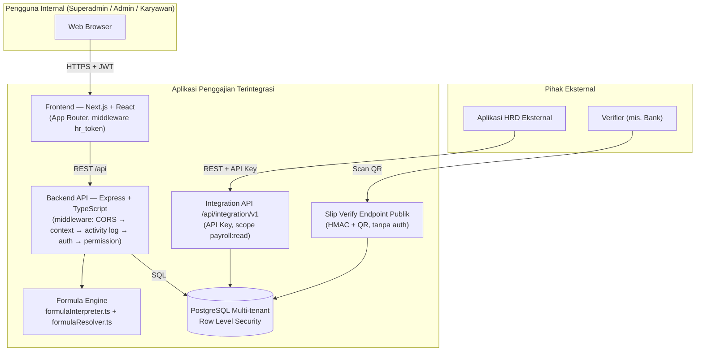
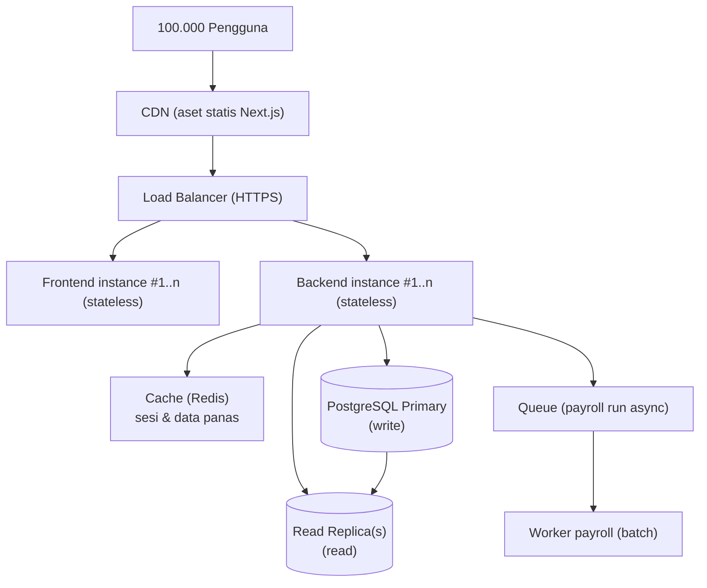
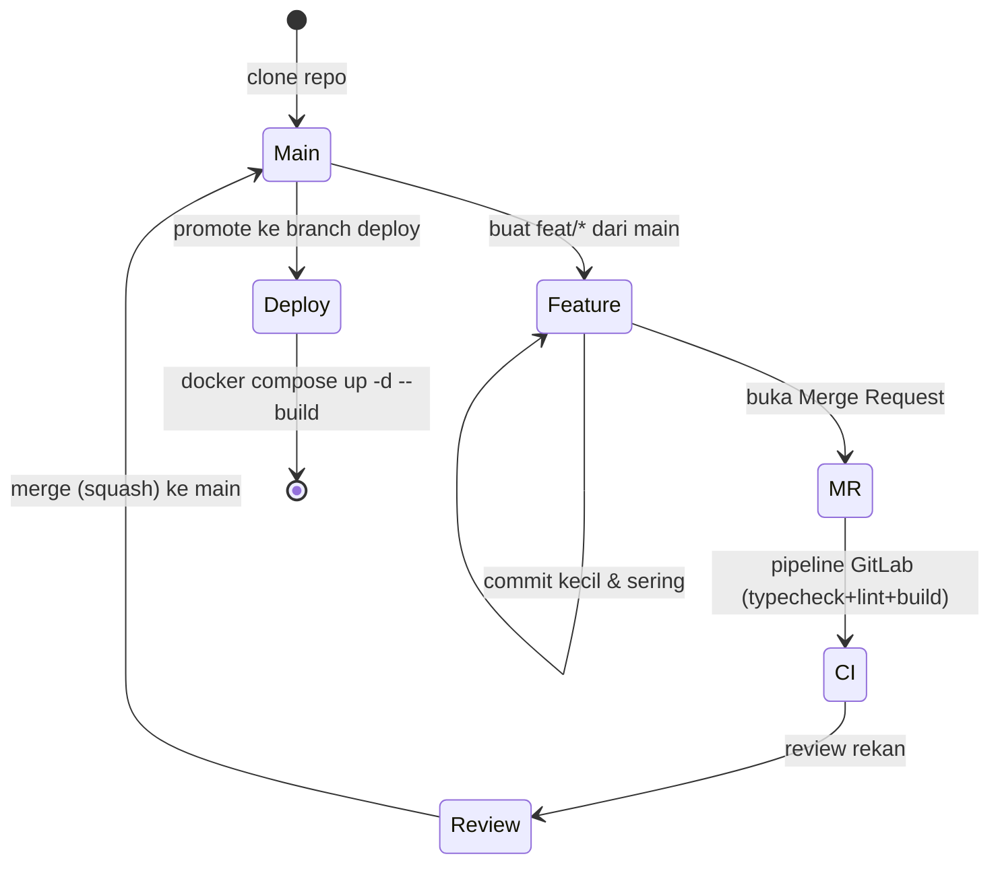

_Back to_ [[IF3250 Proyek Perangkat Lunak]]

🧵 Pembahasan Soal UAS Berbasis Proyek — **Aplikasi Penggajian Terintegrasi**.

Menjawab soal-soal esai UAS terdahulu yang konteksnya dari proyek kelompok.

Data nyata: Kelompok 04, IF3250 K03 G04 DIV2, untuk **PT LAPI Divusi**.

Tiap bagian menandai soal mana yang dijawab, mis. *(UAS 2020/2021 — Bagian II no.3)*.

Untuk soal yang butuh data personal (kontribusi %, refleksi diri): tersedia kerangka + contoh berbasis fakta proyek. **Sesuaikan** dengan kondisi aktual. 👇

## 1. Identitas & Topik Proyek

> Menjawab: *(UAS 2021/2022 — Bagian 2 no.1)* · *(UAS 2024/2025 — pengantar Bagian II)*

**Aplikasi Penggajian Terintegrasi** = sistem web **multi-tenant** untuk mengotomasi seluruh siklus penggajian di PT LAPI Divusi.

Cakupan: master data pegawai → konfigurasi komponen gaji **fleksibel per perusahaan** → perhitungan payroll periodik → distribusi **slip gaji digital**.

Satu instalasi melayani banyak perusahaan dengan **isolasi data per perusahaan**.

Sistem **tidak** menangani HRD penuh (rekrutmen, performance appraisal, cuti) — itu tetap di aplikasi HRD eksternal.

Sebagai jembatan: ada **Integration API** (`/api/integration/v1/payroll/...`) dengan API key ber-scope `payroll:read`.

Plus **endpoint publik verifikasi slip** (QR + tanda tangan kriptografis) agar pihak ketiga (mis. bank) bisa memverifikasi keaslian slip.

## 2. Peran & Kontribusi Tim

> Menjawab: *(UAS 2019/2020 — PART 2 no.1 & 2)* · *(UAS 2020/2021 — Bagian II no.1)* · *(UAS 2021/2022 — Bagian 2 no.2)*

Anggota Kelompok 04: **Ahmad Wafi Idzharulhaqq (13523131)**, **Anas Ghazi Al Gifari (13523159)**, **Benedictus Nelson (13523150)**, **Muhammad Farrel Wibowo (13523153)**, **Naufarrel Zhafif Abhista (13523149)**.

Pemetaan peran diturunkan dari area kerja nyata (feature branch GitLab). **Isi persentase sesuai kontribusi aktual** sehingga total tiap kolom = 100%. 👇

| Nama | Analyst/Designer | Programmer | Testing/QA | CI-CD Engineer | Project Mgmt | Area kerja utama (branch) |
|------|:---:|:---:|:---:|:---:|:---:|---|
| (anggota 1) | xx% | xx% | xx% | xx% | xx% | `feat/payroll-engine-and-audit`, `feat/payroll-formula-qr-variance-component` |
| (anggota 2) | xx% | xx% | xx% | xx% | xx% | `feat/hr`, `feat/dynamic-upload-form` |
| (anggota 3) | xx% | xx% | xx% | xx% | xx% | `feat/db-management`, `feat/schema-ddl-dml` |
| (anggota 4) | xx% | xx% | xx% | xx% | xx% | `feat/user-management`, `feat/company-model`, `feat/database-auth` |
| (anggota 5) | xx% | xx% | xx% | xx% | xx% | `feat/activity-log`, `feat/rekap-penggajian-integrasi-hrd`, `test/*` |
| **Total** | **100%** | **100%** | **100%** | **100%** | **100%** | |

Narasikan singkat kontribusi konkret tiap orang, mis. *"membangun Formula Engine (`formulaInterpreter.ts` + `formulaResolver.ts`) dan proses payroll run"*, *"setup pipeline GitLab CI + Dockerfile + deployment Apache reverse proxy"*, *"DDL/DML dinamis (table builder) + activity log immutable"*.

## 3. Tech Stack & Evaluasi Ketepatannya

> Menjawab: *(UAS 2024/2025 — Bagian II no.1)*

Tech stack yang dipakai: 👇

| Lapisan | Teknologi |
|---|---|
| Frontend | Next.js 16 (App Router) + React 19 + Tailwind CSS 4 + TypeScript |
| Backend | Express.js + TypeScript (Node.js 20) |
| Formula Engine | `expr-eval` + `mathjs` |
| Auth | JWT (`jsonwebtoken`) + `bcrypt` |
| Database | PostgreSQL via native `pg` (**tanpa ORM**), hosted di **Supabase** (managed, ap-southeast-1) |
| Export | `exceljs` |
| Testing | Jest + ts-jest + Supertest |
| Infra | Docker + Docker Compose, Apache reverse proxy (cPanel VPS), GitLab CI |

Apakah pemilihan sudah tepat? Pola jawab: tepat di mana, kurang tepat di mana. 👇

✅ **Tepat:** TypeScript di kedua sisi → satu bahasa, tipe konsisten lintas FE-BE.

✅ **Express tanpa ORM + `pg`** beri kontrol penuh atas SQL — krusial untuk **Row Level Security (RLS) multi-tenant** & formula dinamis yang sulit diekspresikan via ORM.

✅ **Supabase** menghemat ops DB (backup & HA terkelola) sesuai keterbatasan VPS 2 vCPU. **`expr-eval`** pas untuk evaluasi formula gaji dinamis secara aman (sandbox).

⚠️ **Trade-off:** tanpa ORM → query SQL manual, rawan duplikasi & boilerplate (lihat kompleksitas `buildSalaryPreview`).

⚠️ Next.js 16 + React 19 masih sangat baru → beberapa ekosistem belum matang. DB cloud (Supabase) menambah **latency jaringan** dibanding DB lokal.

🔁 **Bila mengulang:** pertimbangkan **query builder ringan** (mis. Kysely) agar tetap dekat SQL tapi lebih aman tipe, dan tambahkan **connection pooling**/caching untuk menekan latency Supabase.

## 4. Arsitektur Perangkat Lunak

> Menjawab: *(UAS 2019/2020 — PART 2 no.5)* · *(UAS 2021/2022 — Bagian 2 no.4)*

Arsitektur **three-tier client-server**: presentasi (Next.js) — logika bisnis (Express) — data (PostgreSQL).

Dikemas sebagai **dua aplikasi terpisah** yang berkomunikasi via REST API. Lihat juga [[Domain-Specific Software Architecture (DSSA)]].

**Frontend (Next.js)** — UI per peran; proteksi rute via Next.js Middleware (`hr_token` cookie); halaman publik `/login`, `/select-company`, `/slip-verify`.

**Backend (Express)** — semua request lewat **rantai middleware**: CORS → request context (set `app.current_company_id`) → activity logger → auth (JWT) → permission (hak akses per menu).

**Formula Engine** — `buildSalaryContext` menyusun variabel (GP, masa kerja, status keluarga), `evaluateSalaryComponents` mengevaluasi formula, `detectCircularDeps` + `topoSort` memastikan urutan evaluasi aman. (Contoh **internal DSL** — lihat 10.)

**PostgreSQL** — **RLS** memfilter tiap query per `companyId` otomatis → isolasi data multi-tenant berlapis.

**Integration API & Slip Verify** — pintu masuk machine-to-machine & verifikasi publik.

Kekurangan 1: **Single point of failure** — hanya 1 VPS menjalankan FE+BE; jika mati, seluruh sistem down. → **Usul:** pisah container ke beberapa node + load balancer, atau minimal health-check + auto-restart & monitoring.

Kekurangan 2: **Coupling tinggi di `buildSalaryPreview`** (V(G) ≈ 40–45, lihat 12) — logika resolusi komponen menumpuk di satu fungsi → sulit diuji & dipelihara. → **Usul:** refactor jadi *strategy* per sumber nilai (override/table/grade/formula) + ekstraksi fungsi kecil yang testable.

## 5. Usulan Arsitektur untuk 100.000 Pengguna

> Menjawab: *(UAS 2020/2021 — Bagian II no.3 & 4)*

Arsitektur saat ini (1 VPS + DB cloud) tidak cukup untuk 100.000 pengguna se-Indonesia. Usulan perubahan: 👇

**CDN** — menyajikan aset statis dekat pengguna → latency rendah, beban server turun.

**Load Balancer** — distribusi request ke banyak instance → **horizontal scaling**.

**Frontend & Backend stateless** — bisa direplikasi sesuai beban; sesi tidak di memori instance (pindah ke JWT + Redis) → instance bebas ditambah/kurangi.

**Cache (Redis)** — menyimpan sesi & data sering dibaca (master komponen, referensi) → kurangi beban DB.

**PostgreSQL Primary + Read Replica** — pisah jalur tulis & baca; replika menskalakan operasi baca (lihat slip, rekap) yang dominan.

**Queue + Worker** — proses **payroll run** yang berat dijalankan asinkron sebagai batch agar tidak memblok request HTTP.

Ini menjawab tantangan **large-scale** (kompleksitas interaksi, concurrency, partisi beban) di [[Large-Scale Software Problems and Characteristics]].

## 6. Pembangunan PL Skala Besar

> Menjawab: *(UAS 2021/2022 — Bagian 2 no.5)*

Berdasarkan [[Large-Scale Software Problems and Characteristics]] & [[Principles and Coordination in Large-Scale Development]], dikaitkan ke proyek kami. 👇

Penting: **partisi ke komponen kecil independen** — kami membagi sistem ke ~12 modul rute & model (auth, company, employee, payroll, formula, activity log, dll.).

Penting: **configuration management & version control** — Git/GitLab + branch protection + Merge Request review.

Penting: **automation** — GitLab CI (typecheck/lint/build) + pengujian otomatis (351 test) sebagai jaring regresi.

Penting: **koordinasi tim (3C)** — Communication, Capacity, Cooperation: daily sync + pembagian feature branch agar minim konflik.

Persoalan: **merge conflict** saat banyak feature branch menyentuh file yang sama (mis. schema/routes).

Persoalan: **kompleksitas interaksi antar komponen** — formula gaji yang saling mereferensi butuh `topoSort` & deteksi dependensi melingkar.

Persoalan: **koordinasi pembagian tugas** agar beban merata tiap sprint.

Persoalan: **constraint teknis** — keterbatasan VPS (2 vCPU/2–4 GB) saat build image & latency DB cloud.

## 7. Strategi Branching (GitHub Flow)

> Menjawab: *(UAS 2019/2020 — PART 2 no.3 aspek Branching)* · *(UAS 2020/2021 — Bagian II no.8 & 9)*

Tim memakai **GitHub Flow**: satu branch utama berumur panjang (`main`) + **feature branch berumur pendek** langsung dari `main`.

Di-merge cepat kembali ke `main` lewat **Merge Request** setelah review + CI hijau.

Cocok untuk tim kecil dengan iterasi cepat (quick merge), tanpa kompleksitas branch `develop`/`release` ala GitFlow. Branch `deploy` khusus deploy ke produksi.

**Bukti dari repo:** branch nyata kami `feat/payroll-engine-and-audit`, `feat/hr`, `feat/user-management`, `feat/db-management`, `feat/activity-log`, `feat/rekap-penggajian-integrasi-hrd`, plus `hotfix/sprint-4-backend` & `fix/employee-authorize` — semua bermuara ke `main` (contoh commit: `Merge branch 'feat/hr' into 'main'`).

**Terlaksana baik:** feature branch pendek + penamaan `feat/*` konsisten + merge via MR.

**Kurang:** ada branch yang umurnya terlalu panjang → conflict; review kadang dilewat saat kejar deadline.

Issue 1: **Merge conflict** pada file schema/routes → *perbaikan:* pecah modul lebih halus + sering rebase ke `main`.

Issue 2: **Branch lama menumpuk** → *perbaikan:* batasi 1 feature = 1 branch berumur ≤ beberapa hari, hapus branch setelah merge.

Issue 3: **Hotfix** (`hotfix/sprint-4-backend`) tidak selalu langsung disinkronkan → *perbaikan:* segera merge hotfix ke `main` agar tidak hilang di rilis berikutnya.

## 8. Proses CI/CD + Kritik

> Menjawab: *(UAS 2020/2021 — Bagian II no.10)*

**Proses CI/CD (GitLab CI, `.gitlab-ci.yml`):** 3 stage berurutan — **install → check → build** — untuk BE & FE pada image `node:20-alpine`.

`install` → `npm ci` (cache `node_modules` per branch).

`check` → `tsc --noEmit` (typecheck) + `npm run lint` (ESLint), berjalan paralel.

`build` → `npm run build`, hanya jalan setelah typecheck & lint lulus.

**Deploy** manual: `git pull && docker compose up -d --build` di VPS, dengan Apache sebagai reverse proxy + TLS.

Kritik 1: **Belum ada stage `test` di pipeline** — 351 kasus uji (unit+integrasi) hanya jalan lokal, bukan gerbang otomatis. → unit test harus jadi gate sebelum merge, integration test sebagai job terpisah.

Kritik 2: **Deploy belum otomatis (no CD)** — masih manual `git pull && up --build`, rawan human error & downtime. → tambah stage `deploy` / GitLab environment.

Kritik 3: **Tidak ada staging environment** — perubahan langsung ke produksi tanpa lingkungan uji mirip produksi.

**Korelasi dengan branching (GitHub Flow):** pipeline idealnya **trigger saat MR ke `main`** — CI jadi **gerbang kualitas** tiap MR sebelum masuk `main`, lalu `main`/`deploy` yang hijau dipromosikan ke produksi. Branch pendek → MR sering → CI sering → integrasi terkontrol.

## 9. Alat Bantu Configuration Management

> Menjawab: *(UAS 2021/2022 — Bagian 2 no.3)*

**Git + GitLab** — version control, Merge Request, code review, branch protection.

**GitLab CI** — pipeline otomatis (install/check/build).

**Docker + Docker Compose** — konfigurasi lingkungan konsisten (container backend `:5000`, frontend `:3000`, volume `payroll_storage`).

**Berkas `.env` / `.env.production`** — konfigurasi rahasia (DATABASE_URL, JWT_SECRET, PAYROLL_SLIP_SECRET) terpisah dari kode.

**Migrasi DB ber-skrip** (`npm run db:migrate` / `db:rollback`) — skema dikelola sebagai kode.

Perlu diperbaiki: **secret management** lebih aman (GitLab CI/CD variables / vault) ketimbang `.env` di server; pastikan `.gitignore` & `.htaccess` memblok `.env`/`.git`.

Perlu diperbaiki: **tambah stage test & deploy** di pipeline agar CM mencakup CD penuh.

Perlu diperbaiki: **tag/versioning rilis** yang jelas + changelog agar tiap deploy bisa ditelusuri & di-rollback.

## 10. Internal DSL

> Menjawab: *(UAS 2020/2021 — Bagian II no.7)*

Proyek kami memakai **internal DSL** nyata: **formula komponen gaji**.

Ekspresi teks yang dievaluasi `expr-eval` dengan variabel dari konteks karyawan, mis. `GP * 0.05 + TJ_PASANGAN` — di mana `GP`, `MK`, `TJ_PASANGAN` di-resolve oleh `buildSalaryContext`.

Untung 1: **memakai infrastruktur bahasa host** — tak perlu parser/compiler sendiri; cukup library evaluator di atas TypeScript → murah & cepat dibuat.

Untung 2: **ekspresif & dekat domain** — Admin/HR bisa mendefinisikan formula gaji **tanpa mengubah kode** (sesuai architectural driver "fleksibilitas formula").

Untung 3: **integrasi mulus dengan kode host** — hasil evaluasi langsung dipakai di pipeline payroll (resolusi prioritas override → table → fixed, lalu `topoSort`).

2 contoh Internal DSL umum: **jQuery** (DSL manipulasi DOM di JS) dan **Gherkin/RSpec-style** (DSL pengujian).

Ilustrasi: jQuery memakai host JS (untung 1), ekspresif untuk seleksi elemen (untung 2), menyatu dengan kode JS (untung 3) — analog formula gaji kami. Lihat juga [[DSSE Concepts and Three Key Factors]].

## 11. Software Product Line: Domain vs Application Engineering

> Menjawab: *(UAS 2020/2021 — Bagian II no.6)*

Sifat **multi-tenant** proyek kami = contoh alami product line. Lihat [[DSSE Concepts and Three Key Factors]].

2 perbedaan artefak Domain Engineering vs Application Engineering: 👇

| Aspek | Domain Engineering ("for reuse") | Application Engineering ("with reuse") |
|---|---|---|
| **Artefak** | **Core asset / reusable**: skema DB generik, Master Komponen Gaji, Formula Engine, reference architecture, RLS multi-tenant | **Produk spesifik**: konfigurasi komponen gaji & formula **per perusahaan**, data karyawan, hasil payroll run |
| **Fokus** | Commonality & variability lintas perusahaan | Instansiasi varian untuk satu perusahaan |

Ilustrasi: *Master Komponen Gaji* + *Formula Engine* (Domain Engineering, dibangun sekali, dipakai semua tenant) → disalin & di-override jadi *Master Komponen Gaji Pegawai* dengan nilai/formula khas tiap perusahaan (Application Engineering). Satu platform, banyak produk penggajian spesifik.

## 12. Cyclomatic Complexity Fungsi Terkompleks

> Menjawab: *(UAS 2020/2021 — Bagian II no.11)*

**Fungsi:** `buildSalaryPreview(userId, companyId)` — mesin perhitungan gaji.

**Lokasi:** `backend/src/models/salaryPreviewModel.ts` (≈332 baris, baris 60–392).

**Perhitungan (McCabe):** $V(G) = P + 1$, dengan $P$ = jumlah *predicate node* (titik keputusan).

Fungsi ini penuh keputusan: validasi awal, cabang `is_manual_salary`, rantai ternary lookup referensi (fungsional/struktural/proyek), `if (jabatanId)`, `if (gradeId)`, loop lookup rules, **rantai `if…else if` 5 cabang** prioritas sumber nilai (override → table → grade tenure → fixed → formula), kondisi boolean majemuk (`&&`/`!`), fallback master component, loop resolusi formula dengan `try/catch`, hingga filter output → **V(G) ≈ 40–45**.

**Analisis kualitas:** ambang aman McCabe **≤ 10** ([[Size and Complexity Metrics]]). Nilai ≈40–45 = fungsi **sangat kompleks**: sulit diuji menyeluruh, sulit dipahami & dipelihara, rawan bug.

Usul: **extract method** per strategi resolusi nilai (override/table/grade/formula) → tiap fungsi kecil dengan V(G) rendah.

Usul: **pisahkan tahap** — build context, resolve raw values, topological sort, evaluasi formula, agregasi/format output.

Usul: ganti rantai `if…else if` panjang dengan **map/strategy pattern** sumber nilai.

Usul: tambah unit test per strategi → naikkan coverage (saat ini ~37–41%).

> Catatan jawaban ujian: sebutkan **nama class+method + URL GitLab** ke baris fungsi, mis. `salaryPreviewModel.ts#L60`.

## 13. Pengujian Product Backlog

> Menjawab: *(UAS 2019/2020 — PART 2 no.6)* · *(UAS 2021/2022 — Bagian 2 no.6)*

Pilih satu **product backlog**, mis. **PB-20 "Proses Penggajian"** (Admin menjalankan payroll periode tertentu). Struktur: **Tujuan → Prosedur → Kasus Uji → Hasil**.

**Tujuan:** memastikan perhitungan komponen gaji (gross, deduction, net) benar, konsisten, tahan manipulasi, sesuai acceptance criteria PB-20 (hasil tersimpan sebagai draft, log tercatat).

**Prosedur:** pengujian otomatis dengan **Jest + ts-jest + Supertest** (HTTP tanpa menyalakan server), terbagi **unit test** (dependensi di-mock) dan **integration test** (PostgreSQL nyata, validasi query/constraint/isolasi multi-tenant). Dijalankan via `npm run test`, `npm run test:integration`, `npm run test:coverage`.

Kasus uji (contoh): 👇

| ID | Input | Expected | Tipe |
|---|---|---|---|
| Positif | payroll run periode valid, semua komponen aktif | status `DRAFT`, total net = gross − deduction | integrasi |
| Negatif | formula komponen melingkar | respons **422** (deteksi circular deps) | unit |
| Negatif | peran `USER` akses rekap penggajian | respons **403** | integrasi |
| Negatif | slip dengan net amount dipalsukan | verifikasi **gagal** (HMAC) | unit |

**Hasil (nyata):** total **351 kasus uji** — **232 unit (19 suite)** + **119 integrasi (9 suite)** — **100% lulus (0 gagal)**.

Coverage unit ≈ **37–41%** (modul inti tinggi: `authMiddleware` 100%, `errorHandler` 100%, `payrollValidationModel` 100%, `formulaResolver` 97,9%).

Pengujian ditambahkan **inkremental per sprint** → berfungsi sebagai **regresi**: 👇

| Sprint | Modul diuji |
|---|---|
| 1 (Mar 2026) | auth, employee, health, schema |
| 2 (Apr awal) | company, user, permission, middleware, switchCompany |
| 3 (Apr akhir) | activityLog, ddl, dml |
| 4 (Mei) | formulaResolver, salaryComponent, employeePayroll, payroll, recap, integrationApi |

## 14. Refleksi Scrum & Perbaikan

> Menjawab: *(UAS 2020/2021 — Bagian II no.2)* · *(UAS 2019/2020 — PART 2 no.3 & 4)* · *(UAS 2024/2025 — Bagian II no.2 & 3)*

**(a) Praktik Scrum yang tidak terlaksana baik** *(2020/2021 B2-2)* — contoh: **Daily standup tidak konsisten** karena jadwal kuliah berbeda.

Kegunaan daily: sinkronisasi progres & deteksi blocker dini. Akibat tak terlaksana: blocker (mis. konflik schema) telat ketahuan → merge conflict menumpuk. *Perbaikan:* daily async via chat + papan kanban yang selalu update.

**(b) Perbaikan PENTING per aspek + evidence** *(2019/2020 PART 2 no.3)* 👇

**Issue Management:** mulai pakai **GitLab Issues + label + milestone** agar prioritas backlog jelas (evidence: board issues).

**Branching:** disiplinkan **GitHub Flow** — feature branch pendek + MR review (evidence: daftar `feat/*` + commit `Merge … into 'main'`).

**Pembagian Tugas:** estimasi beban saat **Sprint Planning** + 1 anggota fokus 1 modul (evidence: pemetaan branch → orang).

**Teknologi & Arsitektur:** terapkan **layering** (routes → controllers → models → lib/utils) + RLS multi-tenant (evidence: struktur `backend/src`).

**(c) Pembagian tugas agar target sprint tercapai** *(2024/2025 B2-3)* — product backlog dipecah → sprint backlog saat **Sprint Planning**; tugas dibagi **per modul/feature branch** sesuai keahlian (self-organizing); sinkronisasi via daily; **Definition of Done** = kode + test lulus + MR ter-merge. Pengujian per-sprint (lihat 13) memastikan increment benar-benar selesai.

**(d) Perencanaan evaluasi di kelompok** *(2024/2025 B2-2)* — **Sprint Review** (demo increment tiap akhir sprint) · **Sprint Retrospective** (continue/stop/start) · **Code review via MR** + **CI (typecheck/lint/build)** sebagai gerbang kualitas · **Pengujian otomatis** (351 test) sebagai evaluasi regresi tiap sprint. Lihat [[Sprint Closure and Retrospective Practices]].

**(e) Perbaikan diri** *(2019/2020 PART 2 no.4)* — jawab reflektif & jujur, mis.: *"lebih disiplin menulis unit test sebelum push (coverage masih ~40%)"*, *"komunikasikan blocker lebih awal di daily"*, *"rebase ke `main` lebih sering agar minim conflict"*.

## 💡 Tips Cara Menjawab (per tema)

**Identitas & peran (1, 2):** sebutkan nama aplikasi, klien (PT LAPI Divusi), sifat multi-tenant, lalu tabel peran dengan **total kolom 100%** + narasi konkret per orang.

**Tech stack (3):** jangan cuma "sudah tepat" — tunjukkan **trade-off** (no-ORM, Supabase latency, framework baru) agar terlihat reflektif.

**Arsitektur (4) & scaling (5):** selalu **gambar diagram + jelaskan komponen + 2 kekurangan/usulan**; untuk 100k user tonjolkan **LB + stateless + cache + read replica + CDN + queue**.

**Skala besar (6):** kaitkan ke **partisi + reuse + CM + automation + 3C** dan persoalan **konflik + kompleksitas + constraint**.

**Branching (7):** tegaskan ini **GitHub Flow** (bukan GitFlow) — branch pendek, quick merge ke `main` via MR; sertakan **diagram state + 3 issue nyata + perbaikan**.

**CI/CD (8):** sebut 3 stage nyata + **3 kritik** (no test stage, deploy manual, no staging) + **korelasi**: CI sebagai gate MR ke `main`.

**Config management (9):** Git/GitLab + CI + Docker + `.env` + migrasi; perbaikan = secret management + CD + versioning.

**Internal DSL (10) & SPL (11):** pakai **formula gaji** sebagai contoh DSL internal; multi-tenant sebagai contoh product line (Domain vs Application Engineering).

**Cyclomatic complexity (12):** tunjukkan **$V(G)=P+1$**, nilai ≈40–45, ambang **≤10**, lalu usulan **extract method/strategy**. Sertakan **nama method + URL GitLab**.

**Pengujian (13):** struktur **Tujuan → Prosedur → Kasus uji (tabel, sertakan kasus negatif) → Hasil** dengan **angka nyata (351 test, 100% lulus)**.

**Refleksi Scrum (14):** jujur & konkret; pola **Situasi → Tindakan → Bukti/Hasil**.
