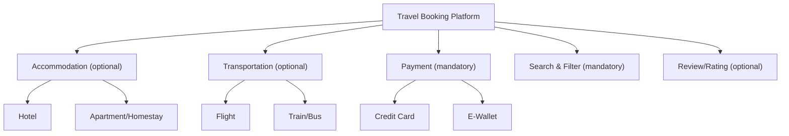
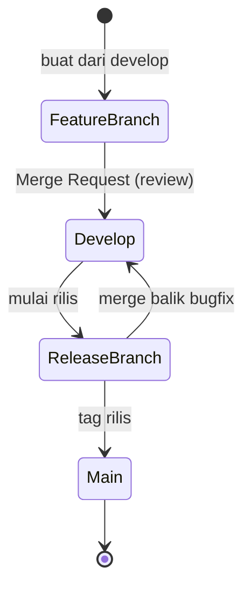

_Back to_ [[IF3250 Proyek Perangkat Lunak]]

# UAS Semester II 2020/2021 — Pembahasan

> Jumat, 12 Mei 2021 · Waktu 150 menit · Closed Book
> Format: **Bagian I (30 menit, 30 pilihan ganda)** + **Bagian II (120 menit, 11 esai berbasis proyek)**

## Bagian I (Pilihan Ganda)

> Jawaban kunci ditandai **tebal** (banyak soal bersifat *pilih semua yang benar* / ditandai `*`).

**1. Software Architecture plays the important role → (d) It represents the earliest set of design decision.**
Arsitektur = himpunan keputusan desain paling awal yang membatasi implementasi.

**2. Tugas Scrum Master, KECUALI → (a) membagi tugas ke anggota, (b) menentukan technology stack, (c) menjaga hubungan tim dengan product owner.**
Yang **merupakan** tugas SM = (d) memimpin daily stand up. Tim self-organizing (bagi tugas sendiri), tech stack keputusan tim.

**3. Contoh DSL → (d) HTML, SQL, R.**

**4. Causes of Variability → (d) Different customer/market needs** (dan secara umum juga *technical constraints of hardware/platform*).
Kunci menandai (d); ingat keduanya adalah penyebab variability dalam SPLE.

**5. Fungsi Kanban Board → (a) menjamin kelancaran penyelesaian task** (juga mengetahui bottleneck).

**6. Artifak relevan untuk Identifikasi & Analisis Kebutuhan PL → (a) Product backlog, (c) Use case, (d) Feature model** (kunci menandai a/b/c/d; inti kebutuhan = backlog, use case, feature model).

**7. Yang dibahas pada Sprint Retrospective → (a) mulai dilaksanakan, (b) dilanjutkan, (d) dihentikan (start/continue/stop).**
Bukan "apa yang harus dipilih".

**8. Kelebihan GPL, KECUALI → (a) Mudah digunakan oleh domain expert.**
Itu kelebihan DSL. GPL unggul: banyak programmer berpengalaman, dukungan IDE, berkembang lewat pustaka.

**9. Pernyataan benar tentang 'flexibility' SPLE, KECUALI → (b) produk spesifik yang satu mampu diubah menjadi produk spesifik lainnya.**

**10. Tools GitLab untuk CI/CD → (c) Pipeline** (dan Runner). Bukan Code Review/Worker/Ansible.

**11. Kelebihan DSL, KECUALI → (a) Banyaknya dukungan IDE yang baik.**
DSL minim dukungan IDE; kelebihannya: ekspresif, khusus domain, sederhana → produktif.

**12. Langkah menerapkan variability → (d) Identifikasi variability subject, definisikan variability point, definisikan varian.**

**13. Relasi antar feature pada feature modeling → (b) Require** (cross-tree constraint; pasangannya exclude/conflict).

**14. Ukuran kualitas maintainability → (c) modularity, (d) testability** (+ analysability, modifiability, reusability).
*adaptability* = portability; *interoperability* = compatibility. Lihat [[Software Quality and ISO IEC 25010]].

**15. Burndown Day 4 & 5 (effort naik) → (b) bug pada task yang sudah closed, (c) sebuah task telah selesai, (d) salah estimasi beban task.**
Garis *remaining effort* naik/datar → effort ditambahkan kembali (bug/re-estimasi); bar *completed task* terkait penyelesaian. Bukan "tidak bisa disimpulkan".

**16. Tipe relasi feature → (a) Optional, (b) Alternative, (c) OR.**
*AND feature* bukan tipe relasi feature standar (mandatory ≠ "AND").

**17. Yang termasuk DIRECT measure → (a) line of code, (d) effort.**
*efficiency* & *complexity* = **indirect** measure (external attribute). Lihat [[Software Measurement Fundamentals]].

**18. Role pada Scrum → (b) Team, (c) Product owner, (d) Scrum master.**
*Team leader* bukan role Scrum.

**19. Metodologi agile → (a) Extreme Programming, (b) Scrum.**

**20. Diagram UML untuk model domain → (c) Profile.**

**21. Kegunaan platform SPLE → (b) menurunkan cost, (c) membangun berbagai variasi produk, (d) menyediakan dasar teknologi seragam.**
Bukan "menyediakan komponen untuk produk spesifik".

**22. Artifak yang dihasilkan pada Scrum → (a) Product backlog, (c) Sprint backlog, (d) Burndown chart.**
*Kanban board* bukan artefak baku Scrum.

**23. Arsitektur dapat berperan, KECUALI → (d) Prototipe dari sistem.**
Peran: alat komunikasi stakeholder, abstraksi sistem, manifestasi keputusan desain.

**24. Yang dibahas pada Scrum daily meeting → (c) Hambatan (impediment).**

**25. Komponen DSSA, KECUALI → (d) Reference model.**
Komponen: reference architecture, domain model, component library, application configuration method, reference requirements.

**26. Ceremony pada Scrum → (a) Sprint retrospective, (b) Sprint review, (c) Sprint planning** (+ daily scrum). "Stand-up meeting" tidak ditandai sebagai ceremony terpisah di kunci ini.

**27. Testing dengan GitLab → (c) Integration testing, (d) Unit testing.**
Bukan system/user testing.

**28. Motivasi product line engineering → (a) peningkatan kualitas, (b) peningkatan akurasi estimasi biaya, (c) minimalkan effort perawatan, (d) minimalkan time-to-market.** Semua benar.

**29. Diagram UML jenis interaction → (a) Communication, (c) Sequence, (d) Timing** (+ interaction overview). *Object* bukan interaction.

**30. Diagram UML behaviour, KECUALI → (a) Deployment.**
Deployment = structure diagram; Activity/State machine/Use case = behaviour.

## Bagian II (Esai Berbasis Proyek)

> Menilai proyek kelompok kamu. Berikut kerangka & contoh jawaban model.

**1. Kontribusi Anda & rekan pada peran (Analyst/Designer, Programmer, Testing/QA, CI/CD, Project Management) — total tiap kolom 100%.**
Isi tabel persentase per anggota; pastikan tiap kolom berjumlah 100%. Tambah narasi singkat kontribusi konkret.

**2. Sebutkan sebuah praktik SCRUM yang tidak terlaksana dengan baik; jelaskan kegunaan praktik itu & alasan tidak terlaksana.**
Contoh: *Daily standup sering dilewat* → kegunaannya sinkronisasi & deteksi blocker dini → alasan: beda jadwal kuliah → akibat: blocker telat ketahuan. Tutup dengan rencana perbaikan.

**3. Usulkan perubahan arsitektur agar dapat diakses 100.000 pengguna se-Indonesia (UML Diagram).**
Gambar arsitektur **scalable**: load balancer → multiple app server (stateless) → cache (Redis) → database dengan read replica → CDN untuk aset statis. Kaitkan dengan isu skala besar di [[Large-Scale Software Problems and Characteristics]].

**4. Jelaskan fungsi tiap komponen & bagaimana usulan arsitektur menangani 100.000 pengguna.**
Per komponen jelaskan: *Load balancer* (distribusi request), *App server stateless* (horizontal scaling), *Cache* (kurangi beban DB), *Read replica* (skalakan baca), *CDN* (latency rendah). Tegaskan: skalabilitas horizontal + caching + replikasi = throughput tinggi & tahan beban.

**5. Buat feature diagram travel agency (AirBnB, Traveloka, Agoda, Tiket.com) + penjelasan tiap fitur.**
Akar *Travel Booking Platform* dengan: **Accommodation** (hotel/apartment — Agoda, AirBnB), **Transportation** (flight/train — Traveloka, Tiket.com), **Payment** (mandatory), **Search & Filter** (mandatory), **Review/Rating** (optional), **Promo** (optional). Tandai mandatory/optional/OR/alternative. Lihat [[Domain Model]] (Feature Model).

**6. Software product line: 2 perbedaan artefak Domain Engineering vs Application Engineering + ilustrasi pada proyek.**
- *Domain Engineering* menghasilkan **core asset / reusable artifacts** (reference architecture, feature model, komponen umum) → "for reuse".
- *Application Engineering* menghasilkan **produk spesifik** dari core asset (konfigurasi varian, kode aplikasi) → "with reuse".
Ilustrasi: pada proyek, modul autentikasi generik (domain eng.) dipakai ulang dengan konfigurasi role berbeda tiap aplikasi (application eng.). Lihat [[DSSE Concepts and Three Key Factors]].

**7. 3 keuntungan Internal DSL + 2 contoh + ilustrasi.**
Keuntungan: (1) memakai infrastruktur bahasa host (tooling, compiler) → murah dibuat; (2) ekspresif & dekat ke domain → kode terbaca; (3) integrasi mulus dengan kode host. Contoh: **jQuery** (DSL DOM di JS), **RSpec/Gherkin-style** atau **SQL builder** di Ruby/Kotlin. Ilustrasikan tiap keuntungan pada kedua contoh.

**8 & 9. Git branching strategy tim (UML State/Activity Diagram) + bagian yang terlaksana/tidak + 3 issue + perbaikan; upload diagram.**
Jelaskan strategi (mis. **GitFlow**: main, develop, feature/*, release/*, hotfix/*). Gambar perjalanan feature dari dibuat → merge ke develop → release → main sebagai **state diagram**. Sebutkan 3 issue nyata (mis. merge conflict, branch lama tak di-merge, lupa hotfix ke develop) + perbaikannya.

**10. Jelaskan proses CI/CD tim + 3 kritik + korelasi dengan branching strategy.**
Deskripsikan pipeline (build → test → deploy via GitLab CI). Kritik (mis. tidak ada test otomatis, deploy manual, tidak ada staging). Korelasi: pipeline jalan pada **Merge Request ke develop/main** sehingga branching menentukan kapan CI/CD trigger.

**11. Ambil fungsi/method terbesar, hitung Cyclomatic Complexity, analisis kualitas, usulkan perbaikan.**
Gunakan $V(G) = E - N + 2 = P + 1$ (P = jumlah predicate node). Sebutkan nama class+method+URL GitLab. Jika **V(G) > 10** → kompleks, sulit ditest → usulkan *refactor*: extract method, kurangi nesting, ganti switch besar dengan polymorphism. Lihat [[Size and Complexity Metrics]].

---

## Tips Cara Menjawab (per soal)

**Bagian I — strategi umum:** Soal `*` adalah **pilih semua yang benar** → jangan berhenti di satu opsi. Pola "KECUALI" = cari opsi yang konsepnya **nyebrang topik**.

- **Soal 1, 23, 25 (arsitektur/DSSA):** Arsitektur = keputusan desain awal + komunikasi + abstraksi (**bukan prototipe**). Komponen DSSA tak termasuk "reference *model*".
- **Soal 2, 18, 24, 26 (Scrum):** Hafalkan 3 role (PO/SM/Dev), SM = fasilitator (bukan pembagi tugas/penentu tech stack), daily = bahas hambatan, ceremony = planning/review/retro (+daily).
- **Soal 3, 8, 11 (DSL/GPL):** Pengecualian selalu sifat yang tertukar — "mudah utk domain expert" milik DSL; "banyak dukungan IDE" milik GPL.
- **Soal 4, 9, 12, 16, 21, 28 (SPLE/variability/feature):** Ingat langkah variability **subject→point→varian**, motivasi PLE (kualitas, time-to-market, estimasi, perawatan), tipe feature (mandatory/optional/OR/alternative + require/exclude).
- **Soal 5, 15, 22 (monitoring/artefak):** Kanban → kelancaran & bottleneck; burndown naik → bug/estimasi; artefak Scrum = backlog & burndown (bukan kanban).
- **Soal 6, 10, 27, 29, 30 (lainnya):** Kelompokkan UML (struktur/behaviour/interaction). GitLab = Pipeline/Runner, testing unit/integration.
- **Soal 13 (feature relation), 14 (maintainability), 17 (measure):** Hafalkan sub-karakteristik ISO 25010 (maintainability = modularity/reusability/analysability/modifiability/testability) & direct measure (LOC, effort, cost, speed, memory) vs indirect (quality, complexity, efficiency...). Lihat [[Software Measurement Fundamentals]].

**Bagian II — strategi umum:** Bobot besar (120 menit). **Selalu spesifik ke proyek + evidence**. Untuk soal skala besar (3, 4) tonjolkan **load balancer + stateless server + cache + replikasi DB + CDN** dan kaitkan ke [[Large-Scale Software Problems and Characteristics]]. Untuk feature diagram (5), beri **notasi mandatory/optional/OR/alternative** yang jelas. Untuk cyclomatic complexity (11), **tunjukkan perhitungan $V(G)$** dan interpretasi ambang **≤ 10**. Untuk branching/CI-CD (8–10), gunakan **diagram + kaitkan trigger pipeline ke event branch**.
