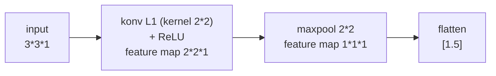
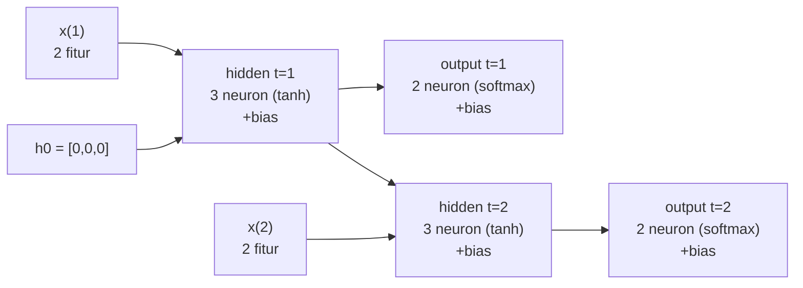

# Pembahasan Paket Soal Latihan UAS IF3270 — CNN, RNN, LSTM

> Semua angka diverifikasi dengan `.claude/skills/if3270-exam-generator/scripts/gen_packet.py`. Pembulatan 4 desimal.

## Bagian I — CNN

**a.** Ukuran feature map, `V = 1 + (W − F + 2P)/S`:
- Konvolusi: `V = 1 + (3 − 2 + 0)/1 = 2` → **2×2×1**.
- Maxpool: `V = 1 + (2 − 2 + 0)/1 = 1` → **1×1×1**.

**b.** Receptive field pertama (pojok kiri-atas), kernel `[[1,0],[0,-1]]`, bias 0.5:

`1·1 + 0·0 + 0·0 + (−1)·1 + 0.5 = 1 + 0 + 0 − 1 + 0.5 =` **0.5**

**c.** Forward propagation L1:

- **Konvolusi** (per posisi, hasil + bias 0.5):
  - pos(0,0): `1+0+0+−1+0.5 = 0.5`
  - pos(0,1): `0+0+0+−1+0.5 = −0.5`
  - pos(1,0): `0+0+0+0+0.5 = 0.5`
  - pos(1,1): `1+0+0+0+0.5 = 1.5`

  Feature map konvolusi:
  ```
  0.5  -0.5
  0.5   1.5
  ```
- **Detector (ReLU)**:
  ```
  0.5   0
  0.5   1.5
  ```
- **Maxpool 2×2 stride 1** (satu window): `max(0.5, 0, 0.5, 1.5) =` **1.5**
  ```
  1.5
  ```
- **Flatten**: **[1.5]**

**d.** Jumlah parameter L1 (shared = True): `1 × (2·2·1 + 1) =` **5**.

**e.** Arsitektur encoder CNN:



## Bagian II — RNN

Hidden: `h_t = tanh(w_xh·x_t + w_hh·h_{t-1} + b_xh)`. Output: `y_t = softmax(w_hy·h_t + b_hy)`.

**No. 2 — h pada t=1** (h0 = 0, x(1) = [0.4, 0.2]):
- neuron 1: `tanh(0.1·0.4 + 0.2·0.2 + 0.1) = tanh(0.18) =` **0.1781**
- neuron 2: `tanh(0.3·0.4 + 0.1·0.2 + 0.0) = tanh(0.14) =` **0.1391**
- neuron 3: `tanh(0.2·0.4 + 0.2·0.2 + 0.1) = tanh(0.22) =` **0.2165**

→ h(1) = **[0.1781, 0.1391, 0.2165]**

**No. 3 — h pada t=2** (x(2) = [0.7, 0.8], h(1) di atas):
- neuron 1: `tanh(0.1·0.7 + 0.2·0.8 + (0.2·0.1781 + 0.3·0.1391 + 0.2·0.2165) + 0.1) = tanh(0.4506) =` **0.4224**
- neuron 2: `tanh(0.3·0.7 + 0.1·0.8 + (0.1·0.1781 + 0.2·0.1391 + 0.1·0.2165) + 0.0) = tanh(0.3573) =` **0.3428**
- neuron 3: `tanh(0.2·0.7 + 0.2·0.8 + (0.2·0.1781 + 0.1·0.1391 + 0.3·0.2165) + 0.1) = tanh(0.5145) =` **0.4734**

→ h(2) = **[0.4224, 0.3428, 0.4734]**

**No. 4 — output t=1**:
- net out1: `0.3·0.1781 + 0.2·0.1391 + 0.1·0.2165 + 0.3 = 0.4029`
- net out2: `0.1·0.1781 + 0.2·0.1391 + 0.3·0.2165 + 0.1 = 0.2106`
- `y(1) = softmax([0.4029, 0.2106]) =` **[0.5479, 0.4521]** → kelas prediksi **[1 0]** (kelas pertama).

**No. 5 — output t=2**:
- net out1: `0.3·0.4224 + 0.2·0.3428 + 0.1·0.4734 + 0.3 = 0.5426`
- net out2: `0.1·0.4224 + 0.2·0.3428 + 0.3·0.4734 + 0.1 = 0.3528`
- `y(2) = softmax([0.4426, 0.2530]) =` **[0.5473, 0.4527]** → kelas prediksi **[1 0]**.

**No. 6 — jumlah parameter**: `(n_in + n_h + 1)·n_h + (n_h + 1)·n_out = (2+3+1)·3 + (3+1)·2 = 18 + 8 =` **26**.

**No. 1 — unfolded network**:



## Bagian III — LSTM

Rumus: `f = σ(Wxf·x + Whf·h_{t-1} + bf)`; `i = σ(Wxi·x + Whi·h_{t-1} + bi)`;
`Ĉ = tanh(Wxc·x + Whc·h_{t-1} + bc)`; `o = σ(Wxo·x + Who·h_{t-1} + bo)`;
`C_t = C_{t-1}⊙f + i⊙Ĉ`; `h_t = o⊙tanh(C_t)`.

**No. 1** (x(1) = [1, 2], h0 = 0, C0 = 0):
- `f1 = σ([0.7,0.5]·[1,2] + [0.1]·[0] + 0.15) = σ(1.7 + 0 + 0.15) = σ(1.85) =` **0.8641**
- `i1 = σ([0.9,0.8]·[1,2] + [0.6]·[0] + 0.4) = σ(2.5 + 0.4) = σ(2.9) =` **0.9478**
- `Ĉ1 = tanh([0.4,0.2]·[1,2] + [0.1]·[0] + 0.1) = tanh(0.8 + 0.1) = tanh(0.9) =` **0.7163**
- `o1 = σ([0.6,0.4]·[1,2] + [0.2]·[0] + 0.2) = σ(1.4 + 0.2) = σ(1.6) =` **0.8320**
- `C1 = C0·f1 + i1·Ĉ1 = 0·0.8641 + 0.9478·0.7163 =` **0.6789**
- `h1 = o1·tanh(C1) = 0.8320·tanh(0.6789) = 0.8320·0.5908 =` **0.4916**

**No. 2 — definisi simbol**:
- **f (forget gate)**: menentukan informasi pada cell state sebelumnya yang dipertahankan (mendekati 1) atau dibuang (mendekati 0).
- **i (input gate)**: menentukan seberapa besar informasi baru yang ditambahkan ke cell state.
- **Ĉ (candidate cell state)**: kandidat informasi baru, dihasilkan dengan tanh sehingga bernilai di [−1, 1].
- **o (output gate)**: menentukan bagian cell state yang dikeluarkan sebagai hidden state.
- **C (cell state)**: memori utama jangka panjang, diperbarui oleh forget gate dan input gate.
- **h (hidden state)**: keluaran LSTM pada waktu t, dipakai ke layer/timestep berikutnya.

**No. 3 — RNN vs LSTM**:
1. **Cell state**: RNN hanya punya hidden state sebagai memori sehingga informasi lama mudah hilang pada sekuens panjang; LSTM memiliki cell state khusus untuk mempertahankan informasi jangka panjang.
2. **Gate**: RNN tidak punya mekanisme gate; LSTM memiliki forget/input/output gate untuk mengatur informasi mana yang disimpan, diperbarui, atau dibuang sehingga pelatihan lebih stabil terhadap dependensi panjang.
