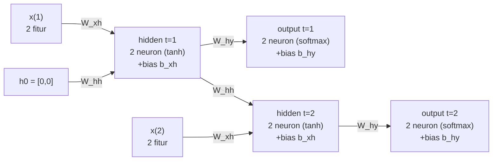

# Pembahasan Paket Soal Latihan UAS IF3270 — Paket 01

> Topik: RNN, LSTM, Transformer, Encoder-Decoder & Attention, Reinforcement Learning. Pembulatan 4 desimal.
> Tiap langkah ditulis **formula → angka tersubstitusi → hasil (tebal)**.

## Bagian I — Pilihan Ganda (rubrik: nilai per nomor hanya bila SEMUA opsi ditandai benar)

**1.**
- a. **(O)** — RNN dirancang untuk data sekuensial yang urutan/temporalnya bermakna.
- b. **(O)** — bobot di-share antar timestep → panjang variabel, jumlah parameter tetap.
- c. **(X)** — justru sebaliknya: jumlah parameter tetap berkat weight sharing, tidak bertambah dengan panjang sekuens.
- d. **(O)** — konteks masa lalu disimpan dan dialirkan lewat hidden state.

**2.**
- a. **(O)** — FFNN tanpa memori; banyak layer pun tak menangkap urutan input.
- b. **(X)** — menambah layer tidak memberi FFNN memori antar input; itu peran rekurensi RNN.
- c. **(O)** — RNN menangkap dependensi antar timestep via hidden state; FFNN hanya memetakan input→output.

**3.**
- a. **(O)** — sentiment/klasifikasi satu label dari satu sekuens = many-to-one.
- b. **(O)** — image captioning (1 gambar → barisan kata) = one-to-many.
- c. **(O)** — panjang input = panjang output, label per posisi = many-to-many sinkron.
- d. **(X)** — panjang input ≠ output (translasi) butuh many-to-many async (encoder-decoder), bukan one-to-one.

**4.**
- a. **(O)** — many-to-one mengambil output dari hidden state timestep terakhir.
- b. **(X)** — itu deskripsi many-to-many sinkron, bukan many-to-one.
- c. **(O)** — cocok untuk mengklasifikasi keseluruhan sekuens menjadi satu label.

**5.**
- a. **(O)** — klasifikasi multi-kelas: softmax, #neuron = #kelas.
- b. **(O)** — regresi: umumnya 1 neuron linear.
- c. **(O)** — translasi: #neuron output = ukuran vocabulary target.
- d. **(X)** — softmax multi-neuron tidak sesuai untuk regresi (regresi nilai kontinu, 1 neuron linear).

**6.**
- a. **(O)** — Bi-RNN = dua RNN maju & mundur, hasil digabung (umumnya concat).
- b. **(X)** — jumlah timestep TIDAK dilipat dua; yang bertambah ≈2× adalah jumlah parameter.
- c. **(X)** — Bi-RNN butuh seluruh sekuens, tidak cocok untuk forecasting real-time.
- d. **(O)** — cocok untuk sequence tagging yang butuh konteks seluruh kalimat.

**7.**
- a. **(O)** — forget gate menentukan info cell lama yang dipertahankan/dibuang.
- b. **(O)** — input gate mengatur seberapa banyak info baru masuk ke cell state.
- c. **(X)** — candidate Ĉ memakai tanh (rentang [−1, 1]), bukan sigmoid.
- d. **(O)** — output gate menentukan bagian cell state yang keluar menjadi hidden state.

**8.**
- a. **(O)** — cell state = jalur memori jangka panjang dengan update aditif.
- b. **(X)** — RNN biasa hanya punya hidden state, tanpa cell state maupun gate.
- c. **(O)** — LSTM dirancang meredam vanishing gradient pada dependensi panjang.

**9.**
- a. **(O)** — hidden state tiap timestep dipetakan ke label via layer softmax.
- b. **(X)** — itu many-to-one; sequence labeling menghasilkan output per timestep.
- c. **(O)** — jumlah neuron softmax = jumlah kelas label.

**10.**
- a. **(O)** — Transformer berbasis attention penuh, meniadakan rekurensi dan konvolusi.
- b. **(X)** — Transformer memproses token secara paralel, bukan sekuensial seperti RNN.
- c. **(O)** — paralelisme menghapus bottleneck sekuensial dan memperkuat relasi long-range.

**11.**
- a. **(O)** — self-attention menghitung relasi antar token dalam sekuens yang sama.
- b. **(O)** — Q/K/V diperoleh dari proyeksi linear pada input.
- c. **(O)** — multi-head: beberapa head paralel, tiap head menangkap relasi berbeda.
- d. **(O)** — pembagian √d_k menstabilkan varians skor agar softmax tidak saturasi.

**12.**
- a. **(O)** — tanpa rekurensi, self-attention memandang sekuens sebagai himpunan tanpa orde → butuh positional encoding.
- b. **(O)** — masked self-attention mencegah decoder melihat token masa depan.
- c. **(O)** — pada enc-dec attention, Q dari decoder, K/V dari encoder.
- d. **(O)** — BERT encoder-only, GPT decoder-only, T5 encoder-decoder.

## Bagian II — RNN Sinkron Many-to-Many

Hidden: `h_t = tanh(W_xh·x_t + W_hh·h_{t-1} + b_xh)`. Output: `y_t = softmax(W_hy·h_t + b_hy)`.

**a. Unfolded network:**



**b. Hidden state.**

t=1 (h0 = [0,0], x(1) = [0.5, 0.3]); suku W_hh = 0:
- neuron 1: `tanh(0.1·0.5 + 0.2·0.3 + 0.1) = tanh(0.21) =` **0.2070**
- neuron 2: `tanh(0.2·0.5 + 0.1·0.3 + 0.1) = tanh(0.23) =` **0.2260**

→ h(1) = **[0.2070, 0.2260]**

t=2 (x(2) = [0.2, 0.6], h(1) di atas):
- neuron 1: `tanh(0.1·0.2 + 0.2·0.6 + (0.1·0.2070 + 0.2·0.2260) + 0.1) = tanh(0.3059) =` **0.2967**
- neuron 2: `tanh(0.2·0.2 + 0.1·0.6 + (0.2·0.2070 + 0.1·0.2260) + 0.1) = tanh(0.2640) =` **0.2580**

→ h(2) = **[0.2967, 0.2580]**

**c. Output layer dan kelas prediksi.**

t=1:
- net out1: `0.2·0.2070 + 0.1·0.2260 + 0.1 = 0.1640`
- net out2: `0.1·0.2070 + 0.2·0.2260 + 0.1 = 0.1659`
- `y(1) = softmax([0.1640, 0.1659]) =` **[0.4995, 0.5005]** → kelas prediksi **2** (neuron-2).

t=2:
- net out1: `0.2·0.2967 + 0.1·0.2580 + 0.1 = 0.1851`
- net out2: `0.1·0.2967 + 0.2·0.2580 + 0.1 = 0.1813`
- `y(2) = softmax([0.1851, 0.1813]) =` **[0.5010, 0.4990]** → kelas prediksi **1** (neuron-1).

**d. Jumlah parameter.**

`(n_in + n_h + 1)·n_h + (n_h + 1)·n_out = (2+2+1)·2 + (2+1)·2 = 10 + 6 =` **16**.

## Bagian III — Encoder-Decoder & Attention

Asumsi: **dimensi input decoder = jumlah neuron output** (token sebelumnya di-feed kembali ke decoder), jadi dim input decoder = 1.

**a. Jumlah parameter (RNN enc-dec + FC output).**

Rumus layer RNN: `n_h·(n_in + n_h + 1)`. Rumus dense: `(n_in + 1)·n_out`.
- Encoder (n_in = 4, n_h = 2): `2·(4 + 2 + 1) =` **14**
- Decoder (n_in = 1, n_h = 2): `2·(1 + 2 + 1) =` **8**
- Output FC (dec_h = 2 → 1 neuron): `(2 + 1)·1 =` **3**

Total = 14 + 8 + 3 = **25**.

**b. Penambahan 1 unit attention (scoring general).**

Asumsi konvensi: fungsi scoring **general** `score(s, h) = sᵀ W_a h`, sehingga tambahan parameter = `dec_h · enc_h`.
- Tambahan attention: `dec_h · enc_h = 2·2 =` **4**

Total = 25 + 4 = **29**.

**c. Formula inferensi decoder tanpa attention.**

Seed: context vector c = hidden state encoder **terakhir** → menjadi seed state awal decoder s0 (s0 = c); token awal y0 = `<start>`.

Untuk tiap timestep t:
- `s_t = f(W_s·s_{t-1} + U_s·y_{t-1} + b_s)`
- `y_t = g(W_y·s_t + b_y)`

dengan f = aktivasi hidden, g = aktivasi output. y_{t-1} (output token sebelumnya) di-feed kembali sebagai input decoder (autoregresif).

**d. Formula inferensi decoder dengan attention.**

Untuk tiap timestep t (h_j = hidden state encoder ke-j):
- `α_{t,j} = softmax_j(score(s_t, h_j))`
- `c_t = Σ_j α_{t,j}·h_j`  (context vector berbeda tiap timestep)
- `s_t = f(W_s·s_{t-1} + U_s·y_{t-1} + c_t + b_s)`
- `y_t = g(W_y·s_t + b_y)`

Berbeda dari tanpa attention, context vector c_t dihitung ulang tiap timestep sehingga decoder dapat fokus ke bagian input yang berbeda untuk tiap output.

## Bagian IV — Reinforcement Learning

**1. Tabel perbandingan supervised learning vs reinforcement learning.**

| Aspek | Supervised Learning | Reinforcement Learning |
| ----- | ------------------- | ---------------------- |
| Informasi yang diperlukan agen | Pasangan (input, label) yang sudah diberi anotasi | Sinyal reward dari hasil interaksi dengan environment |
| Data observasi bersifat sekuensial? | **Belum tentu** (data umumnya i.i.d., tidak harus berurutan) | **Ya** (observasi datang dari interaksi yang berurutan/temporal) |
| Apa yang dipelajari agen? | Pemetaan input → output (fungsi prediksi) | Policy: aksi yang memaksimalkan return (akumulasi reward) |

**2. Wumpus World — TD Q-Learning.**

Formula update: `Q(s,a) ← Q(s,a) + α·[R + γ·max_{a'} Q(s',a') − Q(s,a)]`, dengan semua Q awal = 0, α = 0.4, γ = 0.6.
Jika s' adalah state terminal → max_{a'} Q(s',a') = 0 (tanpa bootstrap). R = reward saat **masuk** ke s'.

**(i) Update Q(s,a) tiap transisi.**

Episode I — (1,1) → (2,1) → (3,1):
- (1,1)→(2,1) [E]: R = 0 → `Q = 0 + 0.4·(0 + 0.6·0 − 0) =` **0**
- (2,1)→(3,1) [E, wumpus terminal]: R = −10 → `Q = 0 + 0.4·(−10 + 0 − 0) =` **−4**

Episode II — (1,1) → (1,2) → (2,2) → (3,2):
- (1,1)→(1,2) [N]: R = 0 → `Q = 0 + 0.4·(0 + 0.6·0 − 0) =` **0**
- (1,2)→(2,2) [E]: R = 0 → `Q = 0 + 0.4·(0 + 0.6·0 − 0) =` **0**
- (2,2)→(3,2) [E, gold terminal]: R = +10 → `Q = 0 + 0.4·(10 + 0 − 0) =` **+4**

Episode III — (1,1) → (1,2) → (1,3):
- (1,1)→(1,2) [N]: R = 0 → `Q = 0 + 0.4·(0 + 0.6·0 − 0) =` **0**
- (1,2)→(1,3) [N, pit terminal]: R = −10 → `Q = 0 + 0.4·(−10 + 0 − 0) =` **−4**

Q akhir yang tidak nol: **Q((2,1),E) = −4**, **Q((2,2),E) = +4**, **Q((1,2),N) = −4**.

**(ii) Grid berisi Q(s,a) terakhir.**

```
baris 3 | (1,3) PIT [-10]  | (2,3)            | (3,3)
baris 2 | (1,2) N: -4      | (2,2) E: +4      | (3,2) GOLD [+10]
baris 1 | (1,1)            | (2,1) E: -4      | (3,1) WUMPUS [-10]
          kolom 1            kolom 2            kolom 3
```

(Hanya aksi dengan Q ≠ 0 yang dituliskan; sisanya tetap 0.)

**(iii) Aksi terbaik tiap ruang non-terminal = argmax_a Q(s,a).**

- (2,2): aksi terbaik **E** (Q = +4, menuju gold).
- (1,2): semua aksi bernilai ≤ 0; Q((1,2),N) = −4 (menuju pit) harus dihindari, jadi pilih aksi lain yang Q = 0 (mis. E menuju (2,2) yang berlanjut ke gold).
- (2,1): Q((2,1),E) = −4 (menuju wumpus) harus dihindari; pilih aksi lain bernilai 0.
- (1,1): semua aksi bernilai 0; pada tahap ini Q belum membedakan, butuh episode lebih lanjut agar nilai gold ter-propagasi mundur.

Policy yang muncul mengarahkan agen via (1,1)→(1,2)→(2,2)→(3,2) menuju gold sambil menghindari wumpus (3,1) dan pit (1,3).
