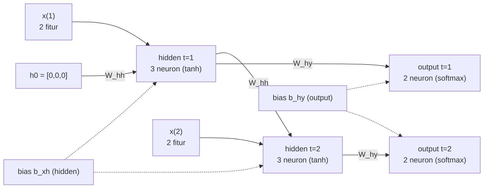
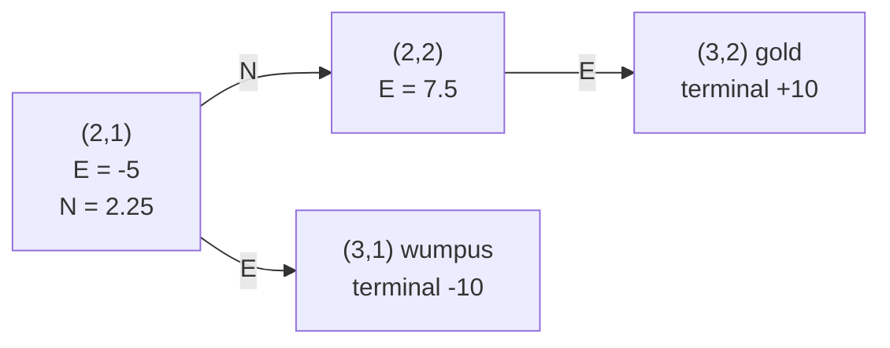

# Pembahasan Paket Soal Latihan UAS IF3270 — Paket 02

> Topik: RNN · LSTM · Transformer/Attention · Encoder-Decoder · Reinforcement Learning. Pembulatan 4 desimal.
> Angka hitungan diverifikasi; konsep merujuk Cheatsheet-UAS-IF3270.

## Bagian I — Pilihan Ganda Konsep RNN/LSTM/Transformer

Rubrik: nilai penuh (2.5) per nomor hanya bila **semua** opsi diberi tanda benar.

1. a. **(O)** FFNN memetakan input→output tanpa memori, tak menangkap urutan walau banyak layer.
   b. **(O)** Hidden state RNN mengalir antar timestep membawa konteks.
   c. **(O)** Bobot di-share antar timestep → jumlah parameter tetap untuk panjang variabel.
   d. **(X)** FFNN tidak unggul pada sekuens; kedalaman tak menggantikan memori temporal.

2. a. **(O)** many-to-one: sekuens → 1 output, diambil dari timestep terakhir.
   b. **(O)** many-to-many sync: output tiap timestep, cocok sequence labeling/POS tagging.
   c. **(O)** one-to-many: 1 input → sekuens, contohnya image captioning.
   d. **(X)** Translasi (panjang beda) butuh many-to-many seq2seq (encoder-decoder), bukan one-to-one.

3. a. **(O)** Klasifikasi → softmax, #neuron = #kelas.
   b. **(O)** Regresi → 1 neuron linear.
   c. **(O)** Translasi → #neuron output = ukuran vocabulary target.
   d. **(X)** #neuron output ditentukan task, tak harus sama dengan #neuron hidden.

4. a. **(O)** Bi-RNN menggabungkan RNN maju dan mundur (umumnya concat).
   b. **(O)** Dua RNN → parameter ≈ 2× RNN satu arah.
   c. **(X)** Jumlah timestep TIDAK dilipat dua; hanya jumlah RNN/parameter yang ganda.
   d. **(X)** Bi-RNN butuh seluruh kalimat (masa depan) → tak cocok real-time forecasting.

5. a. **(O)** Cell state = memori jangka panjang dengan update aditif.
   b. **(O)** Forget gate memilih info cell lama yang dipertahankan/dibuang.
   c. **(O)** Input gate mengatur banyak info baru masuk ke cell.
   d. **(X)** Output gate memakai σ (∈[0,1]); tanh dipakai pada kandidat Ĉ dan tanh(C).

6. a. **(O)** RNN biasa rawan vanishing gradient untuk dependensi panjang.
   b. **(O)** LSTM menambah cell state + 3 gate untuk kontrol aliran info.
   c. **(X)** RNN biasa hanya hidden state, tanpa gate forget/input/output.
   d. **(O)** Kandidat Ĉ memakai tanh → nilainya di [−1, 1].

7. a. **(O)** Encoder meringkas seluruh input menjadi satu context vector.
   b. **(O)** Tanpa attention, context = hidden encoder terakhir.
   c. **(O)** Context tunggal → bottleneck untuk kalimat panjang.
   d. **(X)** Decoder timestep-1 memakai start-token/context, bukan data latih langsung.

8. a. **(O)** Dengan attention, context cₜ berbeda tiap timestep decoder.
   b. **(O)** Bobot attention dipelajari saat training lewat backprop.
   c. **(X)** Attention belajar alignment implisit dari parallel corpus, tanpa anotasi eksplisit.
   d. **(O)** Decoder bisa fokus ke bagian input berbeda tiap kata.

9. a. **(O)** Bahdanau (additive): cₜ dihitung sebelum sₜ → jadi input untuk sₜ.
   b. **(O)** Luong (multiplicative): sₜ dihitung dulu, lalu s̃ₜ = tanh(W_c·[cₜ; sₜ]).
   c. **(O)** Scoring: dot (sᵀh) / general (sᵀWₐh) / concat (vₐᵀtanh(Wₐ[s; h])).
   d. **(X)** Pada Luong cₜ dipakai SETELAH sₜ (via s̃ₜ), tidak menjadi input sₜ seperti Bahdanau.

10. a. **(O)** Transformer berbasis attention penuh, meniadakan rekurensi & konvolusi.
    b. **(O)** Bisa diproses paralel (tak menunggu token sebelumnya) → unggul vs RNN enc-dec.
    c. **(O)** Positional encoding wajib karena self-attention memandang sekuens tanpa orde.
    d. **(X)** Transformer justru paralel, bukan sekuensial seperti RNN.

11. a. **(O)** Q/K/V = proyeksi linear: Query (dicari), Key (dicocokkan), Value (diagregasi).
    b. **(O)** Self-attention = attention antar token pada sekuens yang sama.
    c. **(O)** Pembagian √d_k menstabilkan varians skor agar softmax tak saturasi.
    d. **(X)** Multi-head memakai proyeksi Q/K/V berbeda tiap head → menangkap relasi berbeda.

12. a. **(O)** TD update tiap timestep via bootstrapping, tak menunggu episode selesai.
    b. **(O)** Monte Carlo menunggu Return penuh hingga episode berakhir.
    c. **(O)** Q-learning (off-policy) memakai max Q' → policy optimal/agresif.
    d. **(X)** SARSA (on-policy) memakai Q(s',a') aksi nyata, BUKAN max → tak sama dengan Q-learning.

## Bagian II — RNN Sync Many-to-Many Forward

**a. Unfolded network (Nilai 4).** Satu kotak hidden (3 neuron) per timestep, input vektor 2 fitur, panah W_hh dari h(t-1)→h(t), panah W_hy ke output (2 neuron) tiap t, plus bias b_xh dan b_hy.



**b. Hidden state (Nilai 8).** Rumus: `h_t[j] = tanh((W_xh baris j)·x_t + (W_hh baris j)·h_{t-1} + b_xh[j])`.

t=1 (h0 = 0, suku W_hh = 0):
- neuron1: `tanh(0.1·0.4 + 0.2·0.2 + 0.1) = tanh(0.18) =` **0.1781**
- neuron2: `tanh(0.3·0.4 + 0.1·0.2 + 0.0) = tanh(0.14) =` **0.1391**
- neuron3: `tanh(0.2·0.4 + 0.2·0.2 + 0.1) = tanh(0.22) =` **0.2165**
- → h(1) = [**0.1781**, **0.1391**, **0.2165**]

t=2 (pakai h(1)):
- neuron1: `tanh(0.1·0.7 + 0.2·0.8 + (0.2·0.1781 + 0.3·0.1391 + 0.2·0.2165) + 0.1) = tanh(0.4506) =` **0.4224**
- neuron2: `tanh(0.3·0.7 + 0.1·0.8 + (0.1·0.1781 + 0.2·0.1391 + 0.1·0.2165) + 0.0) = tanh(0.3573) =` **0.3428**
- neuron3: `tanh(0.2·0.7 + 0.2·0.8 + (0.2·0.1781 + 0.1·0.1391 + 0.3·0.2165) + 0.1) = tanh(0.5145) =` **0.4734**
- → h(2) = [**0.4224**, **0.3428**, **0.4734**]

**c. Output layer & kelas prediksi (Nilai 8).** Rumus: `net_o = (W_hy baris o)·h_t + b_hy[o]`, `y_t = softmax(net)`.

t=1:
- `net1 = 0.3·0.1781 + 0.2·0.1391 + 0.1·0.2165 + 0.3 = 0.4029`
- `net2 = 0.1·0.1781 + 0.2·0.1391 + 0.3·0.2165 + 0.1 = 0.2106`
- `y(1) = softmax([0.4029, 0.2106]) =` [**0.5479**, **0.4521**] → kelas **1** (neuron-1)

t=2:
- `net = [0.5426, 0.3528]`
- `y(2) = softmax([0.5426, 0.3528]) =` [**0.5473**, **0.4527**] → kelas **1** (neuron-1)

**d. Jumlah parameter (Nilai 5).** Rumus: `(n_in + n_h + 1)·n_h + (n_h + 1)·n_out`.
- `= (2 + 3 + 1)·3 + (3 + 1)·2 = 18 + 8 =` **26**

## Bagian III — Encoder-Decoder & Attention

Asumsi: dimensi input decoder = jumlah neuron output (di sini 2).

**a. Jumlah parameter (Nilai 7).** LSTM layer = `4·n_h·(n_in + n_h + 1)`, dense = `(n_in + 1)·n_out`.
- Encoder LSTM (n_h=2, input 3 fitur): `4·2·(3 + 2 + 1) = 8·6 =` **48**
- Decoder LSTM (n_h=2, input dim 2): `4·2·(2 + 2 + 1) = 8·5 =` **40**
- Output FC (2 neuron): `(2 + 1)·2 =` **6**
- Total = 48 + 40 + 6 = **94**

**b. Tambahan attention general (Nilai 6).** Scoring general menambah `dec_h · enc_h`.
- `+ = 2·2 =` **4**
- Total baru = 94 + 4 = **98**

**c. Inferensi decoder tanpa attention (Nilai 6).**
- Seed: s0 di-seed dari **context vector** = hidden encoder **terakhir**; y0 = token **<start>**.
- `s_t = f(W_s·s_{t-1} + U_s·y_{t-1} + b_s)`
- `y_t = g(W_y·s_t + b_y)`
- Bersifat **autoregresif**: y_{t-1} (output sebelumnya) menjadi input timestep berikutnya. Context tunggal dipakai sepanjang dekoding (potensi **bottleneck** kalimat panjang).

**d. Inferensi decoder dengan attention (Nilai 6).**
- `α_{t,j} = softmax_j(score(s_t, h_j))` — bobot atas tiap hidden encoder h_j.
- `c_t = Σ_j α_{t,j}·h_j` — context **berbeda tiap timestep** decoder.
- `s_t = f(W_s·s_{t-1} + U_s·y_{t-1} + c_t + b_s)`
- `y_t = g(W_y·s_t + b_y)`
- **Bahdanau (additive)**: c_t dihitung **sebelum** s_t lalu masuk sebagai input bagi s_t (seperti formula di atas).
- **Luong (multiplicative)**: s_t dihitung **dulu**, baru `s̃_t = tanh(W_c·[c_t; s_t])` dipakai untuk prediksi `y_t = g(W_y·s̃_t + b_y)`; lebih sederhana/efisien.

## Bagian IV — Reinforcement Learning

**1. Tabel Supervised vs RL (Nilai 6).**

| Aspek | Supervised Learning | Reinforcement Learning |
| ----- | ------------------- | ---------------------- |
| Informasi yang diperlukan agen | Pasangan (input, label) yang benar | Sinyal reward dari lingkungan |
| Data observasi bersifat sekuensial? | Belum tentu (umumnya i.i.d.) | Ya (interaksi/episode berurutan) |
| Apa yang dipelajari agen? | Pemetaan input → output (label) | Policy: aksi yang memaksimalkan return |

**2. Wumpus World — TD Q-Learning.** Rumus: `Q(s,a) ← Q(s,a) + α·[R + γ·maxQ' − Q(s,a)]`, α=0.5, γ=0.9; jika s' terminal → maxQ' = 0; nilai Q terbawa antar episode.

**(i) Update Q rinci (Nilai 8).**

Episode I — (1,1) → (1,2) → (2,2) → (3,2):
- (1,1)→(1,2) [N]: R=0, maxQ'=0 → `Q = 0 + 0.5(0 + 0.9·0 − 0) =` **0**
- (1,2)→(2,2) [E]: R=0, maxQ'=0 → `Q = 0 + 0.5(0 + 0.9·0 − 0) =` **0**
- (2,2)→(3,2) [E, gold terminal]: R=+10, maxQ'=0 → `Q = 0 + 0.5(10 + 0 − 0) =` **5**

Episode II — (1,1) → (2,1) → (3,1):
- (1,1)→(2,1) [E]: R=0, maxQ'=0 → `Q = 0 + 0.5(0 + 0.9·0 − 0) =` **0**
- (2,1)→(3,1) [E, wumpus terminal]: R=−10, maxQ'=0 → `Q = 0 + 0.5(−10 + 0 − 0) =` **−5**

Episode III — (1,1) → (2,1) → (2,2) → (3,2):
- (1,1)→(2,1) [E]: R=0, maxQ'=0 → `Q = 0 + 0.5(0 + 0.9·0 − 0) =` **0**
- (2,1)→(2,2) [N]: R=0, maxQ'(2,2)=Q((2,2),E)=5 → `Q = 0 + 0.5(0 + 0.9·5 − 0) =` **2.25**
- (2,2)→(3,2) [E, gold terminal]: R=+10, maxQ'=0, Q((2,2),E) saat ini = 5 → `Q = 5 + 0.5(10 + 0 − 5) =` **7.5**

Q akhir (selain 0): `Q((2,2),E) =` **7.5**, `Q((2,1),E) =` **−5**, `Q((2,1),N) =` **2.25**.

**(ii) Grid nilai Q terakhir (Nilai 3).**



```
ASCII (ruang non-terminal yang punya nilai):
(2,1): Q(E) = -5   Q(N) = 2.25
(2,2): Q(E) = 7.5
```

**(iii) Policy argmax_a Q(s,a) (Nilai 3).**
- Dari (2,2): argmax → **E** (Q = 7.5).
- Dari (2,1): argmax → **N** (Q = 2.25 > Q(E) = −5).
