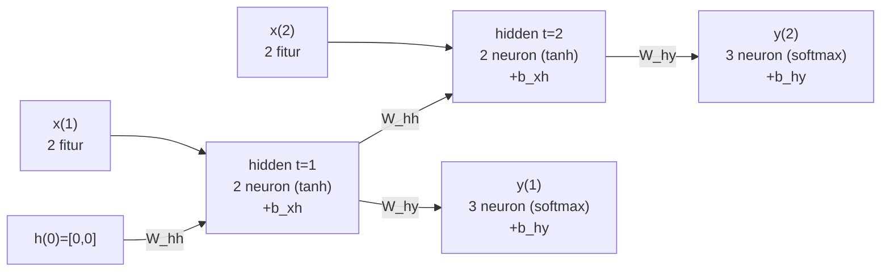

# Pembahasan Paket Soal Latihan UAS IF3270 — Paket 03

> Topik: RNN · LSTM · Transformer/Attention · Encoder-Decoder · Reinforcement Learning.
> Semua angka hitungan diverifikasi. Pembulatan 4 desimal.

## Bagian I — Pilihan Ganda Konsep

Rubrik: nilai penuh (2.5) per nomor hanya bila **seluruh** opsi ditandai benar.

1. a. **(O)** many-to-one memetakan sekuens → 1 output, cocok klasifikasi sentimen.
   b. **(X)** output diambil dari timestep **terakhir**, bukan pertama.
   c. **(O)** input=output panjang → sequence labeling / POS tagging.
   d. **(O)** one-to-many: 1 input → sekuens, contoh image captioning.

2. a. **(O)** keputusan akhir diambil dari output timestep terakhir.
   b. **(O)** seluruh timestep dihitung untuk membentuk konteks hidden akhir.
   c. **(X)** yang dipakai hidden state terakhir, bukan timestep awal.

3. a. **(O)** dua RNN (maju + mundur) lalu digabung (umumnya concat).
   b. **(O)** dua jalur bobot → parameter ≈ 2× RNN satu arah.
   c. **(X)** jumlah timestep **tidak** dilipat dua; hanya jalur bobotnya yang dua.
   d. **(X)** Bi-RNN butuh konteks masa depan → tak cocok real-time/forecasting.

4. a. **(O)** softmax dengan #neuron = #kelas untuk klasifikasi multi-kelas.
   b. **(O)** regresi → 1 neuron linear.
   c. **(O)** translasi → #neuron = ukuran vocabulary target.
   d. **(X)** klasifikasi biner tetap butuh aktivasi (sigmoid), bukan linear murni.

5. a. **(O)** FFNN tanpa memori, tak menangkap urutan.
   b. **(O)** RNN mengalirkan konteks lewat hidden state antar timestep.
   c. **(X)** menambah layer FFNN tidak memberinya memori sekuensial.

6. a. **(O)** cell state = jalur memori jangka panjang dengan update aditif.
   b. **(O)** forget gate mengatur info cell lama dipertahankan/dibuang.
   c. **(X)** RNN biasa hanya hidden state, tanpa cell state & gate.
   d. **(O)** input gate mengatur banyaknya info baru masuk ke cell.

7. a. **(O)** context = hidden encoder terakhir, satu vektor tunggal.
   b. **(O)** satu vektor → bottleneck untuk kalimat panjang.
   c. **(X)** decoder timestep-1 pakai start-token/context, bukan data latih langsung.

8. a. **(O)** context cₜ berbeda tiap timestep decoder.
   b. **(O)** bobot attention dipelajari saat training lewat backprop (tanpa anotasi alignment).
   c. **(O)** decoder dapat fokus ke bagian input berbeda tiap kata.
   d. **(X)** attention justru menangani panjang input ≠ output.

9. a. **(O)** tanpa rekurensi, self-attention memandang sekuens sebagai himpunan tanpa orde.
   b. **(O)** info posisi dijumlahkan ke embedding.
   c. **(O)** tanpa PE urutan kata tak terbedakan (mis. "Budi memukul Andi" = "Andi memukul Budi").

10. a. **(O)** skor dibagi √dₖ menstabilkan varians sebelum softmax.
    b. **(O)** mencegah softmax saturasi → gradien sehat.
    c. **(X)** √dₖ bukan untuk menjumlahkan skor jadi 1; itu tugas softmax.

11. a. **(O)** Transformer meniadakan rekurensi & konvolusi, berbasis attention penuh.
    b. **(O)** komputasi antar token dapat diparalelkan.
    c. **(O)** self-attention = attention antar token sekuens yang sama.
    d. **(X)** encoder-only = **BERT**; GPT adalah decoder-only.

12. a. **(O)** episode berakhir di terminal state lalu reset.
    b. **(O)** π*(s) = argmaxₐ q*(s,a).
    c. **(X)** TD justru **tidak** menunggu episode selesai (bootstrapping, update tiap timestep).
    d. **(O)** Q-learning off-policy karena memakai max atas aksi berikutnya.

## Bagian II — RNN Sync Many-to-Many Forward

**a. Unfolded network.** Hidden 2 neuron, input 2 fitur, output 3 neuron softmax;
panah rekuren W_hh dari h(t−1) → h(t); panah W_hy ke output tiap timestep; bias
b_xh pada hidden, b_hy pada output.



**b. Neuron hidden.** Formula: `h_t[j] = tanh((W_xh baris j)·x_t + (W_hh baris j)·h_{t-1} + b_xh[j])`.

t = 1 (h(0) = 0, suku W_hh = 0):
- pre₁ = 0.2·0.6 + 0.1·0.4 + 0.0 = 0.16 → h(1)₁ = tanh(0.16) = **0.1586**
- pre₂ = 0.1·0.6 + 0.3·0.4 + 0.1 = 0.28 → h(1)₂ = tanh(0.28) = **0.2729**

h(1) = [**0.1586**, **0.2729**]

t = 2 (pakai h(1)):
- pre₁ = (0.2·0.3 + 0.1·0.5) + (0.2·0.1586 + 0.1·0.2729) + 0.0 = 0.11 + 0.0590 = 0.1690
  → h(2)₁ = tanh(0.1690) = **0.1674**
- pre₂ = (0.1·0.3 + 0.3·0.5) + (0.1·0.1586 + 0.2·0.2729) + 0.1 = 0.28 + 0.0704 = 0.3504
  → h(2)₂ = tanh(0.3504) = **0.3368**

h(2) = [**0.1674**, **0.3368**]

**c. Output & kelas.** Formula: `net_o = (W_hy baris o)·h_t + b_hy[o]`; `y_t = softmax(net)`.

t = 1, h(1) = [0.1586, 0.2729]:
- net₁ = 0.1·0.1586 + 0.2·0.2729 + 0.1 = 0.1704
- net₂ = 0.3·0.1586 + 0.1·0.2729 + 0.0 = 0.0749
- net₃ = 0.2·0.1586 + 0.2·0.2729 + 0.1 = 0.1863
- y(1) = softmax([0.1704, 0.0749, 0.1863]) = [**0.3419**, **0.3107**, **0.3474**]
- argmax → **kelas 3** (neuron-3).

t = 2, h(2) = [0.1674, 0.3368]:
- net₁ = 0.1·0.1674 + 0.2·0.3368 + 0.1 = 0.1841
- net₂ = 0.3·0.1674 + 0.1·0.3368 + 0.0 = 0.0839
- net₃ = 0.2·0.1674 + 0.2·0.3368 + 0.1 = 0.2008
- y(2) = softmax([0.1841, 0.0839, 0.2008]) = [**0.3423**, **0.3097**, **0.3481**]
- argmax → **kelas 3** (neuron-3).

**d. Jumlah parameter.**
`param = (n_in + n_h + 1)·n_h + (n_h + 1)·n_out`
= (2 + 2 + 1)·2 + (2 + 1)·3 = 10 + 9 = **19**.

## Bagian III — Encoder-Decoder & Attention

Asumsi: **dimensi input decoder = jumlah neuron output** (= 1 di sini).

**a. Jumlah parameter (tanpa attention).** RNN layer = `n_h·(n_in + n_h + 1)`,
dense output = `(dec_h + 1)·n_out`.
- Encoder = 3·(4 + 3 + 1) = **24**
- Decoder = 3·(1 + 3 + 1) = **15**  (input decoder dim = 1)
- Output FC = (3 + 1)·1 = **4**
- Total = 24 + 15 + 4 = **43**

**b. Tambahan attention (scoring general).** General `score = sᵀ Wₐ h` → matriks
Wₐ berukuran dec_h × enc_h, tanpa bias.
- Tambahan = dec_h · enc_h = 3·3 = **9**
- Total baru = 43 + 9 = **52**

**c. Inferensi decoder TANPA attention.** Seed s₀ diambil dari context = hidden
encoder **terakhir**; y₀ = token `<start>`. Untuk t = 1, 2, …:

```
s_t = f(W_s · s_{t-1} + U_s · y_{t-1} + b_s)
y_t = g(W_y · s_t + b_y)
```

Output autoregresif: y_t menjadi input pada timestep t+1.

**d. Inferensi decoder DENGAN attention.** Tiap timestep decoder t, atas semua
hidden encoder h_j:

```
α_{t,j} = softmax_j( score(s_t, h_j) )
c_t     = Σ_j α_{t,j} · h_j
s_t     = f(W_s · s_{t-1} + U_s · y_{t-1} + c_t + b_s)
y_t     = g(W_y · s_t + b_y)
```

Varian scoring Luong: **dot** `sᵀh` · **general** `sᵀ Wₐ h` · **concat**
`vₐᵀ tanh(Wₐ[s; h])`.

## Bagian IV — Reinforcement Learning

**1. Tabel Supervised vs RL.**

| Aspek | Supervised Learning | Reinforcement Learning |
| ----- | ------------------- | ---------------------- |
| Informasi/sinyal yang diperlukan agen | Pasangan (input, label) yang benar | Sinyal **reward** dari lingkungan |
| Observasi bersifat sekuensial? | Tidak (umumnya i.i.d.) | Ya (sekuensial, hasil aksi memengaruhi state berikutnya) |
| Apa yang dipelajari agen? | Pemetaan input → output (fungsi prediksi) | **Policy** (aksi yang memaksimalkan return) |

**2. Wumpus World — TD Q-Learning.** Rumus: `Q(s,a) ← Q(s,a) + α[R + γ·maxQ' − Q(s,a)]`,
α = 0.3, γ = 0.5; jika s' terminal → maxQ' = 0.

**(i) Update rinci.**

Episode I:
- (1,1)→(2,1) [E]: R=0, maxQ'=0 → Q = 0 + 0.3(0 + 0.5·0 − 0) = **0**
- (2,1)→(3,1) [E, wumpus terminal]: R=−10 → Q = 0 + 0.3(−10 + 0 − 0) = **−3**

Episode II:
- (1,1)→(1,2) [N]: R=0 → Q = 0 + 0.3(0) = **0**
- (1,2)→(1,3) [N]: R=0, maxQ'=0 (Q(1,3,·) masih 0) → **0**
- (1,3)→(2,3) [E, pit terminal]: R=−10 → Q = 0 + 0.3(−10) = **−3**

Episode III:
- (1,1)→(1,2) [N]: R=0 → **0**
- (1,2)→(2,2) [E]: R=0, maxQ'=0 → **0**
- (2,2)→(3,2) [E, gold terminal]: R=+10 → Q = 0 + 0.3(10 + 0 − 0) = **3**

Q akhir (selain 0): **Q((2,1),E) = −3**, **Q((1,3),E) = −3**, **Q((2,2),E) = 3**.

**(ii) Grid nilai Q terakhir.**

```
baris y=3 |  (1,3) E:-3  |   (2,3) PIT*  |   (3,3)       |
baris y=2 |  (1,2) 0     |   (2,2) E:+3  |   (3,2) GOLD* |
baris y=1 |  (1,1) 0     |   (2,1) E:-3  |   (3,1) WUMP* |
            kolom x=1        kolom x=2        kolom x=3
```

(* = terminal. Nilai Q ditulis pada sel asal transisi beserta arah aksinya.)

**(iii) Policy (argmaxₐ Q).** Dari sel **(2,2)**, satu-satunya aksi ber-Q positif
adalah E (Q = +3), maka policy memilih **E** (menuju gold). Aksi menuju wumpus/pit
(ber-Q negatif) dihindari.
